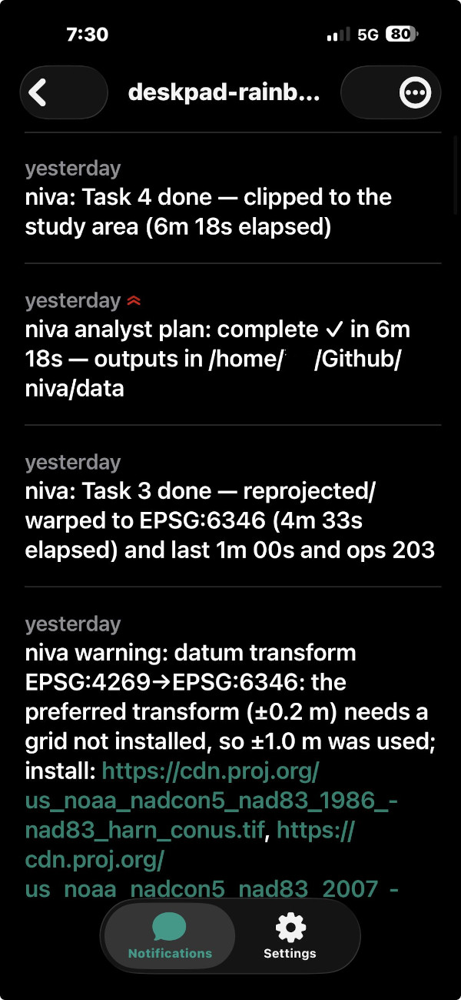
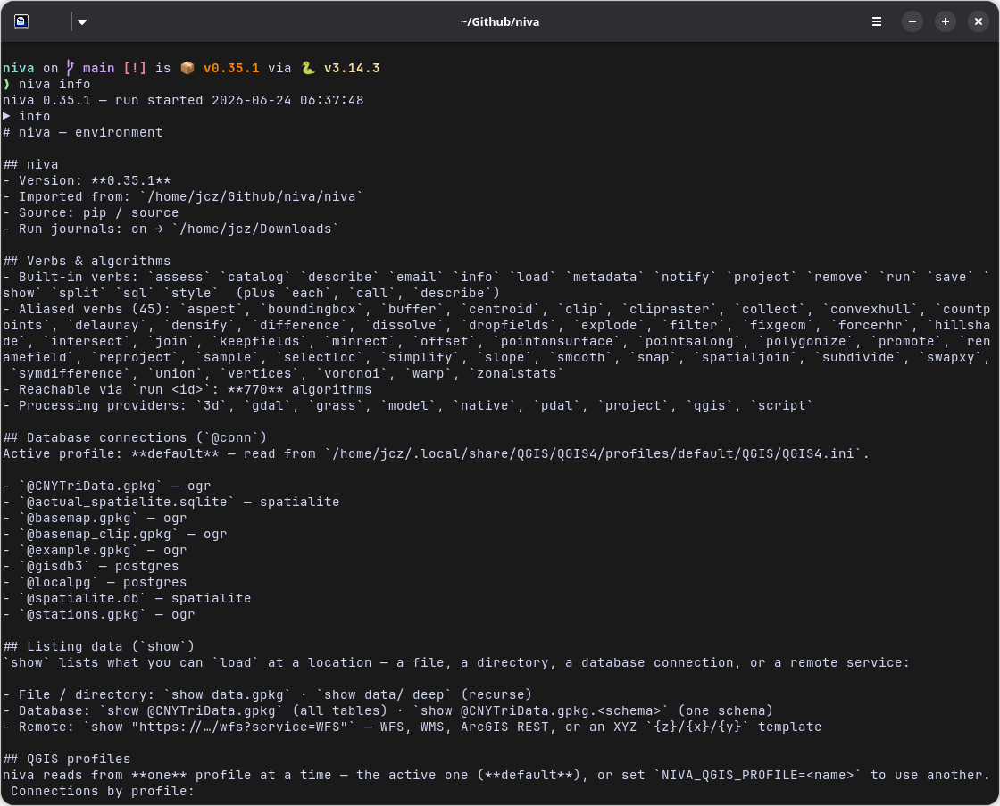
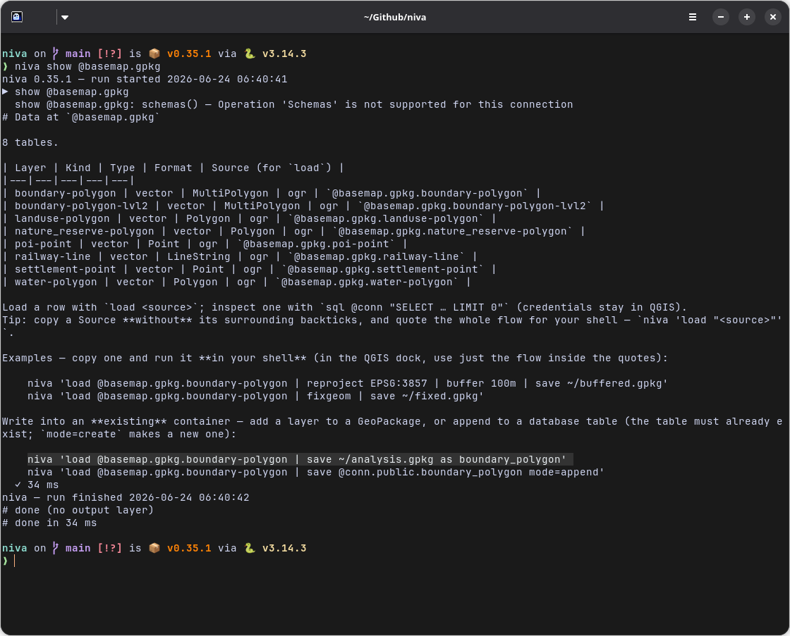
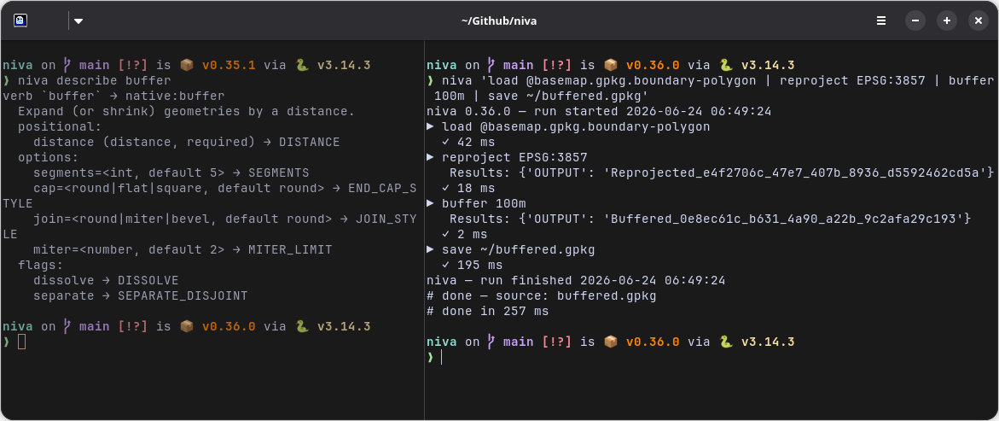

# niva

[](https://github.com/johnzastrow/niva/releases/latest)
[](LICENSE)
[](https://qgis.org)
[](https://www.python.org)
[](docs/guide/faq.md)

**A concise, readable text-pipeline grammar for QGIS geoprocessing — for people who
don't want to write PyQGIS.** *Easy wins every time.*


Write a whole pipeline on one line — friendly verbs running on QGIS's own Processing
algorithms underneath:

```
load roads.gpkg | buffer 100m dissolve | clip city.gpkg | save roads_local.gpkg
```

## What it does

Niva turns QGIS automation from PyQGIS code into a readable single lines of text. 

* **Runs in QGIS's own Python**
* Reaches **any** of its ~769 algorithms
* **Near-zero dependencies**
* **~45 friendly verbs → real QGIS algorithms**, across vector geometry (`buffer`,
  `simplify`, `smooth`, `convexhull`, `centroid`, `densify`, `offset`, …), overlay
  (`clip`, `intersect`, `union`, `difference`, `dissolve`, `spatialjoin`,
  `selectloc`, …), attributes (`renamefield`, `dropfields`, `keepfields`,
  `countpoints`, …), and **raster** (`warp`, `clipraster`, `hillshade`, `slope`,
  `aspect`, `polygonize`, …). `run <id>` reaches any of the ~769 with no alias;
  `describe` shows their parameters. Every alias is validated against the installed
  QGIS by `scripts/lint_registry.py`.
* **Raster and vector output** — `save` writes either (rasters via `gdal:translate`,
  vectors via `QgsVectorFileWriter`, driver chosen by extension).
* **Databases** via named QGIS connections — read (`load @conn.table`,
  `sql @conn "SELECT …"`), **write** (`save @conn.table`, fail-closed with
  `mode=create|replace|append`), and **analyse** server-side (non-SELECT
  `sql @conn "CREATE TABLE … AS SELECT …"`). Credentials never leave QGIS.
* **Provenance for free** — every `save` records lineage; `assess` writes data-quality
  reports; the run journal echoes the exact `processing.run(…)` for each step.
* **Composable** — chain stages with `|`, compose files with `call`, and **export a
  flow to a standalone PyQGIS script** (`niva export`) or import one back.
* **Utility verbs beyond QGIS** — `notify` (ntfy push when a long job finishes),
  `email` (SMTP, Gmail-aware), `catalog` (recurse a directory and inventory every
  geospatial dataset — CRS, extent, fields, bands — to a Markdown report), `show` (list the
  loadable layers/tables at a file, directory, `@conn`, or remote **WFS/WMS/ArcGIS REST/XYZ**
  URL — name, type, format,
  ready-to-load source), and `info` (inspect the local QGIS environment — the registered `@conn`
  connection
  names across every profile, providers, versions). Credentials for `notify`/`email` come
  **only from the environment**, never the flow text.

## Screenshots

### Setup

*Install the plugin from ZIP and enable the niva toolbar button in QGIS.*

### Run niva

*Enter a flow and execute it directly from the plugin UI.*

### Export to PyQGIS

*Export a flow to a standalone PyQGIS script for automation or sharing.*

### niva panel

*The niva plugin integrates commands and workflow controls into QGIS.*

### ntify notifications

*The niva plugin integrates commands and workflow controls into QGIS.*

### CLI — `info`

*`niva info` reports the environment: the built-in and aliased verbs, the reachable algorithms, and the registered `@conn` connections per QGIS profile.*

### CLI — `show`

*`niva show @basemap.gpkg` lists the loadable layers at a location — with ready-to-`load` sources and copy-paste example flows.*

### CLI — `describe` and a flow run

*Left: `niva describe buffer` shows the verb → algorithm mapping (args, options, flags). Right: a full flow (`load | reproject | buffer | save`) running with per-stage progress.*


## Quick start

### In QGIS — no install needed (easiest)

1. Get `niva_qgis.zip` — download it from the
   [latest release](https://github.com/johnzastrow/niva/releases/latest), or build it
   with `plugin/build_plugin.sh`.
2. In QGIS: **Plugins ▸ Manage and Install Plugins ▸ Install from ZIP** → pick the
   zip. (Enable *"Show also experimental plugins"* if it doesn't appear.)
3. Click the **niva** toolbar button, type a flow, hit **Run** — results land on the
   map. The plugin bundles niva, so there's no pip step on Windows, macOS, or Linux.

### As a package — CLI + Python

Install into **QGIS's own Python** (niva runs on QGIS's Processing):

```bash
<qgis-python> -m pip install git+https://github.com/johnzastrow/niva.git
```

#### Make `niva` a terminal command

`niva` runs on **QGIS's own Python**, so the `niva` command has to point at *that*
interpreter — not a Homebrew/pyenv/conda `python3`. The most portable way (it works whether you
`pip install`ed niva or run it straight from a clone) is a small alias/function in your shell
profile. Substitute **`<qgis-python>`** — the full path to QGIS's Python; find it in the QGIS
**Python Console** with `import sys; print(sys.executable)` — and, only when running from a clone,
**`/path/to/niva`** (your repo root). `QT_QPA_PLATFORM=offscreen` keeps it headless.

**Linux — add to `~/.bashrc`** (zsh: `~/.zshrc`), then `source ~/.bashrc`:

```bash
alias niva='QT_QPA_PLATFORM=offscreen PYTHONPATH=/path/to/niva:/usr/share/qgis/python:/usr/lib/python3/dist-packages <qgis-python> -m niva.cli.main'
# pip-installed (no clone)? drop the /path/to/niva: prefix from PYTHONPATH.
# Concrete: alias niva='QT_QPA_PLATFORM=offscreen PYTHONPATH=/home/me/Github/niva:/usr/share/qgis/python:/usr/lib/python3/dist-packages /usr/bin/python3.12 -m niva.cli.main'
```

**macOS — add to `~/.zshrc`**, then `source ~/.zshrc`:

```zsh
# QGIS.app's bundled Python already imports the bindings — no PYTHONPATH needed when pip-installed.
alias niva='QT_QPA_PLATFORM=offscreen /Applications/QGIS.app/Contents/MacOS/bin/python3 -m niva.cli.main'
# running from a clone? add the repo: PYTHONPATH=/path/to/niva /Applications/QGIS.app/Contents/MacOS/bin/python3 -m niva.cli.main
```

**Windows (Windows Terminal / PowerShell) — add to `$PROFILE`** (open it with `notepad $PROFILE`),
then reload with `. $PROFILE`:

```powershell
function niva {
  $env:QT_QPA_PLATFORM = 'offscreen'
  & 'C:\OSGeo4W\bin\python-qgis.bat' -m niva.cli.main @args
}
# standalone installer instead of OSGeo4W? use e.g. 'C:\Program Files\QGIS 3.40\bin\python-qgis.bat'.
```

`python-qgis.bat` sets up the QGIS environment itself, so no `PYTHONPATH` is needed on Windows.
After reloading your profile, `niva run myflow.niva` works from any terminal. More detail
(finding QGIS's Python, troubleshooting) is in the **[User Guide](docs/guide/user-guide.md)**.

Then run flows from the shell or Python:

```bash
niva run myflow.niva                              # execute a .niva file
niva "load a.gpkg | buffer 100m | save b.gpkg"    # a one-liner
niva describe buffer                              # how a verb maps to a QGIS algorithm
niva "load a.gpkg | buffer 100m | save b.gpkg" --dry-run   # validate — no QGIS needed
```

```python
import niva
niva.flow('load "data.gpkg|layername=roads" | buffer 100m dissolve | save out.gpkg')
```

> A GeoPackage holds many layers — name one with `|layername=…`. Databases:
> `load @conn.table`, `sql @conn "SELECT …"`, and write back with `save @conn.table`
> or a non-SELECT `sql @conn "…"` (credentials stay in QGIS).


## Docs

- **[User Guide](docs/guide/user-guide.md)** — install & run niva inside QGIS and standalone,
  configuration, scratch space, troubleshooting
- **[Reference](docs/guide/reference.md)** — every verb, alias, option, type, env var, CLI command,
  and Python entry point · **[Algorithm appendix](docs/algorithms/README.md)** — all 769 QGIS
  algorithms with parameters & descriptions
- **[Cookbook](docs/guide/cookbook.md)** — 50 worked recipes, including spatial SQL for SpatiaLite
  and PostGIS
- **[FAQ](docs/guide/faq.md)** — what libraries you need, how to run niva, scratch space, databases
- [Template projects](docs/guide/templates.md) — author a QGIS project once (layout + styles),
  reuse it against fresh data with `project from-template=`
- [About & goals](docs/guide/about.md) · [Plugin](plugin/README.md) ·
  [Verb ↔ algorithm map](docs/planning/14-traceability-matrix.md)
- [Design & risk docs](docs/planning/) — PRD, architecture, grammar, security, the
  `Oscar` failure register
- [CHANGELOG](CHANGELOG.md)

📘 **The whole guide ([User Guide](docs/guide/) + Reference + Cookbook + FAQ + the
769-algorithm appendix) is also one PDF: [`niva-guide.pdf`](https://github.com/johnzastrow/niva/blob/9206e42d0c55ef96238c514e9bbf3a038bc69c7c/docs/guide/niva-guide.pdf)** (also
attached to the [latest release](https://github.com/johnzastrow/niva/releases/latest); rebuild
with `python3 scripts/build_guide_pdf.py`, which needs `pandoc` + a LaTeX engine).

## Tested platforms

The table below records platforms where the full test suite has been run against a release.
See [`tests/TESTING_LOG.md`](tests/TESTING_LOG.md) for per-run details (suite counts, notes,
and a how-to-update template for adding new platforms).

| Platform | OS | QGIS | Python | niva | Result | Date |
|---|---|---|---|---|---|---|
| Windows 11 · x86\_64 | 10.0.26200 | 4.0.3-Norrköping | 3.12.13 | 0.35.0 | ✅ 718/718 + 3 skip | 2026-06-23 |
| Windows 11 · x86\_64 | 10.0.26200 | 3.44.11-Solothurn | 3.12.13 | 0.35.0 | ✅ 718/718 + 3 skip | 2026-06-23 |
| macOS 26.5.1 · x86\_64 | Darwin 25.5.0 | 4.0.3-Norrköping | 3.12.11 | 0.35.0 | ✅ 715/715 + 3 skip | 2026-06-22 |
| Linux 7.0 · x86\_64 | Linux 7.0.0 | 4.0.3-Norrköping | 3.14.4 | 0.35.0 | ✅ 718/718 + 10 skip | 2026-06-22 |
| macOS 26.5.1 · x86\_64 | Darwin 25.5.0 | 4.0.3-Norrköping | 3.12.11 | 0.34.1 | ✅ 668/668 + 3 skip | 2026-06-22 |

> Linux, macOS, and Windows all pass 0.35.0; Windows covers both the QGIS **4.0.3** and **3.44 LTR**
> lines. See [`tests/TESTING_LOG.md`](tests/TESTING_LOG.md) for per-run detail.

## License

[GPLv3](LICENSE) — consistent with the QGIS ecosystem (niva builds on PyQGIS, a GPL
library). Not yet on PyPI; install from source or the plugin zip.
