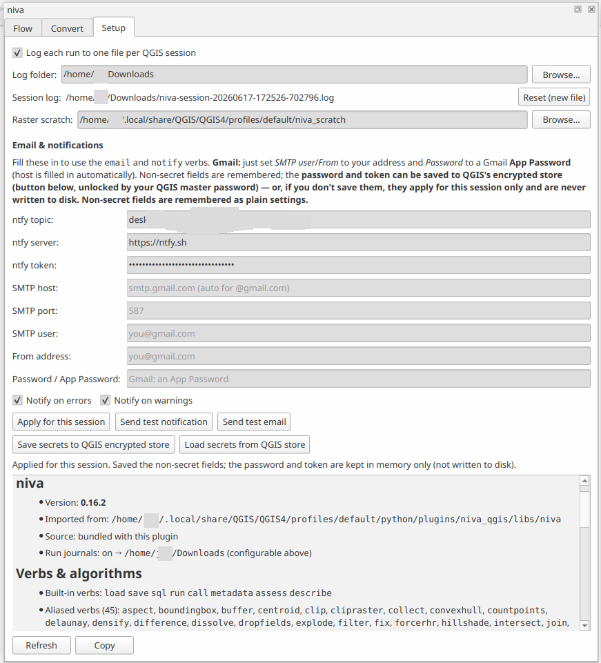
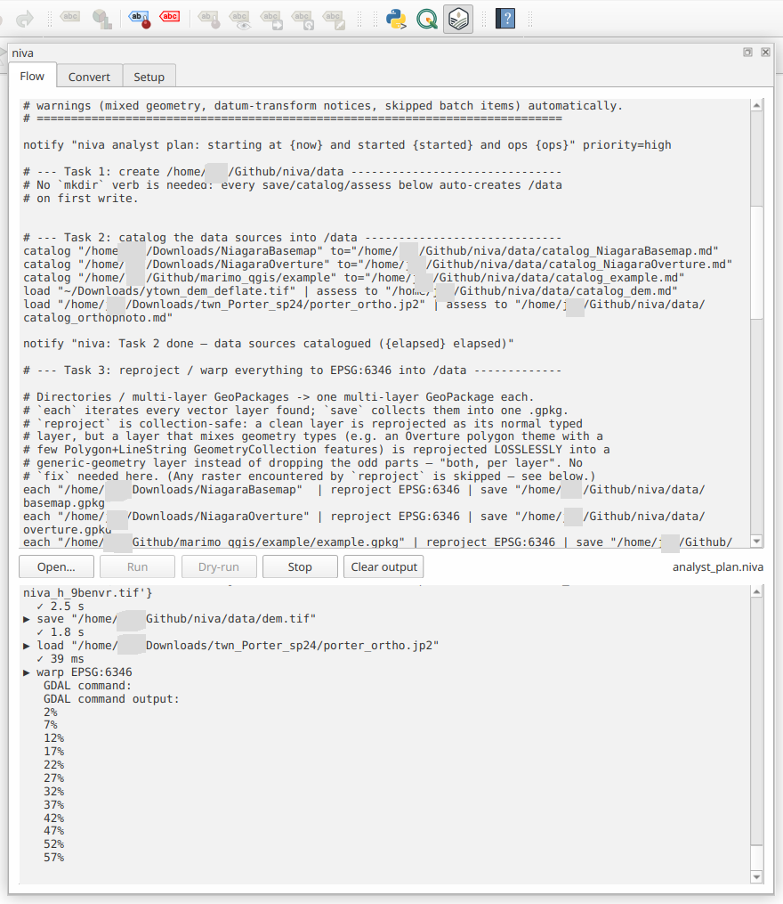
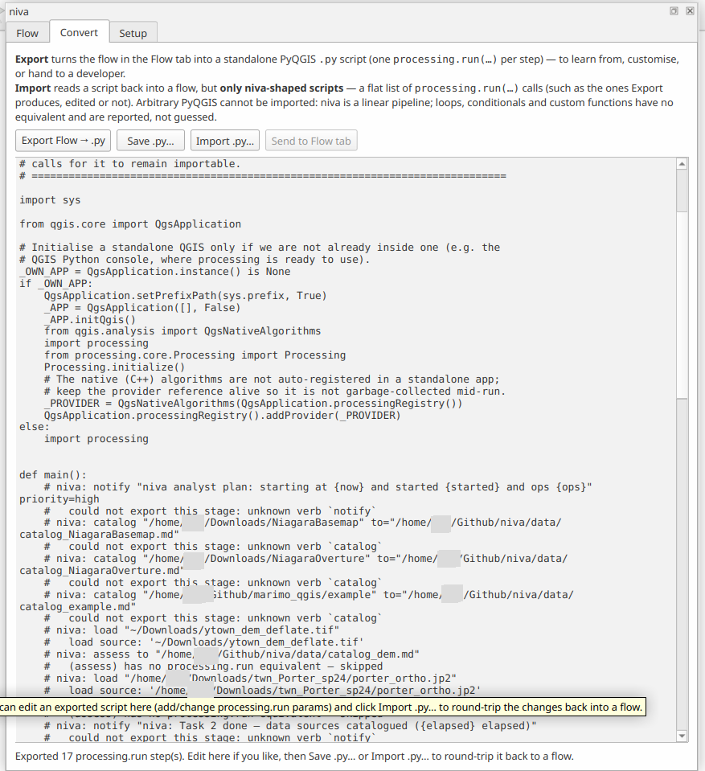
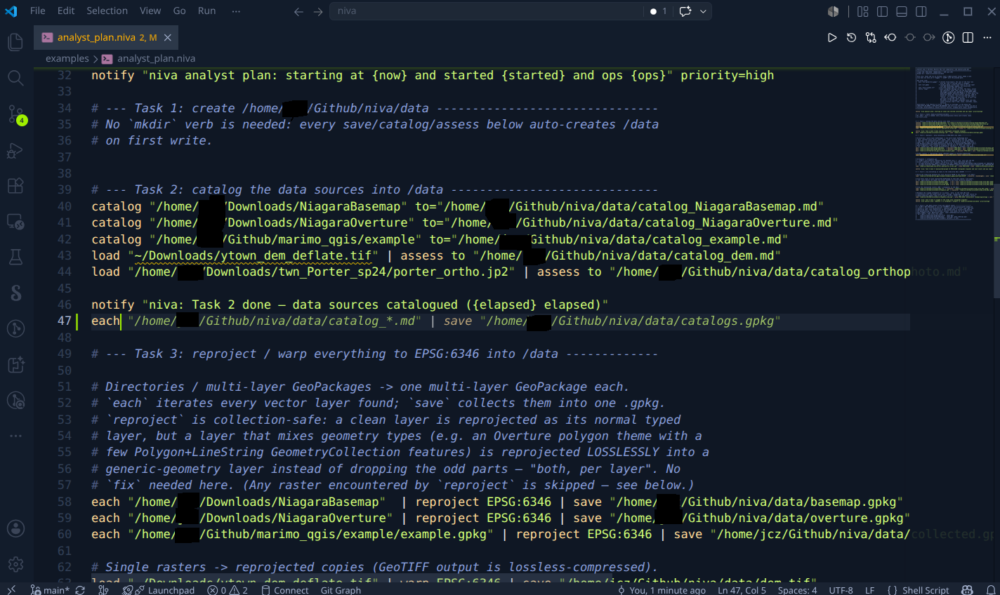

# niva

**A concise, readable text-pipeline grammar for QGIS geoprocessing — for people who
don't want to write PyQGIS.** *Easy wins every time.*


Write a whole pipeline on one line — friendly verbs running on QGIS's own Processing
algorithms underneath:

```
load roads.gpkg | buffer 100m dissolve | clip city.gpkg | save roads_local.gpkg
```

## What it does

Niva turns QGIS automation from PyQGIS code into a readable single lines of text. 

* **Runs in QGIS's own Python**
* Reaches **any** of its ~769 algorithms
* **Near-zero dependencies**
* **~45 friendly verbs → real QGIS algorithms**, across vector geometry (`buffer`,
  `simplify`, `smooth`, `convexhull`, `centroid`, `densify`, `offset`, …), overlay
  (`clip`, `intersect`, `union`, `difference`, `dissolve`, `spatialjoin`,
  `selectloc`, …), attributes (`renamefield`, `dropfields`, `keepfields`,
  `countpoints`, …), and **raster** (`warp`, `clipraster`, `hillshade`, `slope`,
  `aspect`, `polygonize`, …). `run <id>` reaches any of the ~769 with no alias;
  `describe` shows their parameters. Every alias is validated against the installed
  QGIS by `scripts/lint_registry.py`.
* **Raster and vector output** — `save` writes either (rasters via `gdal:translate`,
  vectors via `QgsVectorFileWriter`, driver chosen by extension).
* **Databases** via named QGIS connections — read (`load @conn.table`,
  `sql @conn "SELECT …"`), **write** (`save @conn.table`, fail-closed with
  `mode=create|replace|append`), and **analyse** server-side (non-SELECT
  `sql @conn "CREATE TABLE … AS SELECT …"`). Credentials never leave QGIS.
* **Provenance for free** — every `save` records lineage; `assess` writes data-quality
  reports; the run journal echoes the exact `processing.run(…)` for each step.
* **Composable** — chain stages with `|`, compose files with `call`, and **export a
  flow to a standalone PyQGIS script** (`niva export`) or import one back.
* **Utility verbs beyond QGIS** — `notify` (ntfy push when a long job finishes),
  `email` (SMTP, Gmail-aware), and `catalog` (recurse a directory and inventory every
  geospatial dataset — CRS, extent, fields, bands — to a Markdown report). Credentials
  for `notify`/`email` come **only from the environment**, never the flow text.

## Screenshots

### Setup

*Install the plugin from ZIP and enable the niva toolbar button in QGIS.*

### Run niva

*Enter a flow and execute it directly from the plugin UI.*

### Export to PyQGIS

*Export a flow to a standalone PyQGIS script for automation or sharing.*

### niva panel

*The niva plugin integrates commands and workflow controls into QGIS.*


## Quick start

### In QGIS — no install needed (easiest)

1. Get `niva_qgis.zip` — download it from the
   [latest release](https://github.com/johnzastrow/niva/releases/latest), or build it
   with `plugin/build_plugin.sh`.
2. In QGIS: **Plugins ▸ Manage and Install Plugins ▸ Install from ZIP** → pick the
   zip. (Enable *"Show also experimental plugins"* if it doesn't appear.)
3. Click the **niva** toolbar button, type a flow, hit **Run** — results land on the
   map. The plugin bundles niva, so there's no pip step on Windows, macOS, or Linux.

### As a package — CLI + Python

Install into **QGIS's own Python** (niva runs on QGIS's Processing):

```bash
<qgis-python> -m pip install git+https://github.com/johnzastrow/niva.git
```

Then run flows from the shell or Python:

```bash
niva run myflow.niva                              # execute a .niva file
niva "load a.gpkg | buffer 100m | save b.gpkg"    # a one-liner
niva describe buffer                              # how a verb maps to a QGIS algorithm
niva "load a.gpkg | buffer 100m | save b.gpkg" --dry-run   # validate — no QGIS needed
```

```python
import niva
niva.flow('load "data.gpkg|layername=roads" | buffer 100m dissolve | save out.gpkg')
```

> A GeoPackage holds many layers — name one with `|layername=…`. Databases:
> `load @conn.table`, `sql @conn "SELECT …"`, and write back with `save @conn.table`
> or a non-SELECT `sql @conn "…"` (credentials stay in QGIS).


## Docs

- [About & goals](docs/about.md) · [Plugin](plugin/README.md) ·
  [Verb ↔ algorithm map](docs/planning/14-traceability-matrix.md)
- [Design & risk docs](docs/planning/) — PRD, architecture, grammar, security, the
  `Oscar` failure register
- [CHANGELOG](CHANGELOG.md)

## License

[GPLv3](LICENSE) — consistent with the QGIS ecosystem (niva builds on PyQGIS, a GPL
library). Not yet on PyPI; install from source or the plugin zip.
