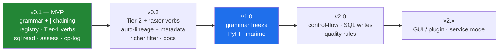

# Niva — Roadmap

_Status: draft for review. The text grammar + pipe chaining is v1 core (not
deferred). This sequences the work defined across the planning docs: the verb set
(`03`), the alias registry (`07`), the layer handle contract (`02`), the SQL/
metadata surfaces (`06`), and data quality/provenance (`08`)._

> **Three parallel tracks** run through the milestones: **Grammar/Engine** (the
> pipeline), **Coverage** (verbs via the registry), and **Provenance** (logging,
> assessment, lineage). The MVP delivers a thin slice of all three.

## Status snapshot (v0.8.0 — 2026-06-15)

The milestone *numbering* below predates how the work actually sequenced — the
front-end/provenance tracks ran ahead. Where things really stand:

- **Shipped (ahead of the original plan):** the QGIS **plugin** (Flow/Convert/Setup
  tabs) with **background `QgsTask` runs + a Stop button** (was slated v2.x); the run
  **journal** (human `.log` + machine `.jsonl`) that **echoes the equivalent
  `processing.run(…)`**; auto-**lineage** on save; **`assess`** incl. `--deep`;
  **`.niva ↔ .py` export/import** (transpile); the `run` escape hatch (all ~769
  algorithms); the **registry linter** (`scripts/lint_registry.py`, planning 07-§9).
- **Now in progress — v0.2 "breadth + raster":** the curated verb set grew from ~12
  to **~45** (geometry, attributes, overlay, selection, creation, **raster**), all
  validated against live QGIS; **`save` now writes rasters** as well as vectors
  (lossless-compressed by default).
- **Shipped — multi-layer write + batch:** `save <gpkg> as <layer>` accumulates
  layers in one GeoPackage (append, not overwrite); **`each "<dir|glob|gpkg>"`**
  iterates files/layers and runs the rest of the flow per item, naming each output
  after its source (into one `.gpkg`, or to a `{name}` path template). Together they
  do directory-wide reproject/clip into a single GeoPackage.
- **Shipped — utility verbs not backed by QGIS:** `notify` (ntfy push), `email`
  (SMTP, Gmail-aware; secrets from the environment, TLS enforced, fail-closed), and
  `catalog` (recurse a directory and inventory every geospatial dataset — including
  per-layer for multi-layer GeoPackages — to a Markdown report).
- **Shipped (v0.18.0) — `project` verb: copy a project & repoint datasources.**
  `project <src.qgs|qgz> to=<out> repoint=<target>` copies a QGIS project and repoints
  each vector layer's datasource to a new home — a GeoPackage **or** an `@conn[.schema]`
  database (ties into the v0.17.0 DB write) — matched by layer name, subset filters
  preserved, `missing=fail|keep|drop` for unmatched layers; never silently breaks a
  project file. Standalone `QgsProject()` + `QgsMapLayer.setDataSource`, off the main
  thread. This completes "compile a region" / analyst-plan Task 5. (Design:
  [15-postgis-and-project-design](15-postgis-and-project-design.md).)
- **Shipped (v0.19.0) — raster-layer repointing in `project`.** `project … rasters=<dir>`
  repoints raster layers (DEM, orthophoto) to a same-basename file in `<dir>` via the
  `gdal` provider, alongside the vector `repoint=` target.
- **Shipped (v0.20.0) — `style` verb: layer styles & metadata.** `style apply <file>` /
  `style save <file>` apply or export a `.qml` (symbology) / `.qmd` (metadata) sidecar for
  the current layer, persisting an applied style into a GeoPackage's `layer_styles` table
  or a same-basename sidecar. Remaining: `apply` to a database-backed layer.
- **Shipped (v0.21.0) — `project new from=<dir> to=<out.qgs>`.** Create a fresh project
  loading freshly compiled outputs — the complement to repointing an existing one.
- **Shipped (v0.22.0) — `style save <.sld|.qlr>`.** Export a layer's style as OGC SLD,
  or a portable QGIS Layer Definition (`.qlr`: datasource + style).
- **Shipped (v0.23.0) — `project info <src.qgs>`.** Inventory a project's layers /
  datasources / CRS to a Markdown report.
- **More project/layer-file ops planned** (`TODO.md`): path rewrite,
  `.qgs`↔`.qgz` repackage, and cartographic decoration (bookmarks, map themes, legend,
  print layouts).
- **Still ahead:** richer `filter` (IN/LIKE/NULL), `qgis_process` backend, grammar
  freeze + PyPI (v1.0), named intermediates / SQL writes / quality rules (v2.0).

## v0.1 — Grammar + engine (MVP)

The foundation. Get the grammar, the chain model, and the **layer handle
contract** right (`02-§3`) — everything later builds on them.

**Grammar / engine**
- `grammar/`: lexer, parser (`Stage[]`), runner (pipe chaining, sinks).
- `core/`: `engine.run()`, the `Layer` handle (source/qgs/db_table/memory) +
  cross-surface threading (`02-§3.3`), `Result`, `OpError`/`FlowError`, `qgis_env`.
- `backends/`: `Backend` ABC + **`PyqgisBackend` only** (in-process; runs
  interactive *and* headless via a headless `QgsApplication`). The ABC is the
  seam; `qgis_process` + auto-select are deferred to v0.2 (`00-§3.3`, decided).

**Coverage (the registry)**
- `registry/`: declarative alias entries + loader + **linter** validating against
  the installed QGIS, and the **scaffolder** that seeds entries from the live
  registry (`07-§9`).
- **Built-in verbs**: `load`/`save`/`add`/`run`/`find`/`describe`/`filter`/
  `compute`, plus **`sql` read passthrough** (`SELECT → layer`, `06-§4`).
- **Tier 1 registry aliases** (`03-§2.2`): buffer, clip, intersect, union,
  difference, dissolve, reproject, fix, explode, merge, join, spatialjoin, extract,
  selectloc, centroid. The simplified `filter` translator with raw-expression
  fallback (`03-§3`).

**Provenance (first slice)**
- **Operation log / run journal** (`08-§2`): structured `OpRecord`s; the ordered
  journal as machine-readable methods documentation.
- **`assess`** (`08-§4`): structure (CRS/extent/schema), validity, duplicates,
  null counts, basic field stats, and any existing lineage — no mutation.

**Delivery**
- **Runner everywhere**: `niva run flow.niva`, `niva "…"`, `niva.flow("…")`
  (marimo/console); Python engine/API as the escape hatch.
- `pyproject.toml`; `pip install` into QGIS's Python; `niva` console script.
- **Tests/CI**: grammar units (no QGIS), the registry linter, and end-to-end
  flows on fixture GeoPackages; headless GitHub Actions on a QGIS Linux
  container, across a small QGIS-version matrix (`07-§9`).
- **Exit criteria**: `03-mvp-scope.md` "definition of done".

## v0.2 — Breadth + provenance

- **Tier 2 verbs** (`03-§2.3`): convexhull, simplify, smooth, pointonsurface,
  boundingbox, voronoi, grid, vertices, field ops (refactor/drop/retain/rename),
  promote, countpoints, **zonalstats/sample** (raster×vector).
- **Raster basics**: `warp`/reproject, `clip` by mask/extent, `hillshade`
  (`gdal:*` / `native:*`).
- **Auto-lineage to formal metadata** on `save` (`08-§3`) and the **`metadata`**
  verb (read/set/export, `06-§2.5`); `assess --deep` (Check-geometry battery).
- **Richer `filter`** (IN, LIKE, NULL handling) while staying non-code-like.
- **`qgis_process` backend** + auto-selection (`--backend` / `NIVA_BACKEND`) — the
  second `Backend` impl, for process isolation / no-Python headless batch.
- Minimal `config`; `--json` contracts; timing.
- **`call` / file composition**: parameterless `call other.niva` to run another
  file's flows inline (procedural reuse), usable anywhere in a parent (`03-§4.1`).
- Docs site + a cookbook of example `.niva` flows.

## v1.0 — Stable release

- **Grammar freeze** — SemVer commitment to the verb/flag/param surface; the
  registry is the contract.
- **PyPI publish** (verify the `niva` name first; fallbacks in `05`).
- Worked **marimo-qgis integration** (niva flows in notebook cells) and a
  `startup.py` preload snippet for the QGIS console.

## v2.0 — Control-flow, SQL writes & quality rules

Extends the grammar without breaking v1 flows.

- **Named intermediates / reuse**: capture a stage's output and reuse it
  (e.g. `… > $roads`, then `load $roads`) — non-linear flows (branch/merge).
- **Variables / parameters** in `.niva` scripts, and **parameterized `call`**
  (pass values / the current layer into a called file) — reusable macros
  (`03-§4.1`), guarded so the common case still reads like prose.
- **SQL writes & connection management** (`06-§4`, `03-§6`): ~~`UPDATE`/`DELETE`/
  `CREATE`, import-to-PostGIS/SpatiaLite~~, managing `@connections`; exit code `4`
  (connection/SQL). (Read passthrough shipped in v0.1; **write/analyse shipped in
  v0.17.0** — `save @conn.table` with `mode=create|replace|append` and non-SELECT
  `sql @conn "…"`. Still ahead: in-app `@connection` *management*.)
- **Quality rules / constraints** (`08-§6`): assert conditions and fail a flow on
  bad data; metadata templates; catalog/search integration
  (`QgsLayerMetadataProviderRegistry`).

## v2.x — Front ends & service mode

- Optional **QGIS plugin / Processing-Toolbox** front end so flows run from the
  GUI (the niva plugin stub is the seed).
- Optional **service/daemon mode** to amortize QGIS startup across many flows.
- **Hard-to-reach surfaces** (`06-§6`): *composing* print layouts and symbology is
  GUI-shaped — later. (But *exporting* an existing atlas/layout is a Processing
  algorithm — `native:atlaslayouttomultiplepdf` — so per-canvasser handouts from a
  `.qpt` template are reachable earlier via `run`.)
- Optional compiled outer CLI only if packaging/startup friction warrants it (no
  geoprocessing-speed reason — see `05 §3`).

## Cross-cutting (all milestones)

- **Clean-room** discipline: grammar/API derived from QGIS Processing + readability only.
- **Non-programmer-first** grammar: no stage may read like code.
- **Introspect, never assume** (`06-§8.4`): the registry, providers, CRS ops and
  SQL functions are build-specific; validate against the installed QGIS.
- **Provider preference: native-first** (`07-§12.1`): prefer `native` → `gdal` →
  `qgis` → `pdal`; **GRASS/SAGA last**, only when nothing else covers the job
  (reached via `run`). The long tail (GRASS network/TSP, PDAL lidar) is reachable
  from v0.1 without curated aliases.
- **Interop** stays first-class (`02-§3.6`); the `run` escape hatch always reaches
  the full surface.
- **One spec per verb** drives grammar, Python API, CLI, and `describe` — never diverge.
- **Provenance is a byproduct**: the op-log and lineage grow with every milestone,
  not bolted on at the end (`08`).
