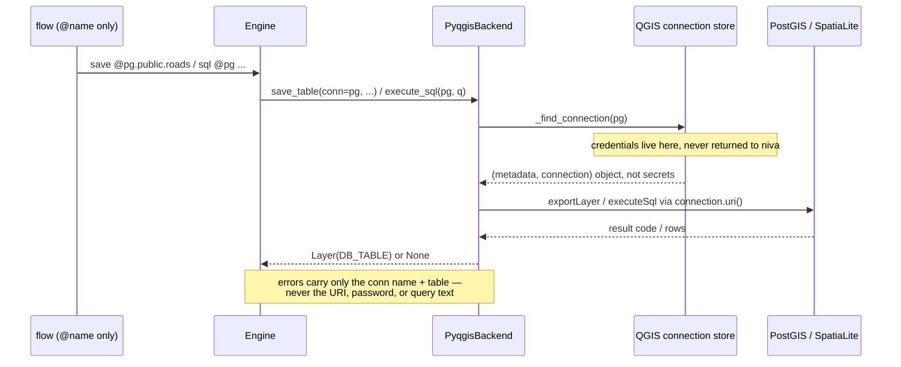
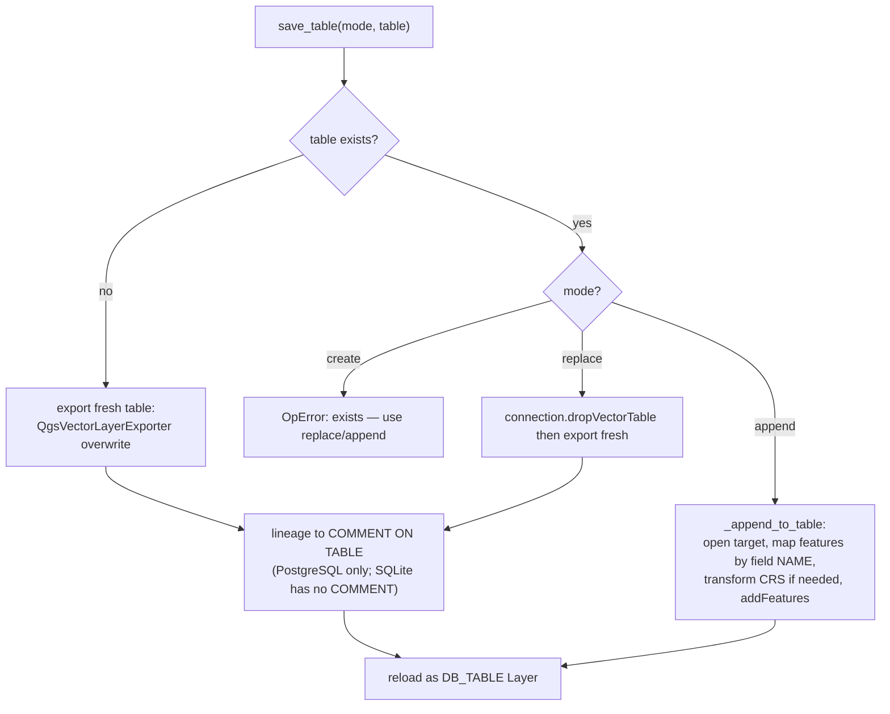
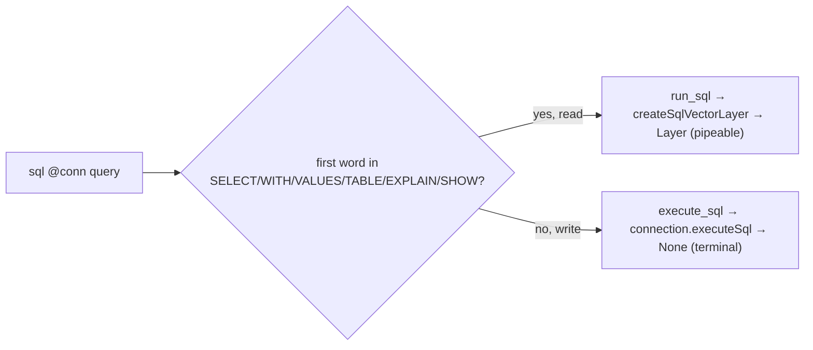
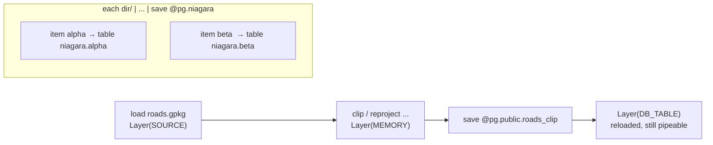
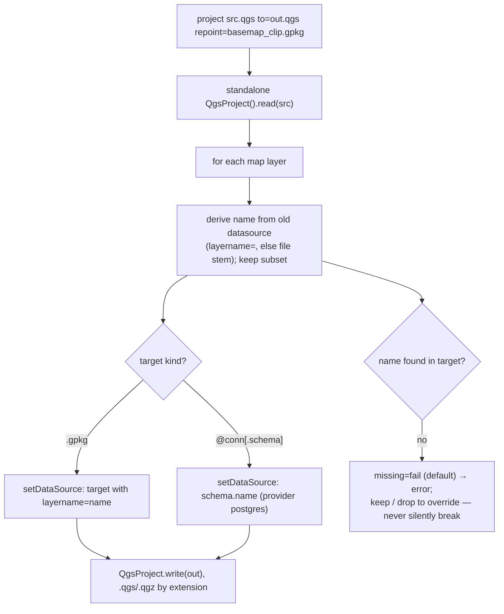

# 15 — PostGIS as a first-class target, and the `project` verb

Design for the **read / write / analyse in a database** round (Phase 1, shipped v0.17.0)
and the **project-file repointing** round (Phase 2, shipped v0.18.0). Read alongside
[12-security-model](12-security-model.md) (the credential boundary), the `save` / `sql`
sections of [13-verb-reference](13-verb-reference.md), and the roadmap status in
[04-roadmap](04-roadmap.md).

## Why
niva already *read* from named QGIS database connections (`load @conn.table`,
`sql @conn "SELECT …"`) but could only *write* to files and could not run non-SELECT SQL.
"Compile a region into PostGIS" — and the upcoming `project` verb — needs niva to **write**
layers into DB tables and **analyse** in-database, without ever handling credentials. Work
is phased: **Phase 1** = DB write + SQL analyse; **Phase 2** = `project`.

## Principles carried in
- **Credentials never leave QGIS.** The flow text carries only `@name`; the destination
  URI (host, db, login) is built from the *live* connection. No credential, URI, or query
  text appears in the flow, the journal, or any error message. (12-§3.)
- **Fail-closed writes.** `save @conn.table` creates a new table and errors if it exists,
  unless the user opts into `mode=replace` or `mode=append`. No silent overwrite.
- **Off the main thread.** niva runs flows in a background `QgsTask`; DB work uses the
  provider connection API and standalone transform contexts, never `QgsProject.instance()`.

---

## 1. Data-target model — `save` dispatches file vs database

`_save` (`engine.py`) forks on the first argument: a `@conn` reference goes to the new DB
path; everything else is the unchanged file writer.

```mermaid
flowchart TD
    S["_save(stage, current, lineage)"] --> Q{args[0] is_connection_ref?}
    Q -- no --> F["file branch, unchanged:<br/>QgsVectorFileWriter / _save_raster"]
    Q -- yes --> D["_save_to_db: parse @conn[.schema].table,<br/>reject as / name-template, validate mode=, raster guard"]
    D --> B{in an each batch?}
    B -- yes --> BS["table = item name;<br/>trailing qualifier = SCHEMA<br/>(@conn.schema.table is an error)"]
    B -- no --> NB["table required<br/>(bare @conn is an error)"]
    BS --> ST["backend.save_table(layer, conn, schema, table, mode, lineage)"]
    NB --> ST
```

## 2. Connection resolution and the credential boundary

The connection *name* is the only thing that crosses from the flow into niva. QGIS holds
the secrets; niva asks the resolved connection object to build URIs and run statements.



## 3. `save_table` — create / replace / append × table-exists

The QGIS exporter (`QgsVectorLayerExporter`) can only *create* a table, so `append` is a
separate path that opens the target and adds rows. (This split was found by running the
SpatiaLite round-trip tests on live QGIS — every "append" option still tried to CREATE.)



Notes: success is `VectorExportResult.Success` (`== NoError == 0`). The lineage comment is
escaped (`'` → `''`) and attempted only on `postgres` (SpatiaLite errors on `COMMENT`).

## 4. `sql` — read returns a layer, write runs server-side

`_sql` routes on the statement's leading keyword. SELECT-style queries become a pipeable
query layer (as before); everything else executes as a terminal step.



`CREATE TABLE … AS SELECT …` routes to **execute** (leading `CREATE`); `WITH … SELECT …`
routes to **read** (leading `WITH`). A `None` return makes any following stage fail with
the existing "needs an input layer" error — correct for a terminal write.

## 5. Layer-handle lifecycle through a DB write



## 6. Phase 2 (v0.18.0, shipped) — the `project` verb (repoint)

`project "<src.qgs|qgz>" to="<out>" repoint="<target>" [missing=fail|keep|drop]`. A new
built-in verb (dispatch in `_run_stage`; `_project` in the engine; `repoint_project` in the
backend), using a **standalone** `QgsProject()` off the main thread. One `<target>` per
call — a `.gpkg` path *or* `@conn[.schema]` (ties into Phase 1's DB write). Vector layers
are repointed by name (subset filters preserved); raster/other layers are left unchanged.
Implementation note found in live-QGIS testing: match the target's layer set with
`QgsProviderRegistry.querySublayers` (not the `sublayers` helper, which returns `[]` for a
single-layer container), and read a layer's name *before* `removeMapLayer` deletes it.



After Phase 2 lands, analyst-plan **Task 5** is de-flagged and the example gains a worked
`save @conn` + `project` flow.
