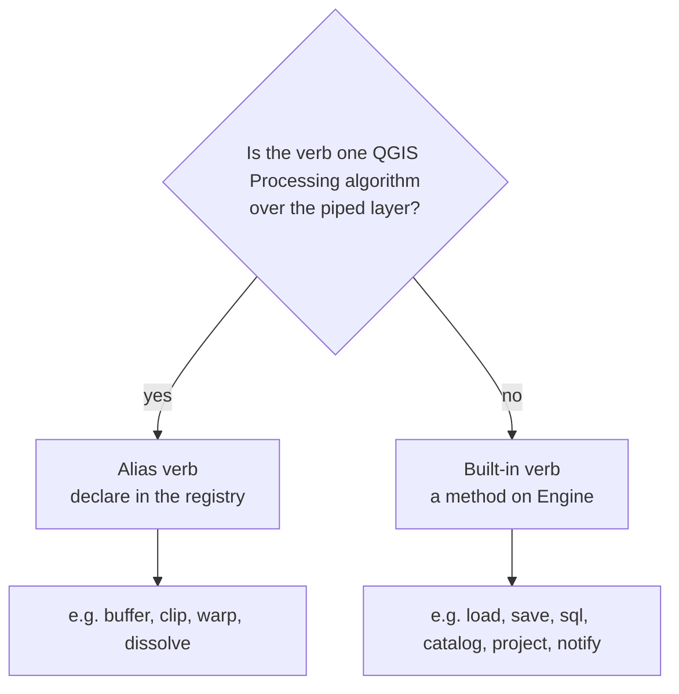
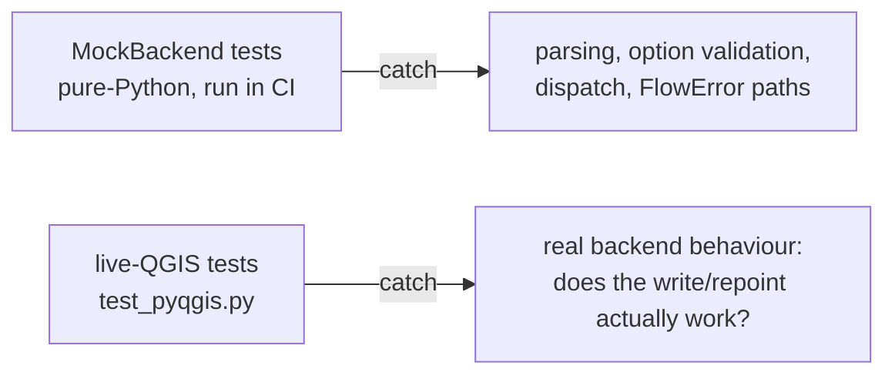
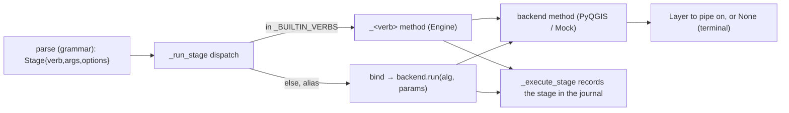

# 16 — Anatomy of a verb (the paved road for adding verbs)

How to add a verb to niva cheaply and consistently. Two kinds — pick the right one, then
follow its checklist. See also [07-alias-registry-design](07-alias-registry-design.md) (the
alias model), [13-verb-reference](13-verb-reference.md) (worked examples), and the security
boundary in [12-security-model](12-security-model.md).

## Which kind?



- **Alias verb** — the verb *is* a `processing.run(<alg>, …)` over the current layer with
  some arguments/options. **~90% of verbs.** Pure declaration; no engine code.
- **Built-in verb** — anything else: reads/writes files or databases, manipulates project
  files, talks to the network, branches the pipe, or otherwise isn't one algorithm over the
  piped layer. A method on `Engine`.

---

## A. Adding an ALIAS verb (the common case)

One change: add an `Alias(...)` to `niva/registry/definitions.py` (args → positional
parameters, options → `key=value`, with types the binder coerces — distance, enum, crs,
layer, …). That's it — parsing, binding, journal echo, and `describe` all come for free.

- Validate it against the installed QGIS: `python scripts/lint_registry.py` (also runs in
  CI) checks the algorithm id and parameter names exist.
- Document it in `13-verb-reference.md`; it appears in the traceability matrix
  (`scripts/gen_traceability_matrix.py`).
- Tests: a registry/binder assertion in `tests/test_registry.py` (the bound params), and —
  if it has non-trivial behaviour — a live-QGIS round-trip (see §C).

## B. Adding a BUILT-IN verb (the checklist)

1. **Write `_<verb>(self, stage)` on `Engine`** (`niva/engine/engine.py`). Take what you
   need — most also take `current` and/or `lineage`. Parse `stage.args` / `stage.options`,
   validate (see Conventions), do the work, and **return** a `Layer` to pipe on or `None`
   for a terminal verb (like `catalog`/`project`). Model it on the closest existing one
   (`_catalog` for a standalone file verb; `_save` for one that consumes the layer).
2. **Register it** — one line in `Engine._BUILTIN_VERBS` (just above `_run_stage`):
   `"<verb>": lambda self, stage, current, lineage: self._<verb>(stage, …)`. The adapter
   passes the handler exactly the context it needs. **This is the only dispatch edit.**
3. **Backend work that needs QGIS but isn't `run()`** (a DB write, a project rewrite, …):
   add an `@abc.abstractmethod` to `Backend` (`niva/engine/backend.py`), a recording stub
   to `MockBackend`, and the real implementation to `PyqgisBackend` (`pyqgis.py`, lazy
   `qgis` imports). Reuse helpers: `_find_connection`, `connections.default_schema`,
   `_temp_path` (tracked scratch), `scratch_dir`.
4. **Surface it** — add the verb name to the built-in list in `plugin/environment.py`.
5. **Export** — if the verb has **no** `processing.run` equivalent, make `transpile.py`
   annotate it (a comment) rather than emit a wrong `OUTPUT=` (see the `save @conn` / `sql`
   guards). Forgetting this silently breaks `niva export`.
6. **Document** — `13-verb-reference.md`; update `04-roadmap.md` status.
7. **Test both tiers** (§C). **Required.**
8. **Version + changelog** — bump per the change (MINOR for a new verb); rebuild the plugin
   zip (`plugin/build_plugin.sh`).

## Conventions (apply to every verb)

- **Errors:** `FlowError` for a usage/config mistake (always with `line=stage.line,
  stage=stage.raw`); `OpError` for a backend/QGIS failure. **Never leak a credential, URI,
  or query text** into an error message — DB errors carry only the connection name + table.
- **Paths:** `os.path.expanduser` every path argument (so `~/…` works), as `load`/`save`
  and the binder already do. Relative paths resolve against the flow file's dir.
- **Credentials:** only ever via a `@conn` reference resolved through QGIS; never read or
  echo secrets. (12-§3.)
- **Journal:** automatic — `_execute_stage` records each stage's text + verb. Don't log
  resolved params or secrets.
- **Off the main thread:** flows run in a worker `QgsTask`. Use standalone QGIS objects
  (`QgsProject()`, `QgsCoordinateTransformContext()`), never `QgsProject.instance()`.

## C. Testing — both tiers are required

niva has two test tiers, and **both matter for a verb** because they catch different bugs:



- **MockBackend tier** (`tests/test_*.py`, no QGIS): assert the engine parses/validates and
  calls the backend with the right arguments. Fast; runs in CI. **Cannot catch backend
  bugs** — a MockBackend test passes even if the real backend is broken (the v0.17.0
  `append` bug passed Mock and failed live QGIS).
- **Live-QGIS tier** (`tests/test_pyqgis.py`, skips cleanly without QGIS): run the real flow
  through `niva.flow(...)` and assert the actual result (table created, project repointed,
  feature count). **This is the tier that catches the dangerous bugs.** Run it headless:
  ```
  PYTHONPATH=…/niva:/usr/lib/python3/dist-packages:/usr/share/qgis/python \
    QT_QPA_PLATFORM=offscreen /usr/bin/python3.14 -m unittest tests.test_pyqgis
  ```
  > These tests currently skip in CI (no QGIS) — running the QGIS tier in CI is the open
  > test-hardening item (see `TODO.md`). Until then, run it locally before every merge.

A verb is not done until it has **both** a MockBackend test (logic) and a live-QGIS test
(behaviour).

## The verb lifecycle (where your code runs)


