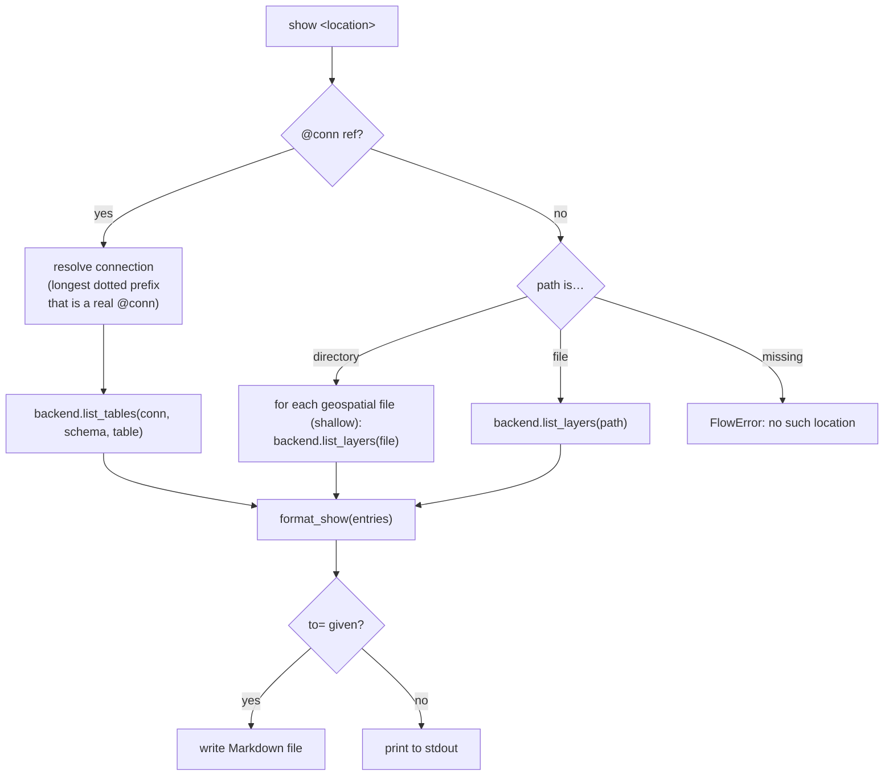
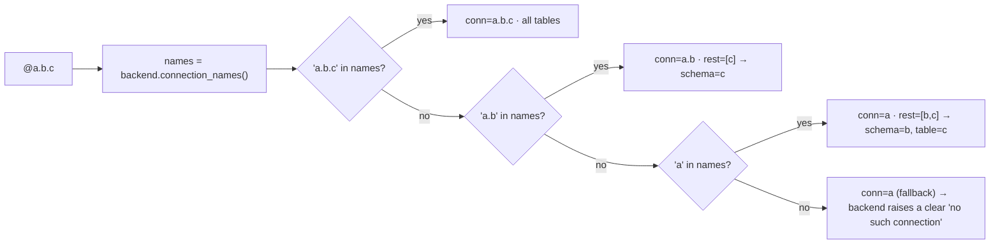

# 17 — The `show` verb: list available data at a location

**Status:** implemented in v0.29.0 (files + database connections). Remote services
(WFS/WMS/XYZ, ArcGIS REST, `/vsicurl` cloud rasters) are a deliberate follow-up.

Related: [13-verb-reference](13-verb-reference.md), [16-anatomy-of-a-verb](16-anatomy-of-a-verb.md),
[15-postgis-and-project-design](15-postgis-and-project-design.md) (the `@conn` model).

## Why

Before you can `load` anything you have to know **what's there and what it's called**.
Inside QGIS the Browser answers that; from a shell — or against a PostGIS connection you
didn't set up — there's nothing. `show` is that missing "what can I load here?" listing:
point it at a file, a directory, or a `@conn` and get back layer/table **names** plus a few
identifying attributes, and a copy-pasteable source you can hand to `load` or `ogrinfo`.

### `show` vs `catalog` vs `info`

| Verb | Question it answers | Cost | Output |
|---|---|---|---|
| `show` | "What can I load *here*, and what's its name/type?" | cheap (names + type, **no counts**) | one location, a flat table |
| `catalog` | "Inventory *everything under this tree* in detail." | deep (CRS, extent, fields, feature counts) | recursive, per-dataset report |
| `info` | "What does my QGIS *environment* look like?" | cheap | versions, providers, `@conn` names |

`show` is intentionally the lightweight one — it never counts features or opens every layer
for full profiling. When you want depth on one layer, the footer points you at
`load … | assess` or `ogrinfo`.

## Grammar

```
show <location> [to=<out.md>]
```

`<location>` is one of:

- a **file** — `show roads.shp`, `show dem.tif`, `show data.gpkg` (a multi-layer container
  expands to one row per layer)
- a **directory** — `show data/` (shallow: immediate children only; each container expands to
  its layers) — recursion is `catalog`'s job
- a **database connection** — `show @conn` (all tables), `show @conn.schema` (one schema),
  `show @conn.schema.table` (one table)

Terminal verb (like `catalog`/`info`): prints a Markdown table to stdout, or writes it with
`to=`. No feature is piped onward.

## Dispatch



Each entry is a uniform dict — `{name, kind, type, format, ref}` — regardless of backend:

| field | file source | DB source |
|---|---|---|
| `name` | layer name | table name |
| `kind` | `vector` / `raster` | `vector` / `raster` / `table` (aspatial) |
| `type` | geometry (`MultiPolygon`) or `N band · Float32` | geometry of the table's geom column |
| `format` | OGR/GDAL driver (`GPKG`, `GTiff`, `ESRI Shapefile`) | provider (`postgres`, `spatialite`) |
| `ref` | `path\|layername=…` (or bare path) | `@conn[.schema].table` |

## Backend boundary

Two new methods on `Backend` (mirrored by `MockBackend` for the QGIS-free tier):

- `list_layers(source) -> [entry]` — **PyqgisBackend** uses
  `QgsProviderRegistry.querySublayers(source)`, the one primitive that uniformly enumerates
  GeoPackage (vector **and** raster), SpatiaLite, shapefiles, GeoTIFFs, … with name, layer
  type, WKB geometry type, driver name, and a ready-to-load URI. Raster band count + pixel
  type come from a lazy `QgsRasterLayer` open.
- `list_tables(conn, schema, table) -> [entry]` — uses the QGIS connection API
  (`connection.tables(schema)` → `TableProperty`). SpatiaLite has no schemas
  (`schemas()` raises) → a single unnamed schema; PostGIS iterates `schemas()` (or just the
  one requested). Geometry type from the table's first geometry column.

A third helper, `connection_names()`, lets the engine resolve a `@conn` reference robustly.

### Connection-name resolution (the dotted-name problem)

`@conn.table` splits on `.`, but **connection names can themselves contain dots** — the user's
real SpatiaLite connections are literally named `actual_spatialite.sqlite` and `spatialite.db`.
A naive split of `@actual_spatialite.sqlite` would read `conn=actual_spatialite, table=sqlite`
and fail. So the engine resolves the connection as the **longest dotted prefix of the
reference that is an actually-registered connection name**, then interprets the remainder:



One trailing component after the connection name is a **schema** scope (you're listing, so a
schema is the natural narrowing); two are schema + table.

## Security

Same boundary as the rest of the `@conn` model (global CLAUDE.md §1/§14, doc 12): only the
connection **name** is ever in scope — host, user, and password stay in QGIS's store. `show`
reads table metadata via the connection API; it never builds a connection string, never logs
credentials, and the listing's `ref` column carries only the `@conn.table` name.

## Out of scope (next round)

- **Remote services** — WFS feature types, WMS layers, XYZ/vector-tile and ArcGIS REST
  endpoints from a URL or a saved OWS connection. These add network I/O, per-protocol parsing,
  and timeout/offline handling, so they get their own pass.
- **Cloud rasters** via GDAL `/vsicurl`, `/vsis3`, … — same reasoning.
- Feature/row **counts** — deliberately omitted to keep `show` instant; use `catalog` or
  `load … | assess` when you want them.
