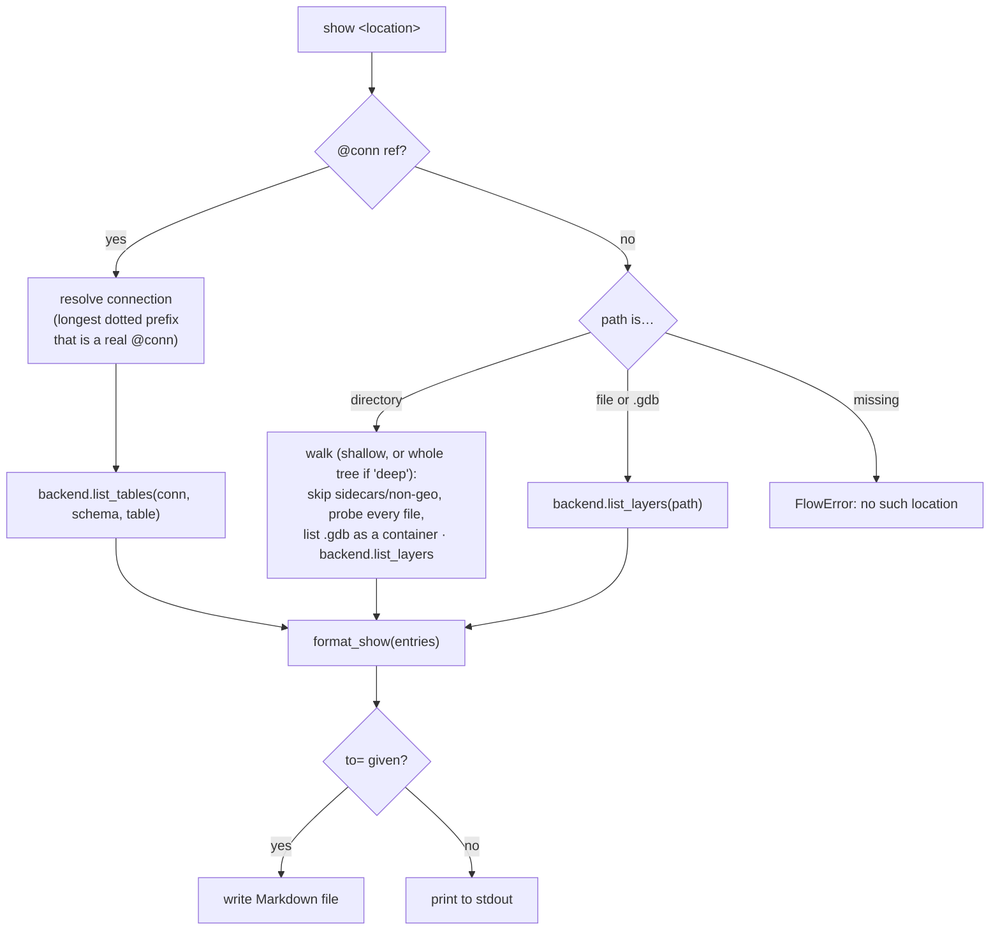
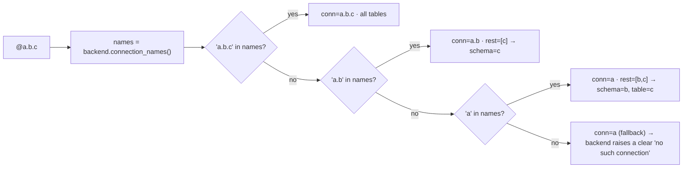
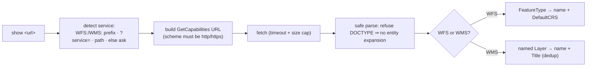

# 17 — The `show` verb: list available data at a location

**Status:** files + database connections in v0.29.0; **remote WFS/WMS services in v0.30.0**.
XYZ / vector-tile / ArcGIS REST and `/vsicurl` cloud rasters remain a follow-up.

Related: [13-verb-reference](13-verb-reference.md), [16-anatomy-of-a-verb](16-anatomy-of-a-verb.md),
[15-postgis-and-project-design](15-postgis-and-project-design.md) (the `@conn` model).

## Why

Before you can `load` anything you have to know **what's there and what it's called**.
Inside QGIS the Browser answers that; from a shell — or against a PostGIS connection you
didn't set up — there's nothing. `show` is that missing "what can I load here?" listing:
point it at a file, a directory, or a `@conn` and get back layer/table **names** plus a few
identifying attributes, and a copy-pasteable source you can hand to `load` or `ogrinfo`.

### `show` vs `catalog` vs `info`

| Verb | Question it answers | Cost | Output |
|---|---|---|---|
| `show` | "What can I load *here*, and what's its name/type?" | cheap (names + type, **no counts**) | one location, a flat table |
| `catalog` | "Inventory *everything under this tree* in detail." | deep (CRS, extent, fields, feature counts) | recursive, per-dataset report |
| `info` | "What does my QGIS *environment* look like?" | cheap | versions, providers, `@conn` names |

`show` is intentionally the lightweight one — it never counts features or opens every layer
for full profiling. When you want depth on one layer, the footer points you at
`load … | assess` or `ogrinfo`.

## Grammar

```
show <location> [deep] [to=<out.md>]
```

`<location>` is a file, a directory, a `@conn` database connection, or a **WFS/WMS URL**
(below). One of:

- a **file** — `show roads.shp`, `show dem.tif`, `show data.gpkg` (a multi-layer container
  expands to one row per layer)
- a **directory** — `show data/` lists the immediate children; the **`deep`** flag
  (`show data/ deep`) recurses the whole tree. Discovery is **format-agnostic**: every file is
  probed via the backend, which returns no layers for anything QGIS can't read, so any
  GDAL/OGR-readable dataset is listed (SpatiaLite, FileGDB, MBTiles, …) — there is **no fixed
  extension allowlist**. Dataset **sidecars** (`.dbf`/`.shx`/`.prj`/`.aux.xml`/…) and obviously
  non-geospatial files (code/docs/images/archives) are skipped; directory-based datasets
  (FileGDB `.gdb`) are listed as a container and not descended into.
- a **database connection** — `show @conn` (all tables), `show @conn.schema` (one schema),
  `show @conn.schema.table` (one table)

Terminal verb (like `catalog`/`info`): prints a Markdown table to stdout, or writes it with
`to=`. Nothing is piped onward — `show` and `catalog` are parallel terminal tools, not
composable stages (`show … | catalog` is invalid on both ends).

The `deep` flag is an unresolved positional in `Stage.args` (the parser doesn't split
positionals from flags); `_show` pulls `deep`/`recursive` out of the args and treats the single
remaining arg as the location.

## Dispatch



Each entry is a uniform dict — `{name, kind, type, format, ref}` — regardless of backend:

| field | file source | DB source |
|---|---|---|
| `name` | layer name | table name |
| `kind` | `vector` / `raster` | `vector` / `raster` / `table` (aspatial) |
| `type` | geometry (`MultiPolygon`) or `N band · Float32` | geometry of the table's geom column |
| `format` | OGR/GDAL driver (`GPKG`, `GTiff`, `ESRI Shapefile`) | provider (`postgres`, `spatialite`) |
| `ref` | `path\|layername=…` (or bare path) | `@conn[.schema].table` |

## Backend boundary

Two new methods on `Backend` (mirrored by `MockBackend` for the QGIS-free tier):

- `list_layers(source) -> [entry]` — **PyqgisBackend** uses
  `QgsProviderRegistry.querySublayers(source)`, the one primitive that uniformly enumerates
  GeoPackage (vector **and** raster), SpatiaLite, shapefiles, GeoTIFFs, … with name, layer
  type, WKB geometry type, driver name, and a ready-to-load URI. Raster band count + pixel
  type come from a lazy `QgsRasterLayer` open.
- `list_tables(conn, schema, table) -> [entry]` — uses the QGIS connection API
  (`connection.tables(schema)` → `TableProperty`). SpatiaLite has no schemas
  (`schemas()` raises) → a single unnamed schema; PostGIS iterates `schemas()` (or just the
  one requested). Geometry type from the table's first geometry column.

A third helper, `connection_names()`, lets the engine resolve a `@conn` reference robustly.

### Connection-name resolution (the dotted-name problem)

`@conn.table` splits on `.`, but **connection names can themselves contain dots** — the user's
real SpatiaLite connections are literally named `actual_spatialite.sqlite` and `spatialite.db`.
A naive split of `@actual_spatialite.sqlite` would read `conn=actual_spatialite, table=sqlite`
and fail. So the engine resolves the connection as the **longest dotted prefix of the
reference that is an actually-registered connection name**, then interprets the remainder:



One trailing component after the connection name is a **schema** scope (you're listing, so a
schema is the natural narrowing); two are schema + table.

## Security

Same boundary as the rest of the `@conn` model (global CLAUDE.md §1/§14, doc 12): only the
connection **name** is ever in scope — host, user, and password stay in QGIS's store. `show`
reads table metadata via the connection API; it never builds a connection string, never logs
credentials, and the listing's `ref` column carries only the `@conn.table` name.

## Remote services (v0.30.0)

`show <url>` lists a **WFS** endpoint's feature types or a **WMS** endpoint's layers. This is
pure standard-library HTTP + XML — no QGIS, no third-party deps — so it lives in `niva/remote.py`
and is fully unit-testable offline by injecting the `fetch` callable. The backend
(`PyqgisBackend.list_service`) just delegates there; the engine routes a service URL (detected by
`remote.is_service_url`) to `Backend.list_service`.



**Security** (global CLAUDE.md §7/§14): only `http`/`https` URLs are fetched (a `WFS:file://…`
can't read local files); HTTPS certs are validated by urllib defaults; every request is timed
and the response size-capped; the XML parser **refuses any `<!DOCTYPE>`**, so no internal or
external entities are ever expanded (blocks billion-laughs / XXE without `defusedxml`). No
credentials are sent — authenticated OWS is out of scope. The URL is user-supplied on the CLI
(like `curl`), so this is intended, not SSRF.

Entry shape is the usual `{name, kind, type, format, ref}`: WFS → `kind=vector`,
`type=DefaultCRS`, `format=WFS`; WMS → `kind=raster`, `type=Title`, `format=WMS`. `ref` is the
GDAL-style `WFS:<url>` / `WMS:<url>`, so `ogrinfo "<ref>" <layer>` works for WFS.

## Out of scope (next round)

- **XYZ / vector-tile / ArcGIS REST** endpoints, and saved OWS connections by name.
- **Cloud rasters** via GDAL `/vsicurl`, `/vsis3`, … .
- **Authenticated** OWS services (credentials).
- Feature/row **counts** — deliberately omitted to keep `show` instant; use `catalog` or
  `load … | assess` when you want them.
