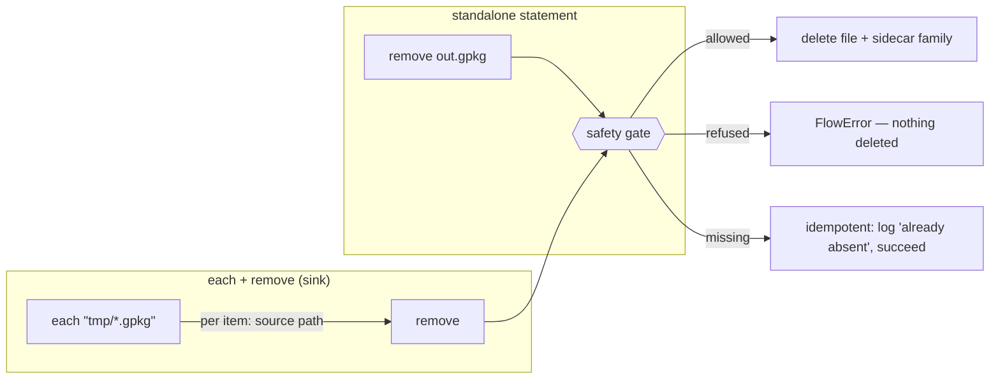
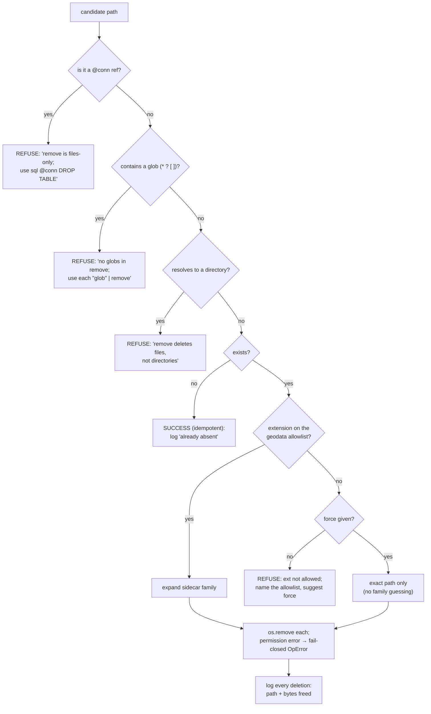
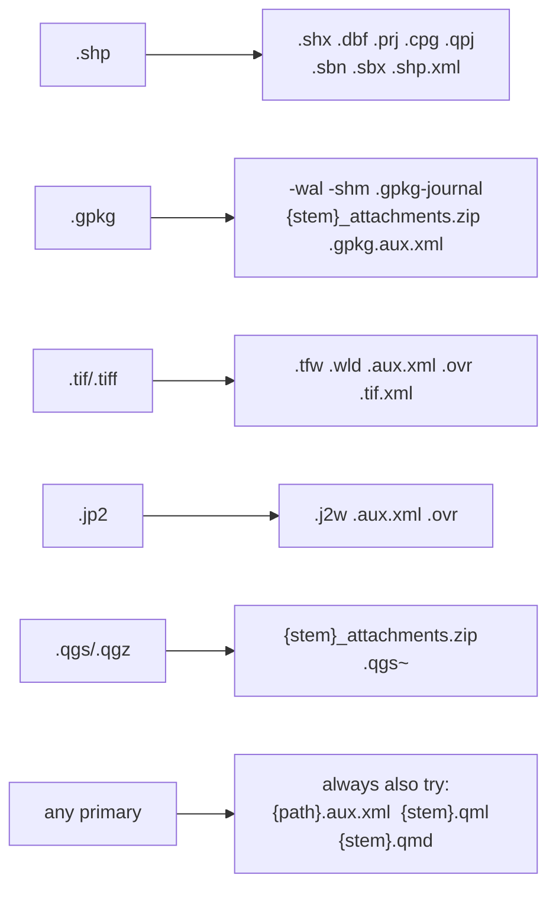

# 18 · The `remove` verb — safe deletion of file outputs

> Status: **design** (for review before implementation).
> Cross-refs: [16 · Anatomy of a verb](16-anatomy-of-a-verb.md) ·
> [02 · Architecture](02-architecture.md) · [13 · Verb reference](13-verb-reference.md).

## 1. Why

niva can *create and overwrite* outputs (`save`, `save … mode=replace`, and for DB tables
`sql @conn "DROP TABLE …"`), but it has **no way to delete a file from disk**. That gap shows up
the moment you want a flow — or a generated script like `tests/suites/validation_suite_2.run.niva` —
to clean up after itself: the harness has to shell out to `os.remove`, and the pure `.niva`
can only drop database tables, leaving GeoPackages/GeoTIFFs/shapefiles behind.

`remove` closes that gap **for files only**, behind a deliberately strict safety gate. It is the
one destructive, hard-to-reverse verb in niva, so the design is mostly about what it *refuses*.

### Decisions taken (this round)

| Question | Choice |
|---|---|
| Name | **`remove`** (distinct from `dropfields`/`dissolve`; reads as "remove this dataset") |
| Scope | **Files + their sidecar family only** — *not* `@conn` tables, *not* GeoPackage sub-layers |
| Safety gate | **Strict extension allowlist**, with an explicit per-path **`force`** escape hatch |
| Batch | **Via `each` only** — no bare globs/dirs inside `remove` |

Out of scope (use existing tools): deleting a DB table → `sql @conn "DROP TABLE …"`; deleting one
layer inside a GeoPackage → `save … mode=replace` semantics or OGR directly. These may come later.

## 2. Surface

```
remove <path> [force]                 # delete one file + its sidecars
each "<glob|dir>" | remove [force]     # batch: delete each matched file
```

`remove` is a **terminal statement / sink** — it consumes a path (or, in a batch, the current
item's source path) and returns nothing downstream, so it can't be piped into another op. It needs
no QGIS layer: it never loads geometry, it only touches the filesystem.

```
# self-cleaning flow
load roads.gpkg | clip aoi.gpkg | save tmp_clip.gpkg | … 
remove tmp_clip.gpkg

# batch cleanup of a scratch folder (each item validated individually)
each "/tmp/niva_scratch/*.gpkg" | remove

# force past the allowlist for one non-geodata file niva wrote
remove run_report.md force
```

### Role in a flow



In a batch, `remove` takes **no path argument** — it deletes the file underlying the current
`each` item. Paths are de-duplicated within a batch, so `each <multilayer.gpkg> | remove` (which
`each` expands one-item-per-layer) deletes the single container once, not once per layer.

## 3. The safety gate (the whole point)

Every deletion passes the same ordered gate. Any failed check raises a `FlowError`/`OpError`
**before anything is deleted** (fail-closed); the only "soft" outcome is *missing → success*.



Notes on each guard:

- **`@conn` refs, globs, directories → hard refusals.** These are the three classic ways a delete
  verb turns into a foot-gun (drop a whole DB, glob-nuke a tree, recurse a folder). `remove` simply
  doesn't do them; the error tells you the supported path (`sql DROP`, `each`, or naming files).
- **Missing path → idempotent success.** A *cleanup* verb must be safe to re-run; "already gone"
  is the goal achieved, not an error. It's logged, not silent.
- **Extension allowlist** (below) is the core guard. `force` bypasses **only** this check, for a
  single named file, and then deletes **exactly that path** (no sidecar guessing, since family
  rules are keyed off recognized extensions). `force` never relaxes the @conn/glob/dir refusals.
- **Permission / I/O error → fail-closed `OpError`.** We never half-delete a family and swallow the
  rest; the error names the path that couldn't be removed.

### 3.1 Allowlist (recognized geodata + niva-written sidecars/exports)

```
vector   .gpkg .shp .geojson .gml .kml .kmz .fgb .sqlite .spatialite .tab .mif .dxf
raster   .tif .tiff .jp2 .img .vrt .asc .nc .grd
niva out .qml .qmd .sld .qlr .qgs .qgz
```

Deliberately **excluded** (need `force`): source code, dotfiles (`.env`, `.bashrc`), `.md`/`.txt`
reports, `.csv`/`.json` (ambiguous: could be primary data, not a niva output), archives, anything
unrecognized. Extension match is case-insensitive on the final suffix.

### 3.2 Sidecar families (deleted alongside an allowlisted primary)



This is what makes `remove roads.shp` actually clean (no orphan `.dbf`/`.prj`) and fixes the real
leak we saw in the validation harness: `project new` writes `<name>_attachments.zip` next to the
`.qgs`, which a naive single-file delete misses.

## 4. Where it lives (implementation sketch)

Per [16 · Anatomy of a verb](16-anatomy-of-a-verb.md), `remove` is a **built-in** (no QGIS
algorithm backs file deletion), so it's one line in `Engine._BUILTIN_VERBS` plus an `_remove`
method — and a backend call. The *policy* (allowlist, glob/dir/@conn checks, sidecar-family
resolution) is **pure** and lives in a standalone, unit-testable module so both backends share it
and it needs no QGIS:

```
niva/remove_policy.py        # pure: classify(path, force) -> Plan | Refusal; family(path) -> [paths]
                             #       is_glob / is_conn_ref / on_allowlist
Engine._remove(stage)        # parse `remove <path> [force]`; in a batch, take the item path;
                             #   call policy; hand the resolved Plan to the backend
Backend.remove_files(plan)   # MockBackend: record intended deletions (pure tests, no real FS)
                             # PyqgisBackend: os.remove each, fail-closed, return bytes freed
```

The grammar already parses a builtin statement with a path arg + flags; `force` binds as a flag
(`remove x.gpkg force` or `… -force`). `remove` records a journal entry (`kind="remove"`) listing
the paths removed and bytes freed — **never file contents** — consistent with niva's logging rules.

## 5. Test plan

- **Pure (MockBackend / policy module), no QGIS:**
  - allowlisted file → plan includes the primary + exactly the right sidecar family;
  - `force` on a non-allowlisted ext → plan is the exact path only, no family;
  - `@conn.table`, a glob, and a directory each → `Refusal` with the right message;
  - non-allowlisted ext without `force` → `Refusal` naming the allowlist;
  - missing path → idempotent success;
  - batch path de-duplication (one container, many `each` layers → one delete).
- **Live (filesystem):**
  - write a real `.shp` (+ sidecars) and `.gpkg` (+ `-wal`), `remove`, assert the whole family is
    gone and nothing else in the dir is touched;
  - `project new` → `.qgs` + `_attachments.zip`, `remove the.qgs`, assert the zip is gone too;
  - permission-denied path → `OpError`, neighbouring files untouched.
- **Suite integration:** once shipped, the validation runner can emit `remove` lines into the pure
  `*.run.niva`, making the generated scripts **fully self-cleaning** (files *and* DB) — the thing
  that prompted this verb.

## 6. Recommended addition (open question)

A **`-dryrun`** flag (`remove "…" -dryrun`, or a session/CLI `--dry-run`) that runs the gate and
**logs the exact plan without deleting**. For the one irreversible verb in niva this is cheap
insurance and makes `each "<glob>" | remove -dryrun` a safe "what would this nuke?" preview. Not in
the four locked decisions above — flagging it for a yes/no before implementation.
