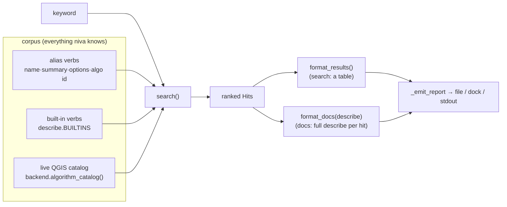

# 19 — Discovery: `search`, `docs`, and describe examples

How niva makes its own surface discoverable: a runnable **example** on every `describe`,
a fuzzy **`search`** over everything niva knows, and a **`docs`** verb that assembles a
made-to-order mini-guide. Added in v0.37.0.

## Why

`describe <verb>` already showed the verb→algorithm mapping, but you had to know the verb's
name first, and the output didn't show how to *use* it. Three gaps:

1. **No example** — a parameter list isn't a usage. Every description should end with a
   runnable flow.
2. **No discovery** — 45 verbs + 1000+ QGIS algorithms, and the only way in was knowing the
   name. Needed keyword search, and it had to be fuzzy (typos, partial words, synonyms).
3. **No "make me a guide"** — a user mid-task wants the full reference for *everything*
   about a topic, in one file they can keep. Piping `search | describe` doesn't fit (the
   niva pipe carries a *layer*, not a list of names), so this is one verb: `docs`.

## Shape

- **`describe` examples** — `Alias.example` carries a curated one for common verbs; verbs
  without one get `describe._example_for(alias)` synthesised from the signature
  (`load <src> | <verb> <required args/options> | save <out>`). Algorithm descriptions get
  `_example_for_algorithm(info)` → `load … | run <id> REQUIRED=<type> | save …` (INPUT/OUTPUT
  omitted — piped/temp). **Every shipped example is executed over MockBackend in CI**
  (`tests/test_describe.py::TestExamplesActuallyRun`), so a bad example fails the build.
- **`search`** (`niva/search.py`) — zero-dependency fuzzy ranking: exact/substring/token-prefix
  signals blended with `difflib.SequenceMatcher`. Multi-word queries are OR-matched. The corpus
  is alias verbs + `describe.BUILTINS` + the live catalog passed in by the caller.
- **`docs`** — same search, then `format_docs` calls `describe()` per hit and concatenates;
  one entry failing to introspect degrades to a note, never sinks the guide.
- **catalog enumeration** — `Backend.algorithm_catalog()` (concrete default `[]`);
  `PyqgisBackend` enumerates the live processing registry (hidden/deprecated skipped);
  `MockBackend` returns a small stub so search/docs are testable with no QGIS.

## Output routing

`search` and `docs` are **terminal report verbs**: they route through `Engine._emit_report`
(added 0.36.0) exactly like `show`/`info`/`describe` — `to=<file>` writes the report; otherwise
it streams to the plugin dock (progress set) or prints to stdout (CLI/API). Same text, every sink.

## Out of scope (for now)

- Ranking by usage frequency / popularity — purely lexical for now.
- Re-running a search result by index (shell-history style) — `docs` covers the "give me
  everything" need; per-result `describe <name>` covers the single case.
