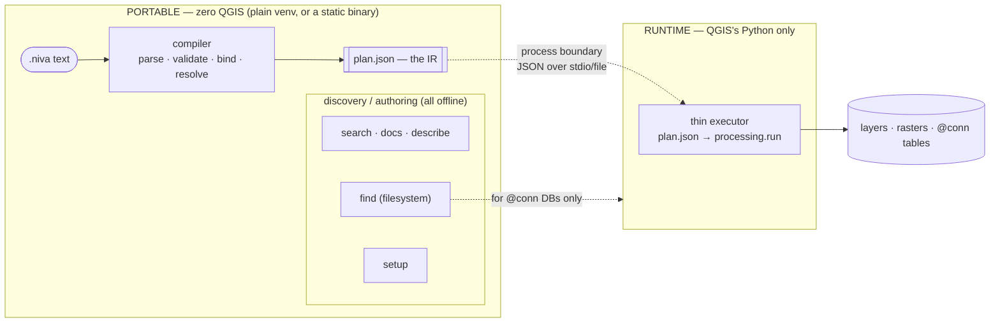
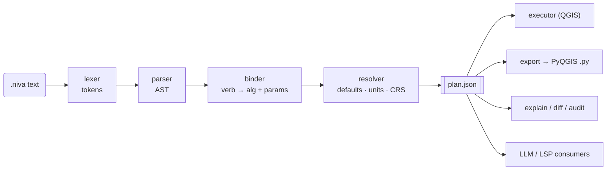
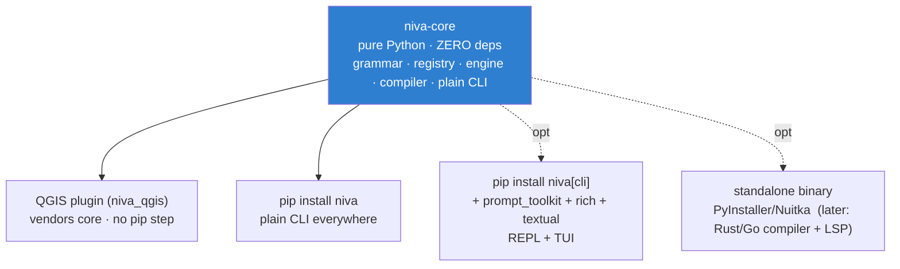
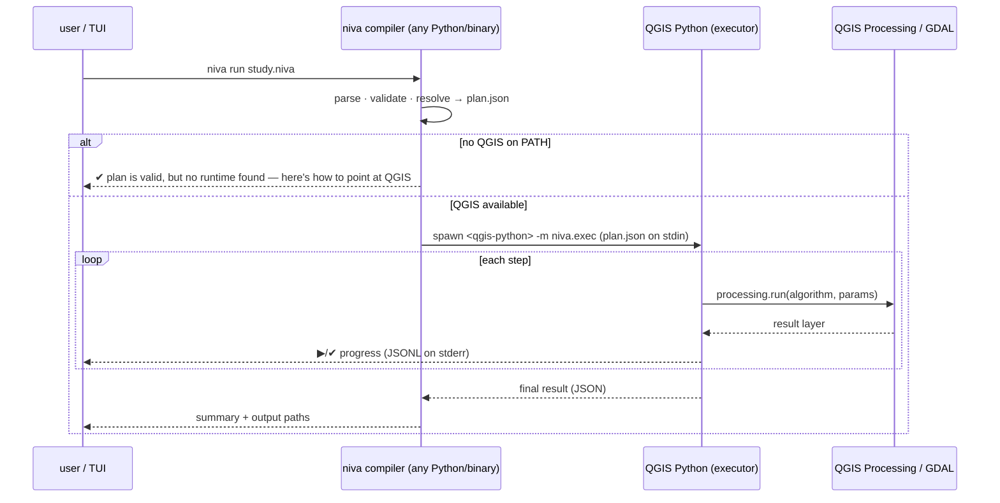
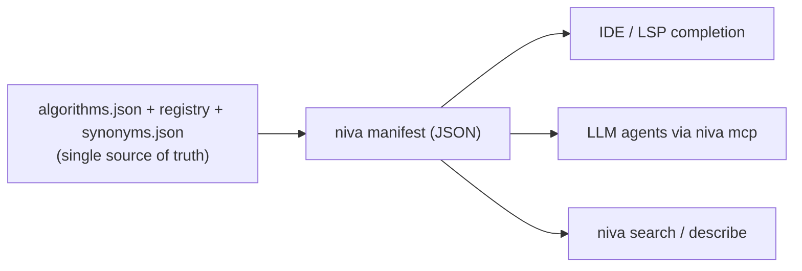
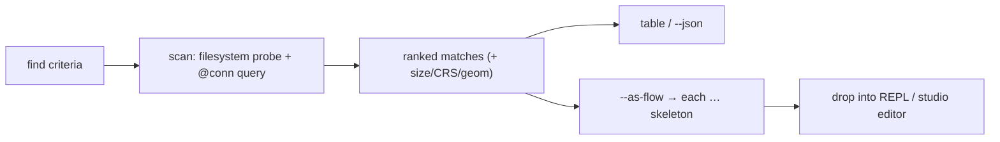
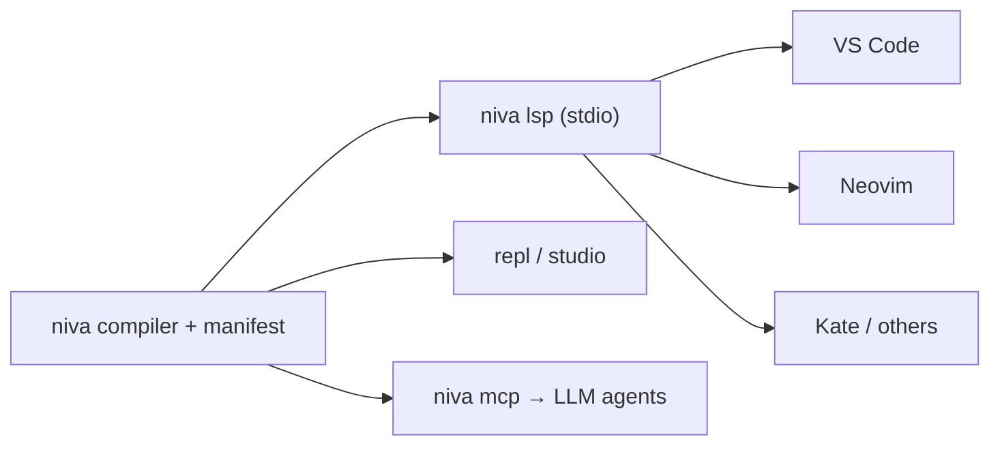
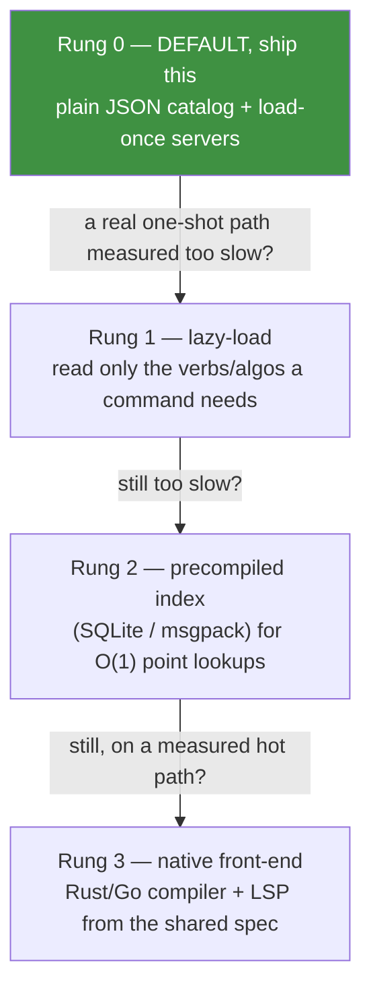
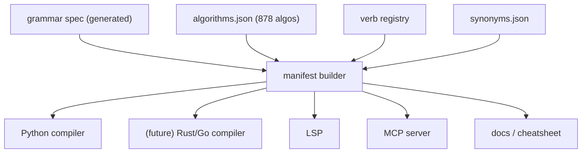

# 20 — The niva CLI & TUI: architecture, the plan IR, and a terminal studio

_Status: design for review._ A blueprint for turning niva's CLI into a fast, portable,
richly-interactive authoring surface that **needs no QGIS to write, lint, and explore flows**,
and delegates real execution to QGIS through one clean contract. Answers four issues as a single
coherent system:

- **#41** — a proper, rich, cross-platform CLI: autocomplete, suggestions, guiding, no QGIS required, able to replace the plugin UI.
- **#44** — a `search` command over verbs/algorithms with **synonyms** (mosaic ≈ merge ≈ append), consumable by IDEs and LLMs.
- **#43** — a `find` command that discovers data across the filesystem and databases.
- **#36** — `niva setup`: view/edit config without QGIS, portable across machines.

---

## 1. Goals & non-goals

**Goals**
- Author, lint, and explore flows with **zero QGIS and zero mandatory dependencies**.
- Scale smoothly from one-shot commands → an interactive REPL → a full-screen terminal IDE.
- Make niva's surface **machine-consumable** (IDEs, LSP, LLM agents) from the same source of truth.
- Keep the **plugin and library strictly zero-dependency**; richness is opt-in and lives elsewhere.
- Preserve one execution path of record (QGIS Processing) — never fork the runtime.

**Non-goals**
- Reimplementing geoprocessing. Execution is and stays QGIS/GDAL (C++). We orchestrate; we don't compute.
- A GUI. This is a *terminal* experience (works over SSH, in CI, on a headless box).

**Guiding principle — keep it easy until we need to make it hard.** Build the simplest thing that
works and defer complexity — optimisations, native code, indexes, extra machinery — behind *measured*
need, never a hypothetical one. This doc deliberately describes a large end state, but nothing here is
a commitment to build it all now: the phased roadmap (§14) ships one small, useful increment at a time,
and the `plan.json` IR (§3) exists precisely so every heavier option stays a cheap, drop-in choice for
*later* (see §12). Prefer boring, reversible steps; add power only when a real use case demands it.

---

## 2. The core insight — niva is a *compiler* and a *runtime*

niva is two programs sharing a name, and they have opposite dependency profiles.

| | **Compiler** (front-end) | **Runtime** (back-end) |
|---|---|---|
| Job | `.niva` → a resolved, validated **plan** | plan → `processing.run(...)`, I/O |
| Touches geodata? | No | Yes |
| Needs QGIS? | **No** | **Yes (only this)** |
| Good language | anything (Python today, Rust/Go later) | must be QGIS's Python/C++ |

**This seam already exists in the codebase**: the `Backend` ABC. `MockBackend` (no QGIS) already powers `validate`/`--dry-run`; `PyqgisBackend` is the runtime. The whole design below is "lift the compiler out, and make the runtime a loosely-coupled, pluggable executor behind a contract."



The payoff line: **~80% of what a person, IDE, or LLM does with niva is authoring — and authoring needs none of QGIS.** Only *running a plan* does, and only across a process boundary.

---

## 3. The plan IR — the contract that unlocks everything

> **IR = intermediate representation.** A stable, structured, machine-readable form that sits
> *between* the source (`.niva` text) and execution — the way a compiler's bytecode sits between
> source code and the CPU. Consumers work against the IR, never the raw text or the internal
> objects, so the front-end (parser/binder/language) and the back-end (executor/packaging) can each
> change independently as long as the IR stays stable.

The single most important artifact is exactly that: a **versioned, language-agnostic "resolved plan"**
(`plan.json`). Specify it once and language + packaging become swappable implementation details.



### 3.1 Schema (sketch)

```jsonc
{
  "niva_plan": "1",                     // IR version — bump on breaking changes
  "niva_version": "0.44.0",             // compiler that produced it
  "source": { "file": "study.niva", "sha256": "…" },
  "steps": [
    {
      "id": 1,
      "stage": "load roads.gpkg",        // original text, for diagnostics
      "op": "load",                      // niva verb / builtin
      "algorithm": null,                 // resolved provider:id, or null for builtins
      "params": { "source": "roads.gpkg" },
      "inputs": [],                      // step ids feeding this one
      "produces": "layer",               // layer | raster | table | none | report
      "injected_defaults": {}            // data-changing defaults the alias added (provenance)
    },
    {
      "id": 2,
      "stage": "buffer 100m dissolve",
      "op": "buffer",
      "algorithm": "native:buffer",
      "params": { "DISTANCE": {"value": 100, "unit": "m"}, "DISSOLVE": true,
                  "SEGMENTS": 5, "END_CAP_STYLE": 0 },
      "inputs": [1],
      "produces": "layer",
      "injected_defaults": { "SEGMENTS": 5, "END_CAP_STYLE": "Round" }
    }
  ],
  "diagnostics": [ { "line": 2, "severity": "warning", "code": "no-unit",
                     "message": "…" } ],
  "requires_qgis": true                  // false ⇒ fully runnable checks only (no exec needed)
}
```

### 3.2 Why the IR matters

- **`explain`, `diff`, `audit`, provenance** all become *reads of the IR* — one representation, many consumers.
- **Reproducibility**: `plan.json` pins every injected default → the exact method is captured (ties to `08-data-quality-provenance.md`).
- **Any front-end** that can emit `plan.json` (Python now, Rust/Go later) plugs into the *same* executor.
- **LLMs/IDEs** consume the IR + diagnostics as structured data, not scraped text.

---

## 4. Packaging & distribution

Three artifacts, one core, plus two optional escalations. **The plugin only ever ships the zero-dep core.**



| Artifact | Deps | Ships to | Delivers |
|---|---|---|---|
| **niva-core** | none | plugin (vendored) + `pip install niva` | grammar, compiler, plain CLI, plan IR |
| **niva[cli]** | `prompt_toolkit`, `rich`, `textual` | opt-in `pip install niva[cli]` | REPL, colour, full-screen TUI |
| **binary** | bundled | download, one file | zero-install author/lint/LSP |

Graceful degradation is a hard rule: **every command runs on niva-core alone**; the `[cli]` extras only *upgrade* the experience (colour → plain, fuzzy dropdown → readline). Detect at runtime; never hard-import an extra in a core path.

---

## 5. Execution — how the front-end reaches QGIS (loose coupling)

The compiler produces `plan.json`; a thin executor inside QGIS's Python consumes it. Coupling is a **process boundary + JSON**, never in-process linkage.



**Runtime discovery** (in priority order), all overridable by `NIVA_QGIS_PYTHON`:
1. An explicit env var / `niva setup` value.
2. `qgis_process` on `PATH` (headless QGIS runner — ideal for CI).
3. A detected QGIS install's bundled Python (OSGeo4W / `.app` / system).
4. If we *are already* running in QGIS's Python (plugin, or `niva` launched by QGIS) — execute in-process, no subprocess.

Trade-off note: `qgis_process` is the cleanest headless contract but has historically not exposed every provider; the `-m niva.exec` shim gives us full `processing.run` fidelity. Support both; prefer the shim when a full QGIS Python is found, fall back to `qgis_process` for CI.

---

## 6. The command surface

One binary, subcommands. Everything above the line is **offline**; below needs a runtime.

| Command | Offline? | Issue | Notes |
|---|---|---|---|
| `niva run <flow>` | needs runtime | — | compile → execute (subprocess/in-proc) |
| `niva validate <flow…>` | ✅ | — | already shipped; the compiler's diagnostics |
| `niva explain <flow>` | ✅ | — | print the resolved plan (IR, human view) |
| `niva describe <verb\|id>` | ✅ | — | already shipped (reads `algorithms.json`) |
| `niva search <kw>` | ✅ | **#44** | fuzzy + synonym-aware; `--json` for machines |
| `niva find <criteria>` | fs ✅ / db needs runtime | **#43** | data discovery → table or `plan` source |
| `niva setup [wizard\|get\|set\|doctor]` | ✅ | **#36** | portable config + environment diagnosis |
| `niva export/import` | ✅ | — | already shipped; `.niva` ↔ PyQGIS |
| `niva repl` | ✅ (richer with `[cli]`) | **#41** | interactive authoring |
| `niva studio` | ✅ (needs `[cli]`) | **#41** | full-screen terminal IDE |
| `niva lsp` | ✅ | **#41/#44** | Language Server for editors |
| `niva mcp` | ✅ | **#44** | Model Context Protocol server for LLM agents |
| `niva manifest` | ✅ | **#44** | emit the machine-readable catalog |

---

## 7. #44 — search, synonyms, and a machine-readable catalog

Three deliverables from one data asset.

**(a) `niva search <kw>` — synonym-aware.** Beyond today's fuzzy match, add a curated **synonym map** so intent finds the verb even when the word differs:

```
merge   → collect, dissolve, run gdal:merge, run native:mergevectorlayers
mosaic  → run gdal:merge (raster), run gdal:buildvirtualraster
append  → run native:mergevectorlayers, save … mode=append
```

The synonym map is small hand-curated data (`registry/synonyms.json`) layered on top of the existing token/description fuzzy search — so results rank: exact verb → synonym → fuzzy-name → description hit.

**(b) `niva manifest` — the tool manifest.** A single JSON describing every verb: canonical name, aliases/synonyms, one-line summary, parameters (name/type/default/enum), a runnable example, and the resolved `provider:id`. Built from `algorithms.json` + the registry + the synonym map. This is what IDEs and LLMs consume — no scraping.

**(c) `niva mcp` — grounded LLM tool-use.** An MCP server exposing `search`, `describe`, `validate`, and `manifest` as tools. An agent authoring a flow can *query the real catalog and lint its draft* instead of hallucinating a `stats` verb — the exact failure mode that motivated #28, now closed structurally at the source. (Ties directly to `AGENTS.md`'s "ground every claim in the source" rule.)



---

## 8. #43 — `find`: data discovery as a first-class source

`niva find` answers "what data do I have that matches X," across everything QGIS can see.

```
niva find "*.gpkg" in ~/data --geom polygon --crs EPSG:2262 --min-features 1
niva find --in @gisdb3 --schema public --has-field parcel_id --bbox aoi.gpkg
```

**Criteria:** glob/extension, geometry type, CRS, feature-count range, bbox intersect, has-field, format, mtime. Filesystem scanning is **offline** (reuses the `catalog`/`show` sublayer probing); `@conn` database search needs the runtime.

**Output modes:**
- **table** (default) — human, sortable, with the same size hints `show` now gives (#21).
- `--json` — for tools.
- **`--as-flow`** — emit a batch `each` skeleton over the matches, e.g. `each "…matches…" | <your stages> | save "out/{name}.gpkg"` — so *find becomes the data source of a flow*. Discovery and authoring compose.



---

## 9. #36 — `niva setup`: portable config + doctor

Config without opening QGIS, and portable between machines.

- **A single, documented, portable file** — `~/.config/niva/config.toml` (XDG; platform-appropriate elsewhere), every key commented. Copy it to move your setup.
- `niva setup wizard` — interactive walk-through (log dir, scratch dir, QGIS runtime path, ntfy/email — secrets to the OS keyring, never the file).
- `niva setup get/set <key>` — scriptable.
- `niva setup export/import` — bundle non-secret config for transport.
- `niva setup doctor` — one report: niva version, resolved QGIS runtime, providers present (native/gdal/grass/pdal/…), `pdal_wrench`, connection health. Generalizes the existing `niva pdal check` into a whole-environment diagnosis; the plugin's Setup tab and this command read/write the **same** config.

---

## 10. #41 — how rich can the terminal get? (the creative ceiling)

Terminals in 2026 are not teletypes. With `textual` (from Rich's author) we can build a genuine IDE-in-the-terminal — mouse, panes, live widgets, themes, over SSH, no display server. Here is the honest capability ladder.

### Tier 0 — plain CLI (niva-core, zero deps, always available)
One-shot commands, `argparse`, hand-rolled ANSI colour (auto-off when not a TTY / `NO_COLOR`), `readline` tab-completion. Works literally everywhere.

### Tier 1 — the REPL (`niva repl`, richer with `[cli]`)
A `prompt_toolkit` read-eval-print loop for authoring:
- **Multiline flow editing** with **live syntax highlighting** (verbs / options / strings / comments — same token model as the plugin highlighter, #35).
- **Context-aware completion dropdowns**: verbs, then that verb's options, then enum *values*, then **file paths** and **`@connections`** — sourced from the manifest.
- **Live validation in the bottom toolbar** — as you type, the compiler runs; the toolbar shows `✔ valid` or `✗ line 2: no option 'segmentz'`. Author-time, not run-time.
- **Inline `?verb`** → describe popover; **`/search kw`** → synonym search without leaving the line.
- **`.run`** compiles and executes via the QGIS subprocess, streaming progress back.

```
niva ▸ load roads.gpkg | buffer 100m disolve | save out.gpkg
                                      ┌───────────────────────────┐
                                      │ dissolve   flag           │  ← completion
                                      │ segments=  option (int)   │
                                      │ cap=       enum: round…   │
                                      └───────────────────────────┘
 ✗ line 1: unknown option `disolve` — did you mean `dissolve`?      ← live toolbar
```

### Tier 2 — "niva studio" (`niva studio`, `textual`) — the terminal IDE
A full-screen app. Proposed layout:

```
┌ niva studio ─────────────────────────────────────── study.niva ● unsaved ┐
│ Flow ─────────────────────────────┐ Resolved plan ───────────────────────┐│
│ 1  load roads.gpkg               ⚠│ 1 load        source=roads.gpkg       ││
│ 2  | reproject EPSG:2262          │ 2 native:...  reproject  CRS=EPSG:2262 ││
│ 3  | buffer 100m dissolve         │ 3 native:buffer DISTANCE=100 m         ││
│ 4  | save corridors.gpkg          │              SEGMENTS=5 (default)      ││
│    ▏cursor                        │ 4 save        corridors.gpkg           ││
├───────────────────────────────────┴────────────────────────────────────────┤
│ Problems (1) ─────────────────────┐ Palette  (Ctrl-P) ──────────────────────┐│
│ ⚠ 1:6 no-unit? none — buffer is m │  buffer   mosaic→merge   find polygons  ││
│ Output ───────────────────────────┤  describe reproject      run gdal:…     ││
│ ▶ native:buffer …  ✔ 812 feat 0.4s│                                         ││
└ F5 Run  ^S Save  ^P Palette  ^F Find data  ^D Describe  ^L Log  ^Q Quit ─────┘
```

Concretely achievable widgets/behaviours:
- **Editor pane** with syntax highlighting + a **diagnostics gutter** (⚠/✗ per line, IDE-style), recompiling on idle.
- **Live "Resolved plan" pane** — the IR rendered, updating as you type; shows injected defaults inline (the reproducibility story, visible).
- **Problems pane** — click a diagnostic → jump to the line.
- **Command palette** (`Ctrl-P`) — fuzzy + synonym search over verbs/algorithms (#44), Enter to insert.
- **Data browser** (`Ctrl-F`) — run `find` (#43) in a modal, pick results, insert as an `each` skeleton or a `load` line.
- **Describe popover** (`Ctrl-D`) — the verb under the cursor, with its example.
- **Run** (`F5`) — execute via the QGIS runtime, stream progress + a per-step progress bar into the Output pane; failures land back in Problems.
- **Themes** — light/dark, honouring the same styling knobs as the plugin (#35 parity).
- **Mouse + keyboard**, resizable splits, and it all runs over SSH.

This is, deliberately, "VS Code for niva, in a terminal" — and it is the same offline compiler underneath, so it needs **no QGIS to author**; only `F5` reaches out to a runtime.

### Capability reality-check

| Want | Terminal-achievable? | How |
|---|---|---|
| Syntax highlighting | ✅ | token model already exists (plugin highlighter) |
| IDE-style squiggles/gutter | ✅ | recompile-on-idle → diagnostics → gutter marks |
| Autocomplete w/ descriptions | ✅ | manifest-driven completion source |
| Live resolved-plan preview | ✅ | render the IR on each edit |
| Mouse, panes, themes, SSH | ✅ | `textual` |
| Fuzzy command palette | ✅ | manifest + synonyms |
| Inline map/geometry preview | ⚠ limited | ASCII/Unicode bbox sparkline or sixel where supported; real rendering stays in QGIS |
| True vector rendering | ❌ | that's QGIS's job — `figure`/`map` verbs, or the plugin |

---

## 11. Autocomplete & editor integration (LSP)

Two audiences, one manifest.

- **Shell completions** — generate bash/zsh/fish/PowerShell completion for subcommands, verbs, and options (`niva completions <shell>`).
- **`niva lsp`** — a Language Server (over stdio) so **any editor** (VS Code, Neovim, Kate, …) gets completion, hover-describe, and live diagnostics on `.niva` files, powered by the compiler + manifest. This subsumes the current per-editor grammar files with real intelligence, and it is the same engine as the REPL/studio.



---

## 12. Performance & cold-start

Interrogating Python's performance is the right instinct, but the workload points the concern at one
narrow place — and the governing rule is **keep it easy until a measurement forces us to make it hard.**

### What actually costs (it isn't the lookups)

| Cost | Python | Rust/Go | When it matters |
|---|---|---|---|
| the lookup (verb hit; fuzzy over 878 algos) | µs–few ms | ns–µs | ~never — 900 items is tiny |
| per-invocation setup (interpreter + import + parse the 2 MB catalog) | ~80–180 ms | ~1–5 ms | **the only real one** |

A dict hit or a fuzzy scan over ~900 items is microsecond work in either language. The real cost is
**cold-start** — interpreter startup + parsing the catalog on every *one-shot* invocation. This is a
launch-latency question, not a compute-throughput one.

### The one win that's free (architecture, not optimization)

Split by usage mode:
- **Long-running processes** (`repl`, `studio`, `lsp`, `mcp`) load the catalog **once**, then every
  keystroke's validate/complete is an in-memory hit (µs). The ~100 ms startup is paid once and
  amortised over thousands of ops. **This is exactly why the latency-sensitive consumers are servers,
  not per-invocation shell-outs** — and it needs no optimisation work, just the design as drawn.
- **One-shot commands** (`search`, `validate x.niva`) pay cold-start each time (~150 ms) — imperceptible
  to a human; only bites under high-frequency automation (an LLM loop, a per-keystroke shell-out, CI
  running one process per file).

### The rule: start easy, measure, escalate only on proven need

**Do not pre-optimise.** Ship the simplest thing — the plain JSON catalog already in the wheel, loaded
once in servers — and *measure* a real one-shot path before adding any machinery. The escalation ladder,
climbed **only when a measurement demands it**:



Each rung is more work and more moving parts than the last; you climb only as far as a *measured*
bottleneck forces you, and no further. **Rung 0 is almost certainly enough** for humans and for
warm-server consumers. The higher rungs (including the SQLite index) exist for a *proven* high-frequency
one-shot need — not a hypothetical one, and not by default.

### Why deferring every optimisation is safe here

The architecture is what earns the right to stay on Rung 0: because the **`plan.json` IR is the
contract** and the **catalog/grammar are generated data**, every rung above is a **drop-in behind the
same interface** — swap JSON for an index, or Python for a Rust front-end, with **no logic fork and no
rewrite**. We get to keep it easy *precisely because* the hard options stay cheap to reach later.
Optimise when it hurts; not before.

---

## 13. Source of truth & drift avoidance

Everything above is safe **only** if one rule holds: **the catalog and grammar are *data*, and every surface is generated from that data — never hand-copied.**



If we later reimplement the compiler in Rust/Go for a static binary + fast LSP, it consumes the *same* generated spec + `algorithms.json`. Two implementations, one truth — no fork. This is the precondition that makes "other, more performant languages" a bounded engineering task rather than a maintenance trap.

---

## 14. Phased roadmap

| Phase | Deliverable | Deps | Unlocks |
|---|---|---|---|
| **0. IR + manifest** | Factor the compiler to emit `plan.json`; ship `niva manifest` + `synonyms.json` | none | every consumer below |
| **1. Offline commands** | `niva search` (#44), `niva find` fs (#43), `niva setup` (#36), `niva explain` | none | the authoring loop, no QGIS |
| **2. Executor contract** | `niva.exec` shim + runtime discovery; `niva run` uses the subprocess path | QGIS (runtime only) | run-from-anywhere |
| **3. Rich layer** | `niva repl`, `niva lsp` | `[cli]` / stdlib LSP | interactive authoring + editors |
| **4. Studio** | `niva studio` full TUI | `[cli]` (`textual`) | the terminal IDE |
| **5. Reach** | `niva mcp`; standalone binary (PyInstaller first) | — | LLM agents; zero-install |
| **6. (optional) native** | Rust/Go compiler + LSP from the shared spec | — | fastest cold-start, tiniest binary |

Each phase is independently valuable and shippable; the order is dependency-driven, not big-bang.

---

## 15. Risks & open questions

- **Runtime discovery UX** — finding QGIS's Python cleanly across OSGeo4W/macOS/Linux is the fiddliest bit. Mitigate: `niva setup doctor`, explicit override, and honest messages ("valid plan; no runtime found; here's how").
- **`qgis_process` vs `-m niva.exec` fidelity** — decide per-provider; keep both.
- **IR versioning** — treat `niva_plan` as a stable, versioned contract from day one; never break it silently.
- **Extra-dependency creep** — enforce "core paths must not import `[cli]` extras" with a CI import-linter check.
- **Drift** if a native compiler lands — non-negotiable: generate from the shared spec.
- **Scope of "replace the plugin UI"** — the TUI can match authoring/most verbs, but true map rendering stays with QGIS; be explicit that studio is a *pro/terminal* companion, not a full GIS canvas.

---

## 16. Cross-platform notes

- Pure-Python core + `textual`/`prompt_toolkit` are first-class on Windows, macOS, Linux (Windows Terminal handles ANSI/Unicode; legacy `cmd.exe` degrades to Tier 0).
- Config paths follow platform conventions (XDG on Linux, `%APPDATA%` on Windows, `~/Library` on macOS).
- Secrets go to the OS keyring, never the portable config file.
- The standalone binary is built per-OS in CI; the compiler is OS-agnostic.

---

_See also: `02-architecture.md` (engine layering), `10-grammar-spec.md` (the grammar the compiler owns), `11-cli-and-api-reference.md` (today's CLI), `19-search-docs-and-examples-design.md` (the discovery verbs this builds on), `08-data-quality-provenance.md` (why the IR pins defaults)._
