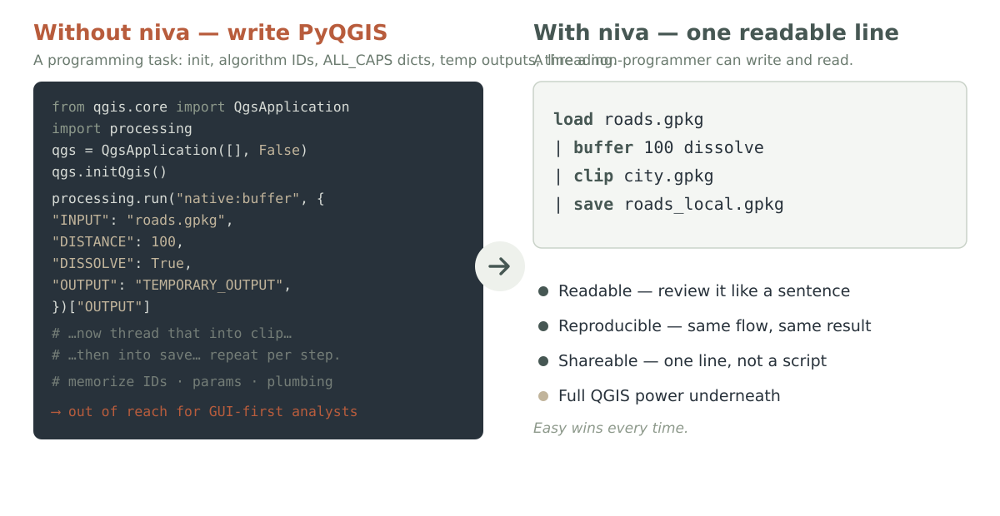
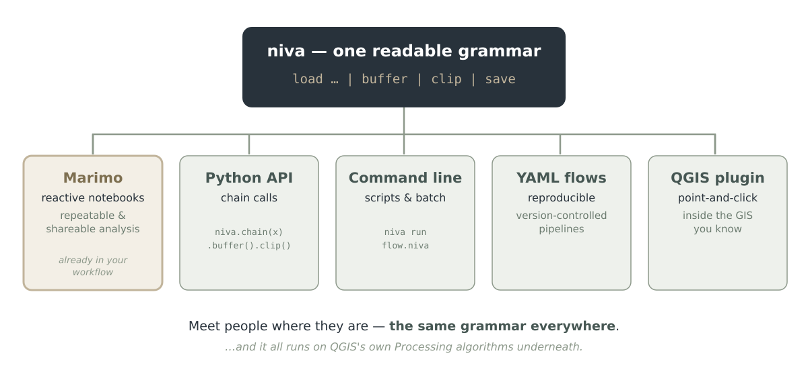
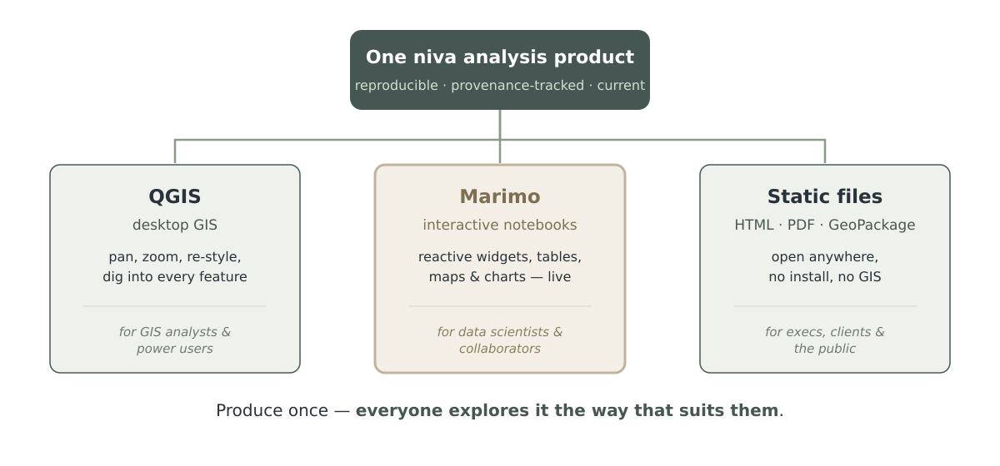
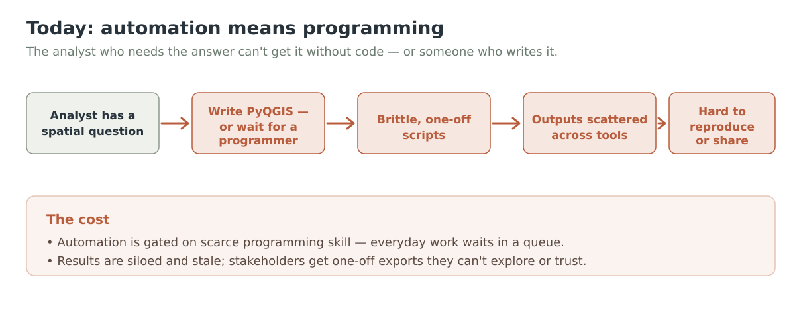
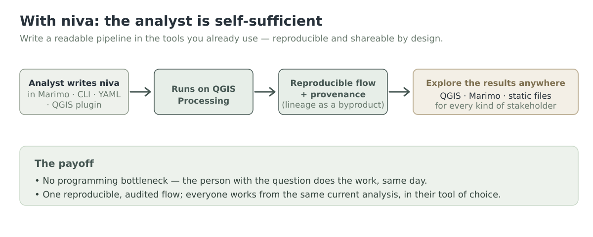

<!-- _class: center -->
<!-- _paginate: false -->
<!-- _footer: '' -->


# Readable geoprocessing for everyone

Spatial analysis a non-programmer can write, reproduce, and share.

**Easy wins every time**

<span class="note">Decision-maker &amp; analyst briefing</span>

---

> The opportunity

# Spatial questions are everywhere

<p class="big">The people who need the answers — analysts, scientists, planners — <strong>mostly aren't programmers.</strong></p>

<p class="lead">Yet to <strong>automate</strong> the work — to make it repeatable and shareable — today's tools demand that they write code. So the work waits, or doesn't happen.</p>

---

> The problem

# Automating QGIS means writing PyQGIS

<p class="lead">To script even simple geoprocessing today, you must:</p>

- **Initialize a `QgsApplication`** — boilerplate before any work begins
- **Memorize algorithm IDs** — `native:buffer`, `native:dissolve`, `native:clip`
- **Build ALL_CAPS parameter dicts** — and juggle `TEMPORARY_OUTPUT`
- **Thread each output into the next** — by hand, step after step

That's a <span style="color:#b85c3c;font-weight:700">programming task</span> — out of reach for the GUI-first analysts who need it most, and tedious even for those who can.

---

<!-- _class: graphic -->

> The shift

# Automation shouldn't require a programmer



---

> The product

# Meet niva

<p class="big">A concise, readable <strong>text-pipeline grammar</strong> for QGIS geoprocessing — for people who don't want to write PyQGIS.</p>

```
load roads.gpkg | buffer 100 dissolve | clip city.gpkg | save roads_local.gpkg
```

A whole pipeline on one line — that a non-programmer can **write and read** — running on QGIS's own Processing algorithms underneath.

<span class="note">Easy wins every time.</span>

---

> Audience

# Who niva is for

<div class="cols">
<div class="card"><h3>Decision-makers</h3><p>Faster answers without hiring scarce GIS programmers. Work that's auditable, reproducible, and shareable across the org.</p></div>
<div class="card warm"><h3>Data scientists<br>(non-programmers)</h3><p>Already use Marimo for repeatable, shareable analysis. Now add geoprocessing — in the same readable, reactive workflow.</p></div>
<div class="card"><h3>Downstream consumers</h3><p>Explore the results in QGIS, in Marimo, or as static files — whichever fits, no GIS expertise required.</p></div>
</div>

---

> Marimo-native

# It fits the workflow you already have

<p class="lead">Marimo is how your team makes analysis repeatable and shareable. niva runs right inside it:</p>

- **Write niva in a Marimo cell** — beside your Python and charts
- **Reactive** — change an input, the map and tables update live
- **Repeatable** — the notebook is the analysis; re-run any time, same result
- **Shareable** — hand someone the notebook, or export it; no setup ritual

**No new tool to adopt** — niva meets your people where they already work.

---

<!-- _class: graphic -->

> Flexible by design

# One grammar, many surfaces



---

> Trust the result

# Reproducible &amp; shareable — by design

<p class="lead">The value decision-makers care about most: results you can re-run, audit, and defend.</p>

- **Pipelines are the record** — the one-line flow (or YAML) *is* the documentation
- **Provenance as a byproduct** — every step auto-recorded as lineage metadata
- **Assess your inputs** — profile incoming data for quality before you trust it
- **Version-controlled flows** — diff and review analysis like any other text

---

<!-- _class: graphic -->

> For every stakeholder

# Produce once — explore it anywhere



---

<!-- _class: graphic -->

> Without niva

# The workflow today



---

<!-- _class: graphic -->

> With niva

# The workflow with niva



---

> Thin, not limiting

# All of QGIS — in plain language

<div class="stats">
<div class="stat"><div class="num">878</div><div class="lab">Processing algorithms</div></div>
<div class="stat"><div class="num">406</div><div class="lab">expression functions</div></div>
<div class="stat"><div class="num">SQL</div><div class="lab">SpatiaLite &amp; PostGIS</div></div>
</div>

<p class="lead">niva is a <strong>thin wrapper</strong> — friendly verbs mapped onto QGIS's own algorithms, not a re-implementation of GIS. The full power of the world's leading open-source GIS, in one readable line.</p>

---

> Beyond the vector layer

# Every data type QGIS reads

<div class="cols">
<div class="card"><h3>Point clouds</h3><p>✓ <code>each</code>/<code>show</code>/<code>catalog</code> see LAS · LAZ · COPC · E57 · …<br>✓ Friendly <code>dtm</code> · <code>dsm</code> · <code>hag</code> — raw LiDAR → raster</p></div>
<div class="card warm"><h3>Raster · mesh · vector</h3><p>✓ Discovery spans <strong>all</strong> GDAL formats + MDAL mesh<br>✓ One inventory: <code>catalog data/ to=report.md</code></p></div>
</div>

<p class="lead">A folder of LiDAR tiles is just another pipeline input:</p>

```
each "tiles/*.las" | dtm resolution=1 | save "dtm/{name}.tif"
```

---

> A real study · end to end

# From a point cloud to a watershed

<p class="lead">One bare-earth DTM → a full hydrologic stack, in plain lines:</p>

```
each "*.las" | dtm resolution=1 | save "dtm/{name}.tif"
run gdal:merge INPUT="dtm/*.tif" OUTPUT=dtm.tif
run grass:r.watershed elevation=dtm.tif accumulation=accum.tif drainage=dir.tif basin=basin.tif
run grass:r.to.vect input=basin.tif type=2 output=catchments.gpkg
run saga:ta_channels:5 DEM=dtm.tif ORDER=strahler.tif SEGMENTS=streams.gpkg BASINS=basins.gpkg
```

<p class="lead">Flow direction · flow accumulation · <strong>vector catchments</strong> · <strong>Strahler-ordered streams</strong> — GRASS &amp; SAGA, one grammar.</p>

---

> Fuse anything

# Terrain, imagery &amp; features — together

<div class="cols">
<div class="card"><h3>Multispectral</h3><p>✓ Landsat · Sentinel-2 · NAIP → NDVI<br>✓ Zonal stats onto parcels — greenness per lot</p></div>
<div class="card warm"><h3>LiDAR → vector</h3><p>✓ Contours · slope zones from the DTM<br>✓ Elevation &amp; canopy per building footprint</p></div>
</div>

<p class="lead">Rasters become lines and polygons; every vector product lands in one GeoPackage.</p>

---

> The tailwinds

# Why niva, why now

- **QGIS is the de-facto open GIS** — ubiquitous, trusted, free; the foundation we build on
- **Reproducible analysis is the norm** — Marimo and notebooks are how modern teams work
- **The automation gap is real &amp; unserved** — GUI analysts still can't automate without code
- **Open and clean-room** — GPLv3, built on PyQGIS; no proprietary lock-in to fear

---

> The value

# What niva delivers

<div class="cols">
<div class="card"><h3>Speed</h3><p>Answers the same day — no queue behind a programmer.</p></div>
<div class="card"><h3>Capacity</h3><p>Existing analysts automate their own work.</p></div>
<div class="card"><h3>Trust</h3><p>Reproducible, provenance-tracked, auditable results.</p></div>
</div>
<div class="cols">
<div class="card warm"><h3>Reach</h3><p>Share to QGIS, Marimo, or static files — for anyone.</p></div>
<div class="card warm"><h3>Lower cost</h3><p>Less custom scripting, less specialized hiring.</p></div>
<div class="card warm"><h3>No lock-in</h3><p>Open source, on open foundations.</p></div>
</div>

---

> Status · built and shipping

# What's working today

<p class="lead">niva ships as a <strong>QGIS plugin</strong> (v0.62) and on <strong>PyPI</strong>, and runs real analysis end-to-end on QGIS's own algorithms:</p>

<div class="cols">
<div class="card"><h3>Grammar &amp; engine</h3><p>✓ Readable lexer + parser → pipeline stages<br>✓ Pipe-chaining engine: layer handles, lineage<br>✓ PyQGIS backend — runs real geoprocessing</p></div>
<div class="card warm"><h3>Verbs &amp; algorithms</h3><p>✓ 48 alias verbs + built-ins (vector · raster · point cloud)<br>✓ <code>sql @conn</code> — SELECT → layer, and server-side writes<br>✓ <code>run</code> — reach ANY of QGIS's 878 algorithms</p></div>
</div>
<div class="cols">
<div class="card"><h3>Every data type</h3><p>✓ Vector · raster · <strong>point cloud</strong> · <strong>mesh</strong> discovery<br>✓ LiDAR: <code>dtm</code>/<code>dsm</code>/<code>hag</code> · GRASS + SAGA hydrology<br>✓ Landsat / Sentinel-2 / NAIP fusion → NDVI</p></div>
<div class="card warm"><h3>Data, cartography &amp; delivery</h3><p>✓ PostGIS &amp; SpatiaLite — read · write · analyse<br>✓ <code>project</code> / <code>style</code> · <code>figure</code> / <code>map</code> · <code>show</code> / <code>catalog</code><br>✓ Plugin · CLI · Python · LSP · 660+ tests · full docs</p></div>
</div>

---

> Roadmap · shipped &amp; next

# The road ahead

- **v0.1 – 0.62 — Shipped** <span class="tan">· available now, on PyPI</span><br><span class="lead">Grammar · 48 verbs + raster · <code>run</code> → 878 algorithms · point clouds + mesh + all-types discovery · GRASS/SAGA hydrology · multispectral fusion · PostGIS read·write·analyse · project / style · <code>figure</code>/<code>map</code> · LSP · QGIS plugin + CLI + Python · provenance · full docs</span>
- **v1.0 — Stable release**<br><span class="lead">Grammar freeze (SemVer) · worked Marimo–QGIS integration</span>
- **v2.0 — Power features**<br><span class="lead">Named intermediates &amp; variables · SQL-driven quality rules &amp; constraints</span>
- **v2.x — Service mode**<br><span class="lead">Service / daemon mode · richer layout &amp; symbology export</span>

---

<!-- _class: dark center -->
<!-- _footer: '' -->


# Let your analysts do the analysis.

<p class="big">Bring readable, reproducible geoprocessing to the people who need it.</p>

**Easy wins every time.**

<span class="note">github.com/johnzastrow/niva &nbsp;·&nbsp; Let's run a pilot.</span>
