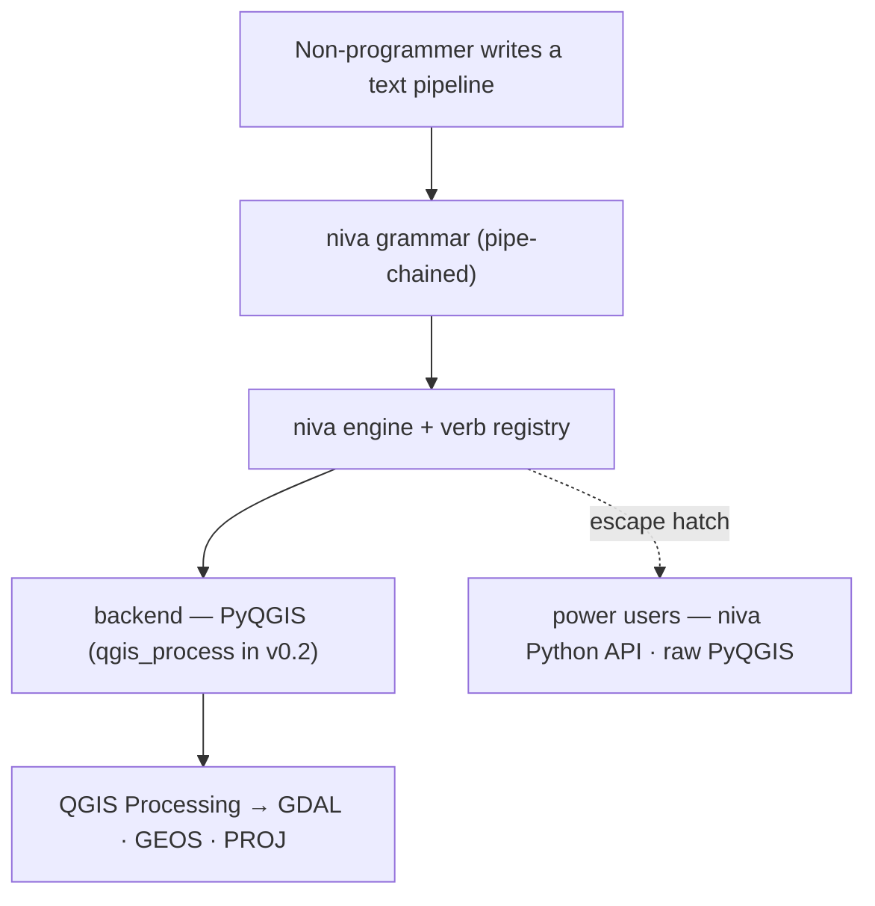

# Niva — Critique of Starting Materials & Open Decisions

> **Status — historical.** This is the original critique of the starting
> materials. **Many questions below have since been decided**; the current state
> of the design lives in `01-prd.md` and `02`–`09`, with every concept's
> disposition in `05-concepts-captured.md`. Superseded items are struck through
> and point to where the decision now lives.

_Critical review of `starting_materials/` (16 Perplexity exports), written to drive
proper planning. Status: awaiting decisions on the open questions at the bottom._

## 1. What the starting materials are

A design exploration (Q&A with an LLM) that converged on a consistent concept:

- **niva** = a Python wrapper over **PyQGIS / QGIS Processing** for concise,
  high-level geoprocessing.
- Package layout: `cli/`, `core/` (engine, registry, types, logging),
  `backends/` (pyqgis, qgis_process), `flows/`, `sql/`.
- An **alias registry** mapping friendly names → `native:*` algorithm IDs.
- Three usage surfaces: a **Python chain API** (`niva.chain(x).buffer().clip()`),
  a **CLI** (`niva vector buffer ...`), and a **flow DSL** (`niva flow exec "buffer | clip | save"`) plus YAML flows.
- Two execution **backends**: in-process PyQGIS and headless `qgis_process`.
- A later **SQL/PostGIS** "live layer" family.

## 2. What's genuinely strong

- **Language call is correct** (doc 10): the bottleneck is GDAL/GEOS/PROJ + QGIS
  startup, not Python glue. Rust/Go would buy packaging, not speed.
- **Core mechanism is right**: alias → `native:*`, chain by feeding `OUTPUT` into
  the next `INPUT`. That is exactly how Processing chaining actually works.
- **CLI hygiene instincts are sound** (clig.dev): shallow verb families, consistent
  flags, stdout-for-data / stderr-for-logs, defined exit codes.
- **Correctly rejects literal shell-piping of geodata** between processes.
- **Honest about its own gaps**: `save` and `sql` are flagged as placeholders.

## 3. Critical issues the exploration glossed over

### 3.1 Identity crisis: library vs CLI
The stated motivation — _PyQGIS is too verbose for everyday geoprocessing_ — is about
a **Python API you script in**, not a command line. Yet most of the design energy went
into a CLI and a bespoke flow-string language. These are two different products with
different ergonomics. **Which is primary?** This single choice reshapes everything else.

### 3.2 The flow-exec string DSL is the riskiest, least-valuable piece
`niva flow exec "buffer --input x | clip --overlay y | save --output z"`:
- **Quoting hell** is already visible in the docs: `'\"CLASS\" = ''local'''`.
- A **hand-rolled parser** to build, document, error-message, and maintain.
- **Redundant**: the Python chain is better for interactive use; YAML is better for
  reproducible pipelines. The string DSL sits awkwardly between them.
- Recommendation: **drop or defer**; keep the Python chain + YAML flows.

### 3.3 Two backends on day one doubles the surface area
In-process PyQGIS vs `qgis_process` differ in parameter serialization, output
handling, error reporting, and temp-file lifecycle. Supporting both from v1 doubles
the work and the bug surface. Pick **one** for v1 (in-process PyQGIS matches the
interactive library goal and reuses the QGIS-interpreter work already done in
marimo-qgis); add `qgis_process` later for headless batch.

> **Decided: PyQGIS-only for v1.** The in-process backend runs **both**
> interactively (a live QGIS session) and headless (niva initializes a headless
> `QgsApplication`, the marimo-qgis model) — so one backend covers every context.
> The `Backend` ABC stays as the extension point; `qgis_process` is added in v0.2
> for process isolation / no-Python batch. This removes the normalization and
> backend-parity cost from v1.

### 3.4 The real hard problem — output/layer lifecycle — is unsolved
This is where niva will live or die ergonomically, and the docs barely touch it:
- `save` is a placeholder (doc 15 admits it doesn't materialize output).
- `TEMPORARY_OUTPUT` vs in-memory vs on-disk; temp cleanup; CRS propagation; layer
  naming/styling; loading results into a live QGIS project vs returning them.
- **Return-type contract is undecided**: does `niva.buffer(...)` return a file path,
  a `QgsVectorLayer`, a niva `Layer` wrapper, or a Processing result dict? Chaining
  requires one consistent answer. (Recommendation: a thin `Layer` wrapper that holds
  either a path or a live layer and knows how to be both source and sink.)
- **Eager vs lazy** chains: the docs show eager (each step runs immediately). Lazy
  would enable dry-run/preview/optimization but adds complexity. Decide explicitly.

### 3.5 Value proposition is asserted, not specified
Versus raw PyQGIS Processing, GeoPandas, and R's `qgisprocess`, what is niva's
wedge? Name the **specific** PyQGIS pains it removes, e.g.:
- QGIS app init / `QgsApplication` boilerplate,
- having to know exact algorithm IDs,
- building `ALL_CAPS` parameter dicts,
- manual `OUTPUT → INPUT` threading,
- CRS handling.
A concrete before/after (verbose PyQGIS → one niva line) belongs in the PRD.

### 3.6 Scope sprawl
`run + flow + vector + raster + select + sql + inspect + config` + chain API + YAML
+ PostGIS live layers + Processing-script integration + plugin integration is many
products at once. v1 needs a ruthless MVP boundary.

### 3.7 SQL/PostGIS "live layers" is a separate product
Valuable given your PostGIS background, but orthogonal to geoprocessing wrapping.
Strong candidate for **v2**, not v1.

### 3.8 Testing/CI in a QGIS environment is unaddressed
PyQGIS code needs a QGIS interpreter to test (the exact constraint just solved in
marimo-qgis). niva needs a test strategy from the start: headless run on QGIS's
Python, fixtures with tiny GeoPackages, and the interpreter-detection logic that
already exists in marimo-qgis (`qgis_python()`).

### 3.9 The materials are AI-validated, not pruned
Every Perplexity answer opens with "Yes — that's the right call" and then adds
features. Planning must now make the cuts the exploration avoided.

## 4. Cross-project opportunity
niva is a natural **geoprocessing layer inside the marimo-qgis notebooks** you just
built — `niva.chain(layer).buffer().clip()` in a marimo cell is exactly the
the concise ergonomics you want. Shared code is plausible: QGIS-Python detection,
headless init, the bridge. Worth deciding whether niva and marimo-qgis are siblings
that share a small core.

## 5. Decisions needed (these drive the PRD / architecture / roadmap)
1. **Primary form factor** — library-first, CLI-first, or co-equal?
2. **v1 backend** — in-process PyQGIS only, or both?
3. **Pipelines in v1** — Python chain + YAML only (drop the string DSL), include the
   string DSL, or defer all pipelines?
4. **Primary usage context(s)** — marimo/QGIS notebooks & console, standalone
   scripts, terminal CLI batch?
5. **MVP operation set** — which ~8–12 operations must v1 cover to be useful to you?
6. **SQL/PostGIS** — v1 or v2?
7. **Distribution/runtime** — pip into QGIS's Python (same model as marimo-qgis)?
   PyPI name `niva` availability?
8. **Return-type / layer model** — your preference, or should I propose one?

## 6. Decisions made (2026-06-11)

| # | Decision | Choice |
| :-- | :-- | :-- |
| 1 | Primary form factor | ~~Library-first~~ → **superseded: the text grammar is the product**; the Python API is the power-user escape hatch (`01-§2a`, `05-§1`) |
| 2 | v1 backend | **PyQGIS-only (in-process)** — runs interactive *and* headless; `qgis_process` deferred to v0.2 (decided, §3.3) |
| 3 | Pipelines in v1 | ~~Deferred to v2~~ → **superseded: pipe chaining IS the v1 product** (the whole grammar; `01`, `03`) |
| 4 | Usage contexts | **All four**: marimo-qgis notebooks, QGIS Python Console, standalone scripts, terminal CLI/batch |

Implications carried into the planning docs:
- The `Backend` abstraction stays the extension point, but v1 ships **only the
  PyQGIS backend** — no normalization/parity cost until `qgis_process` lands (v0.2).
- The CLI/library are generated from the same per-operation specs, so they never drift.

## 7. Resolved direction (2026-06-11, supersedes parts of §6)

After clarifying **target audience and use cases**, the project was re-centered. These
refinements override the earlier form-factor/pipeline answers where they conflict:

| Topic | Earlier answer | **Resolved direction** |
| :-- | :-- | :-- |
| Primary face | Library-first | **Text-pipeline grammar first** — for *non-programmers*; the syntax must not read like Python. The Python library is the engine + power-user escape hatch underneath. |
| Pipelines/chaining | Deferred to v2 | **v1 core** — chaining is the product. The pipe `\|` is the chain (each stage's output feeds the next stage's input). |
| Flow string DSL | "Dropped" | **Re-embraced, redesigned** — the original critique stands against the *programmer-ish, quoting-heavy* draft; the new grammar is brief, pipe-chained, newline-optional, and non-programmer-first. |
| Audience | (assumed: the author) | **Non-programmers (primary)** + QGIS power users + automation developers; **public OSS / PyPI**; assume **minimal coders**. |
| Use cases | (broad) | Interactive exploration · reproducible batch pipelines (saved `.niva` scripts, run headless) · teaching/readable scripts · embedded in marimo cells. |

**Grammar (settled):** `verb [positional] [flag]* [key=value]*`, stages joined by `|`;
whitespace/newlines around `|` are insignificant; only `save` writes to disk. Example:
`load roads.gpkg | buffer 100 dissolve | clip city.gpkg | save out.gpkg`.

The docs below (01–05) are written to this resolved direction.

## 8. Open clarifying questions (for the next session)

Captured so work can resume cleanly. Grouped by area; the grammar ones block the most.

### Grammar & verbs
- **`load` required?** Must every flow begin with `load <path>`, or can the first stage
  be an op that takes a path directly (`buffer roads.gpkg 100 | …`)?
- **Positional conventions** — confirm the primary-arg mapping per verb (buffer→distance,
  clip/intersect/union/difference/select→overlay, dissolve→field, reproject→target_crs,
  filter→expression, calc→field+expr, merge→extra inputs). See `03 §2`.
- **Multi-positional verbs** — is `calc area_m2 "$area"` (two positionals) acceptable, or
  prefer a named form like `calc field=area_m2 expr=$area`?
- **Distance units** — bare value = layer CRS units, or support suffixes
  (`buffer 100m`, `buffer 0.5km`)? Auto-handle metric buffers on geographic CRS?
- **`filter` scope** — how far does the simplified expression go in v1
  (`=`, `<>`, `<`, `>`, `and`/`or`)? Include `IN` / `LIKE` / NULL handling now or later?
  Confirm the raw `expr="…"` fallback. See `03 §3`.
- **CRS defaults** — inherit input CRS? warn/error on mixed-CRS inputs?

### Files, output, UX
- **`.niva` files** — multiple flows separated by blank lines (proposed) or `;`?
  `#` comments (proposed)?
- **`save`** — default format/extension (GeoPackage?), overwrite behavior, layer naming.
- **`add`** — default layer name and styling when loading into the live project.
- **Error UX for non-programmers** — how friendly should parse/runtime errors be (name the
  failing stage, suggest a fix)? The audience is minimal coders, so this matters.
- **marimo display** — what should `niva.flow(...)` return/show in a cell (a `Result`
  summary, a feature count, a map preview)?

### Engine & packaging
- **Ratify the `Layer`/`Result` model** (`02 §3`) — load-bearing; everything builds on it.
- ~~Confirm the v1 verb set (13)~~ — **decided**: ~40 curated verbs (built-ins +
  Tier 1/2), all mapped to real algorithm ids (`03-§2`).
- ~~Backend auto-selection rules~~ — **moot**: v1 is PyQGIS-only; selection
  arrives with the `qgis_process` backend in v0.2 (`00-§3.3`).
- **Targets** — minimum QGIS version, supported Python versions, and license (confirm the
  repo's existing `LICENSE`).
- **PyPI name `niva`** — verify availability before publishing (action item, not a
  question). Fallbacks in `05 §4`.

