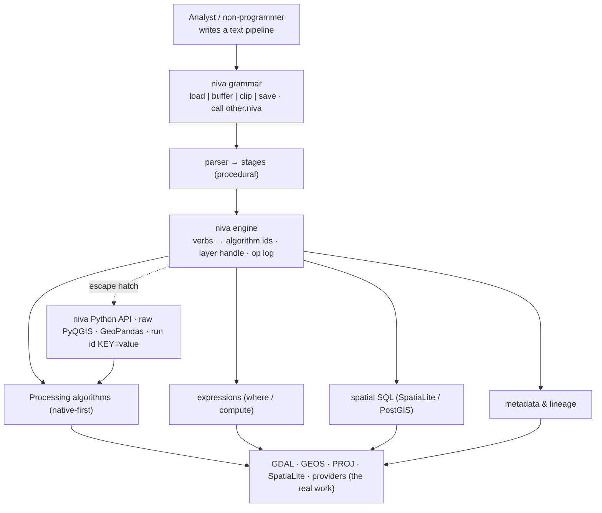
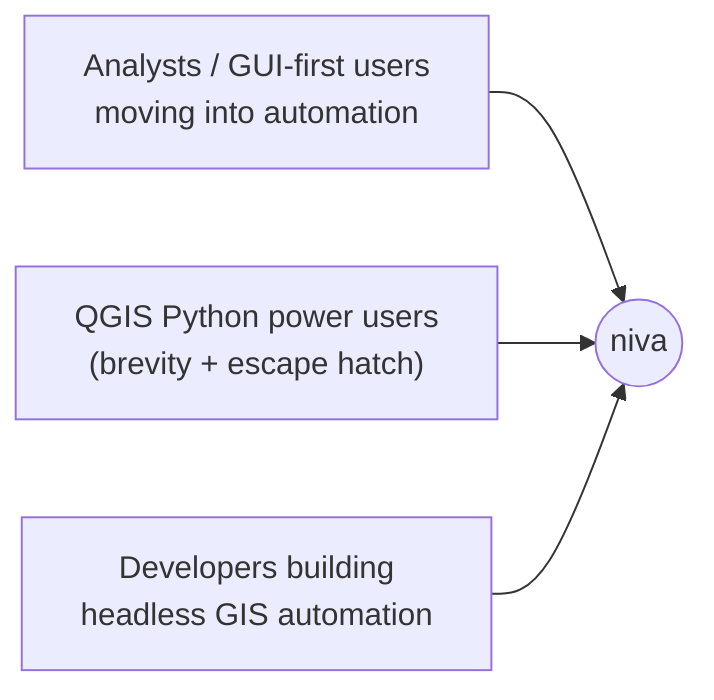

# Niva — Product Requirements (v1)

_A concise **text-pipeline grammar** for geoprocessing, built for non-programmers,
running on PyQGIS / QGIS Processing._
_Status: draft for review. This PRD is the top-level summary; detail lives in
`02`–`08` and `use_cases.md`. Open decisions tracked in `00-…`._

> **Clean-room design.** niva's grammar and API are derived from QGIS Processing's
> own model and plain readability — not from any proprietary GIS scripting
> language. No external API is referenced, reproduced, or used as a template.

## 1. Problem

Geoprocessing automation in QGIS today means writing PyQGIS: initialize a
`QgsApplication`, know algorithm IDs like `native:buffer`, build `ALL_CAPS`
parameter dicts, manage `TEMPORARY_OUTPUT`, and thread one tool's output into the
next. That is a **programming task**, which puts everyday automation out of reach
for the analysts and GUI-first users who most need it — and is tedious even for
those who can. Documenting *what was done* (methods, data quality, lineage) is a
further manual, GUI-bound chore.

niva's answer is a **short, readable text grammar** where a whole pipeline is one
line a non-programmer can write and read:

```
load roads.gpkg | buffer 100 dissolve | clip city.gpkg | save roads_local.gpkg
```

**The same work in raw PyQGIS:**
```python
from qgis.core import QgsApplication; import processing
# … app init, Processing.initialize() …
b = processing.run("native:buffer", {"INPUT":"roads.gpkg","DISTANCE":100,
     "DISSOLVE":True,"OUTPUT":"TEMPORARY_OUTPUT"})
processing.run("native:clip", {"INPUT":b["OUTPUT"],"OVERLAY":"city.gpkg",
     "OUTPUT":"roads_local.gpkg"})
```

## 1a. Where niva sits



The text grammar is the face; the engine underneath maps verbs to QGIS's real
surfaces (catalogued in `06`) and stays open as an escape hatch for power users.

## 2. Value proposition / the wedge

niva makes geoprocessing automation **writable — and documentable — without
programming**:

1. **No code ceremony** — no app init, no imports, no `ALL_CAPS` dicts. One line.
2. **Chaining is the syntax** — the pipe `|` threads each step's output into the
   next; intermediates are invisible; only `save` writes a file.
3. **Readable by humans** — pipelines are legible to someone who has never written
   Python: teachable, reviewable, shareable. Files compose with `call` (`03-§4.1`).
4. **One grammar, every surface** — the same verbs reach QGIS Processing
   (native-first), inline expressions, and **spatial SQL** (`sql` → SpatiaLite/
   PostGIS `ST_*`), so the work goes where it belongs without changing language.
5. **Provenance for free** — `assess` profiles incoming data quality; every step
   is logged; and on `save` the steps that altered data are written as **formal
   lineage metadata** (`08`). The methods document themselves.
6. **Runs everywhere unchanged** — the same pipeline runs headless from a `.niva`
   file, from the terminal, and inside a marimo notebook cell.
7. **Never a dead end** — drop into the niva Python API, raw PyQGIS/GeoPandas/SQL,
   or `run <id> KEY=value` for anything the grammar doesn't alias, then come back.

**Not the wedge:** niva is not a new geometry engine, not a GeoPandas replacement,
not a faster runtime — heavy lifting stays in GDAL/GEOS/PROJ/SpatiaLite via QGIS.
niva is an *accessibility, orchestration, and provenance* layer.

## 2a. Design principles (the spine)

1. **Non-programmer syntax, first and always.** If a stage reads like code, it's
   wrong. Brevity by default; `key=value` only when a parameter is needed.
2. **The grammar is the product.** A small, consistent verb set + one chaining
   rule. Consistency and predictability beat breadth or cleverness.
3. **The pipe is the chain; the file is procedural.** `|` connects output→input;
   a `.niva` runs top-to-bottom; `call` runs another file inline, anywhere.
4. **Native-first.** When more than one provider offers a capability, prefer
   `native` → `gdal` → `qgis` → `pdal`; **GRASS/SAGA last**, only when nothing else
   can (`07-§12.1`).
5. **Introspect, never assume.** The algorithm/provider/CRS/SQL surface is
   build-specific; validate the registry against the installed QGIS (`06-§8.4`).
6. **Provenance is a byproduct.** Logging, assessment, and lineage grow with the
   work, not bolted on at the end (`08`).
7. **Interoperable, never a cage; thin and honest.** Every value exposes the
   underlying layer/path/connection; niva never hides which algorithm ran or what
   parameters were sent (`describe`, `--dry-run`).

## 3. Who it's for



- **Primary:** analysts and GUI-first QGIS users automating geoprocessing
  **without learning to program** — and who must **document data quality and
  methods** (the `use_cases.md` analyst).
- **Also served:** QGIS Python power users wanting brevity + the escape hatch, and
  developers embedding niva pipelines in headless automation.
- **Distribution:** **public open-source on PyPI** — docs, versioning, and a
  contribution path matter.

## 4. Primary use cases

| Use case | What it looks like |
| :-- | :-- |
| **Interactive exploration** | One-line pipelines in a marimo cell or the QGIS console while exploring data. |
| **Reproducible batch pipelines** | Saved `.niva` files (composed with `call`) run headless — CI, scheduled jobs, repeatable analysis. |
| **Documented analysis** | A full multi-source workflow with `assess` reports and automatic lineage — a self-documenting repository (see `examples/youngstown_cat_canvassing.niva`). |
| **Teaching / readable scripts** | Legible pipelines to share, document, or learn geoprocessing without Python. |

## 5. Goals (v1)

- A **text grammar + parser + procedural runner** implementing
  `verb [positional] [flag]* [key=value]*` stages chained by `|`, plus `call`
  file composition (`03`).
- A **runner** for all contexts: `niva run flow.niva`, `niva "…"`, `niva.flow("…")`.
- The **alias registry** (`07`): a curated **~40-verb set** (built-ins + Tier 1/2)
  mapping friendly verbs to real algorithm ids, native-first, validated by a
  linter against the installed QGIS, with `run <id>` as the full-coverage escape
  hatch.
- **`sql` read passthrough** (`SELECT → layer`) reaching SpatiaLite/PostGIS via
  `@`-named QGIS connections (`06-§4`).
- The **layer handle contract** (`02-§3`): one `Layer` (source/qgs/db_table/memory)
  that bridges surfaces, threading temp outputs and materializing only at
  boundaries.
- **Provenance, first slice** (`08`): an **operation log / run journal** and the
  **`assess`** verb (structure, validity, duplicates, nulls, existing lineage).
- A **Python API** underneath (the engine) as the power-user escape hatch, with
  `Layer`/`Result` and first-class interop.
- **Two execution backends** behind one engine — in-process PyQGIS and
  `qgis_process`, auto-selected. *(Single-backend-first is the one unsettled call;
  `00-§3.3`.)*
- Runs on **QGIS's own Python**; `pip`-installable; headless CI on a QGIS-version
  matrix.

## 6. Non-goals (v1 — see `04-roadmap.md`)

- **SQL writes & connection management** (`UPDATE`/`CREATE`, import-to-PostGIS,
  managing connections) → v2. *(Read passthrough is in v1.)*
- **Heavy raster processing** (terrain, raster calculator, warp pipelines) → v1.1.
  *(Raster×vector — `zonalstats`/`sample` — is in v1.)*
- **Auto-lineage to formal metadata** and the `metadata` verb → v1.1. *(The
  operation log + `assess` are in v1.)*
- **Grammar control-flow** (variables, branching, loops) and **parameterized
  `call`** (macros) → v2.
- **GRASS/SAGA curated verbs** — reachable via `run` from v0.1; aliasing the most-
  used is a later, case-by-case call.
- **Rendering, layouts, symbology composition** → v2.x. *(Exporting an existing
  atlas/layout is `run`-reachable now.)*

## 7. Success criteria (v1)

- A non-programmer can express the common geoprocessing **and data-assessment**
  tasks as one readable pipeline and run it from a file, the terminal, and a
  marimo cell — unchanged.
- The **~40 curated verbs** work via both backends with equivalent results; every
  alias passes the registry linter against the installed QGIS.
- `sql "SELECT …"` returns a usable layer from a file and from an `@connection`.
- `assess` produces a quality report; the run journal records every operation.
- `run`/`find`/`describe` and the Python escape hatch cover everything the grammar
  doesn't alias.
- Green headless CI on QGIS's Python; published to PyPI.

## 8. Key risks

- **Grammar ergonomics** — the syntax must stay genuinely non-programmer-friendly
  across real tasks (multi-input ops, expressions/filters, CRS). The
  filter/expression case is hardest to keep un-code-like (`03-§3`).
- **Output/layer lifecycle across surfaces** — temp handoff and materialization as
  a handle crosses Processing ↔ SQL ↔ expressions; CRS/schema propagation
  (`02-§3`).
- **Dual-backend parity** — identical behavior across PyQGIS and `qgis_process`;
  also the open question of whether to ship one backend first (`00-§3.3`).
- **Registry drift** — aliases/enums must stay valid across QGIS versions; the
  linter + CI matrix mitigate (`07-§9`).
- **Provenance scope creep** — lineage/assessment are differentiators but must
  stay simple; default-on lineage and report formats are open (`08-§7`).
- **Name `niva` on PyPI** — verify before publishing (`05-§7`).
