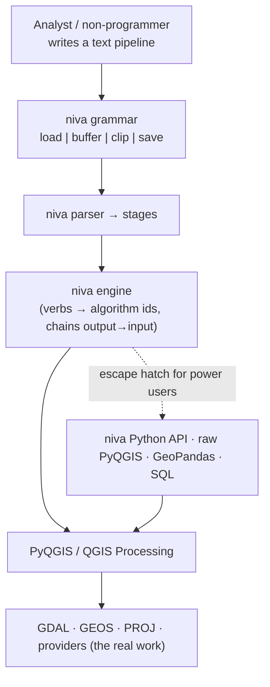
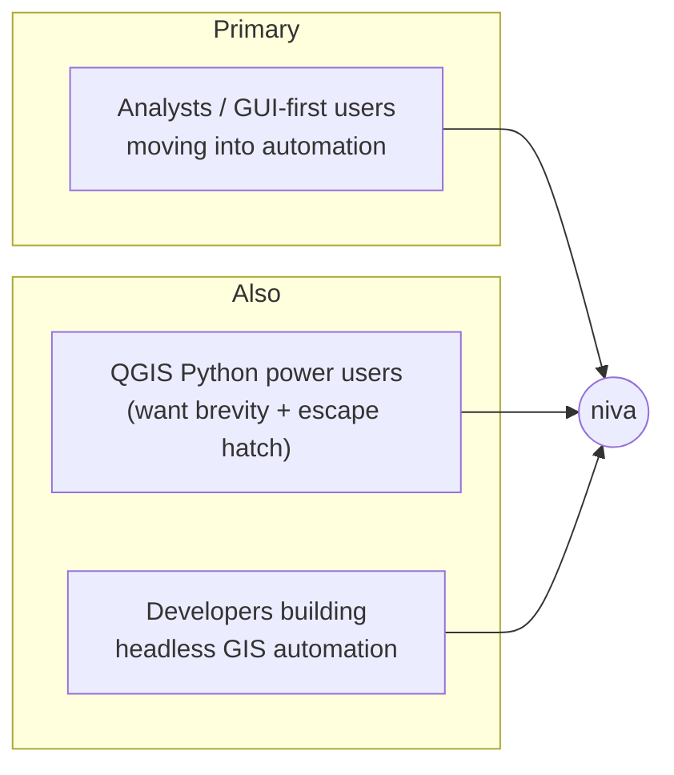

# Niva — Product Requirements (v1)

_A concise **text-pipeline grammar** for geoprocessing, built for non-programmers,
running on PyQGIS / QGIS Processing._
_Status: draft for review. Decisions tracked in `00-…`._

> **Clean-room design.** niva's grammar and API are derived from QGIS Processing's own
> model and plain readability — not from any proprietary GIS scripting language. No
> external API is referenced, reproduced, or used as a template.

## 1. Problem

Geoprocessing automation in QGIS today means writing PyQGIS: initialize a
`QgsApplication`, know algorithm IDs like `native:buffer`, build `ALL_CAPS` parameter
dicts, manage `TEMPORARY_OUTPUT`, and thread one tool's output into the next. That is a
**programming task**, which puts everyday automation out of reach for the analysts and
GUI-first users who most need it — and is tedious even for those who can.

niva's answer is a **short, readable text grammar** where a whole pipeline is one line
a non-programmer can write and read:

```
load roads.gpkg | buffer 100 dissolve | clip city.gpkg | save roads_local.gpkg
```

**The same work in raw PyQGIS:**
```python
from qgis.core import QgsApplication; import processing
# … app init, Processing.initialize() …
b = processing.run("native:buffer", {"INPUT":"roads.gpkg","DISTANCE":100,
     "DISSOLVE":True,"OUTPUT":"TEMPORARY_OUTPUT"})
c = processing.run("native:clip", {"INPUT":b["OUTPUT"],"OVERLAY":"city.gpkg",
     "OUTPUT":"roads_local.gpkg"})
```

## 1a. Where niva sits



The text grammar is the face; the Python engine underneath does the work and stays open
as an escape hatch for power users and for interop.

## 2. Value proposition / the wedge

niva makes geoprocessing automation **writable without programming**:

1. **No code ceremony** — no app init, no imports, no `ALL_CAPS` dicts. One line.
2. **Chaining is the syntax** — the pipe `|` threads each step's output into the next;
   intermediates are invisible; only `save` writes a file.
3. **Readable by humans** — pipelines are legible to someone who has never written
   Python, which makes them teachable, reviewable, and shareable.
4. **Runs everywhere unchanged** — the same pipeline string runs headless from a saved
   `.niva` file, from the terminal, and inside a marimo notebook cell.
5. **Never a dead end** — power users drop into the niva Python API or raw
   PyQGIS/GeoPandas/SQL for anything the grammar doesn't cover, then come back.

**Not the wedge:** niva is not a new geometry engine, not a GeoPandas replacement, not a
faster runtime — heavy lifting stays in GDAL/GEOS/PROJ via QGIS. niva is an
*accessibility and orchestration* layer.

## 2a. Design principles (the spine)

1. **Non-programmer syntax, first and always.** If a stage reads like code, it's wrong.
   Brevity by default; `key=value` only when a parameter is actually needed.
2. **The grammar is the product.** A small, consistent set of verbs + a single chaining
   rule. Consistency and predictability beat breadth or cleverness.
3. **The pipe is the chain.** `|` separates *and* connects; output→input is automatic;
   newlines around `|` are insignificant, so a flow can be one line or wrapped.
4. **Interoperable, never a cage.** Every niva value exposes the underlying layer/path so
   a user can drop into raw PyQGIS / GeoPandas / SQL and hand the result back.
5. **Thin and honest.** niva never hides which algorithm ran or what parameters were
   sent (`--dry-run`, `describe`).

## 3. Who it's for



- **Primary:** analysts and GUI-first QGIS users who want to automate geoprocessing
  **without learning to program**. The grammar is designed for them.
- **Also served:** QGIS Python power users who want the brevity (with the Python escape
  hatch), and developers embedding niva pipelines in headless automation.
- **Distribution:** **public open-source on PyPI** — so docs, versioning, and a
  contribution path matter.

## 4. Primary use cases

| Use case | What it looks like |
| :-- | :-- |
| **Interactive exploration** | Quick one-line pipelines in a marimo cell or QGIS console while exploring data. |
| **Reproducible batch pipelines** | Saved `.niva` script files run headless (CI, scheduled jobs, repeatable analysis). |
| **Teaching / readable scripts** | Legible pipelines used to share, document, or learn geoprocessing without Python. |

## 5. Goals (v1)

- A **text grammar + parser + executor** implementing `verb [positional] [flag]*
  [key=value]*` stages chained by `|` (see `03-mvp-scope.md`).
- A **runner** for all contexts: `niva run flow.niva` (headless), `niva "…"` (terminal),
  `niva.flow("…")` (marimo/console).
- A core **verb set** (~13 vector operations + `load`/`save`/`add`/`run`/`find`/
  `describe`) with brief positional defaults.
- **Two execution backends** behind one engine: in-process PyQGIS (interactive) and
  `qgis_process` (headless), auto-selected.
- A **Python API** underneath (the engine) usable directly as the power-user escape
  hatch, with a consistent `Layer`/`Result` model (see `02-architecture.md`).
- **Interop** guarantees and **discovery** (`find`/`describe`).
- Runs on **QGIS's own Python**; `pip`-installable; headless CI.

## 6. Non-goals (v1 — see roadmap)

- Control flow in the grammar (variables, branching, loops, conditionals) → later.
- SQL / PostGIS sources and sinks → v2.
- Raster operations → v1.1.
- A GUI / QGIS-plugin front end for the grammar → later.

## 7. Success criteria (v1)

- A non-programmer can express the common geoprocessing tasks as one readable pipeline
  and run it from a file, the terminal, and a marimo cell — unchanged.
- The 13 core verbs work via both backends with equivalent results.
- `run`/`find`/`describe` and the Python escape hatch cover everything the grammar
  doesn't.
- Green headless CI on QGIS's Python; published to PyPI.

## 8. Key risks

- **Grammar ergonomics** — the syntax must stay genuinely non-programmer-friendly across
  real tasks (multi-input ops, expressions/filters, CRS). The filter/expression case is
  the hardest to keep un-code-like; needs deliberate design (`03`).
- **Output/layer lifecycle across a chain** — temp handoff, `save`/`add` semantics, CRS
  propagation (`02 §2`).
- **Dual-backend parity** — identical behavior across PyQGIS and `qgis_process`.
- **Name `niva` on PyPI** — verify before publishing.
