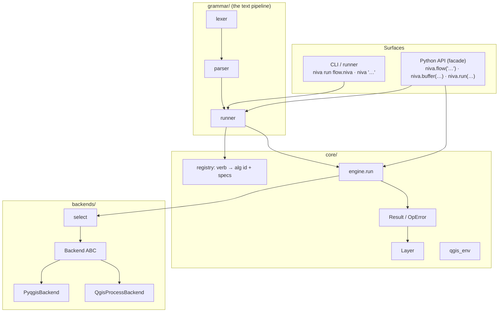
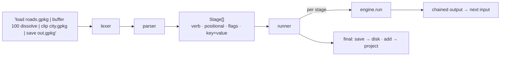
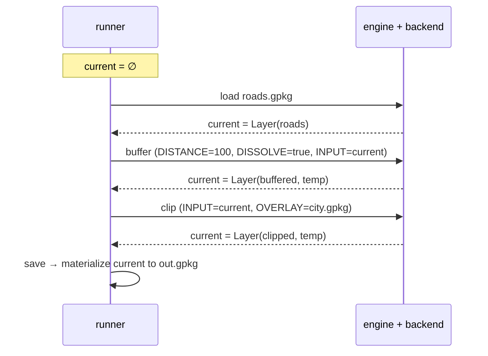
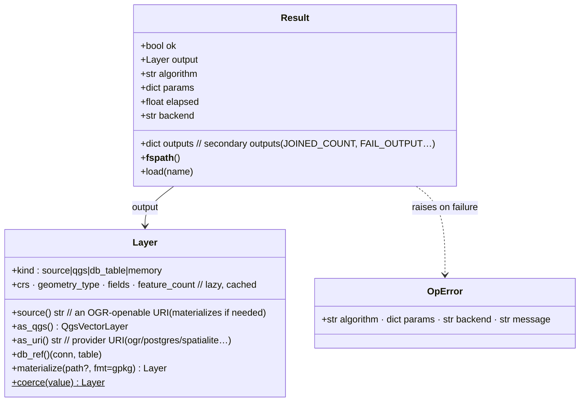
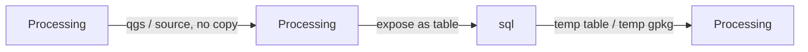
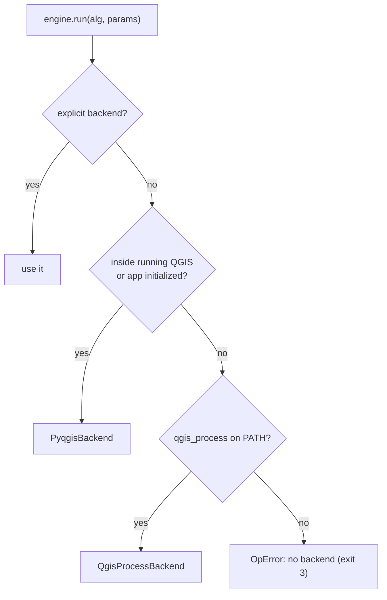
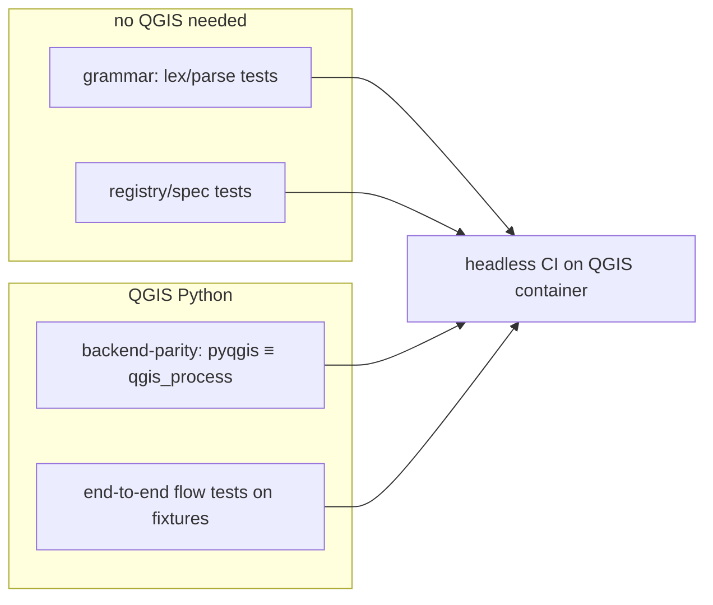

# Niva — Architecture & Technical Design (v1)

_Status: draft for review. Built around the text-pipeline grammar as the primary
surface, with the Python engine underneath._

## 1. Layering



Package layout:

```text
niva/
  grammar/   lexer.py · parser.py · runner.py        # the text pipeline
  core/      registry.py · engine.py · layer.py · result.py · qgis_env.py · logging.py
  backends/  base.py · pyqgis_backend.py · qgis_process_backend.py · select.py
  api.py     # niva.flow(...), niva.buffer(...), niva.run(...), niva.find/describe
  cli/       main.py · emit.py
pyproject.toml
```

Reserved/empty in v1 (future): `grammar/` control-flow, `sql/`.

## 2. The text pipeline: lex → parse → run



A **flow** is one or more **stages** separated by `|`; whitespace and newlines around `|`
are insignificant. Each stage:

```python
@dataclass
class Stage:
    verb: str                 # load, buffer, clip, save, …
    positional: list[str]     # bare values: ["100"] or ["city.gpkg"]
    flags: set[str]           # bare keywords: {"dissolve"}
    params: dict[str, str]    # key=value: {"segments": "16"}
    raw: str
```

Parsing rules (kept deliberately simple so the syntax stays non-code-like):
- split on `|` → stages; tokenize each stage with quote-awareness.
- token 0 = verb; bare `word` = flag; `key=value` = param; everything else = positional.
- the registry's per-verb spec maps positionals/flags/params → Processing parameters,
  so `buffer 100 dissolve` becomes `{DISTANCE:100, DISSOLVE:true, INPUT:<prev>}`.

## 2a. Chain execution (the pipe is the chain)



The runner keeps a single `current` layer; each non-sink stage runs its algorithm with
`INPUT = current` (unless the stage gives its own input) and replaces `current` with the
result. **Sinks** (`save`, `add`) consume `current`: `save` writes to disk, `add` loads
into the live QGIS project. Intermediate outputs are managed temporaries
(`TEMPORARY_OUTPUT` in-process; temp files for `qgis_process`) and cleaned up.

## 3. The layer handle contract

This is the single most load-bearing decision in niva: **what flows through the
`|`**. Every op produces a `Result` whose `.output` is a `Layer` **handle**, and
every op accepts a `Layer` as input. The handle must be the common currency across
all three execution surfaces — Processing algorithms, SQL, and expressions
(`06-§1`) — which is the cross-surface problem `00-§3.4`, `06-§8.3` and `07`
deferred here.



### 3.1 One type, four backing kinds

A `Layer` is **one** Python type that may be backed by any of four kinds, so it is
accepted as input everywhere and produced as output everywhere:

| kind | backing | produced by | consumed cheaply by |
|------|---------|-------------|---------------------|
| `source` | file path / OGR URI (GeoPackage, shp, FlatGeobuf…) | `qgis_process` outputs, `save`, `load <file>` | any surface (Processing `INPUT`, OGR SQL, `load`) |
| `qgs` | a live `QgsVectorLayer` (in-process) | `PyqgisBackend` outputs, `load` in a live QGIS | in-process Processing, `as_qgs()` |
| `db_table` | `(connection @name, schema.table)` | `sql` on a DB connection, `load @conn.table` | `sql` on the **same** connection (no copy); Processing via provider URI |
| `memory` | in-memory features / memory provider | small intermediates | quick in-process ops |

All four expose the same protocol (`source()`, `as_qgs()`, `as_uri()`, `db_ref()`,
metadata, `materialize()`), so callers never branch on kind — they ask for the form
they need and the handle provides it, materializing only if forced (§3.3).

### 3.2 Invariants (what every step may assume)

1. **In, one out.** A step takes exactly one primary input `Layer` and yields
   exactly one primary output `Layer` (plus a `Result` carrying secondary outputs).
2. **No mutation.** A step does not mutate its input; it returns a new handle —
   the pipeline is functional. **Exception:** a `sql` write (`UPDATE`/`DELETE`/
   `INSERT`) returns the *same* `db_table` handle and is documented as in-place.
3. **Metadata travels.** `crs`, `geometry_type`, `fields` are part of the handle,
   computed lazily and cached, and propagate downstream.
4. **Temps are owned.** Intermediate handles are run-owned temporaries, cleaned up
   when the flow ends; `save` materializes the final handle to the user's path,
   `add` registers it in the live QGIS project.

### 3.3 Crossing surfaces — the bridge rules

The handle is the bridge between engines. niva **materializes only at a boundary
that requires it**, always to a temp **GeoPackage** (the portable interchange
format), and records the temp for cleanup. Same-engine consecutive steps never
copy.



| from → to | rule |
|-----------|------|
| **Processing → Processing** (same backend) | pass the handle directly — `qgs` in-process, or a temp `source`. No copy. |
| **Processing → `sql`** | the SQL engine must see a table. If handle is `db_table` on the target connection → query in place. Else expose the `source` **without a full copy** where possible: OGR `SQLITE` dialect, or SpatiaLite **VirtualOGR/VirtualShape**, or a QGIS **virtual layer** over a live `qgs`. Only if none apply → `materialize()` to temp GeoPackage and attach. |
| **`sql` → Processing** | a `SELECT` result becomes a handle: on a DB connection, a `db_table` (result/temp table) or materialized temp GeoPackage; via OGR `SQLITE` dialect, the result is written to a temp GeoPackage → `source`. |
| **expressions** (`where`/`compute`) | these are in-process Processing algorithms (`extractbyexpression`, field calculator) — surface 1, no special bridging. |

This is why the handle carries `db_ref()` and `as_uri()` as well as `source()`:
the boundary code chooses the cheapest exposure for the next engine.

### 3.4 Eager now, lazy-capable later

v1 is **eager**: the runner holds `current`, each step executes immediately and
returns a materialized/live handle — simple and debuggable. The contract is
written so a future **lazy planner** is an invisible optimization: a handle is
"something you can open as a layer," whether it already exists or carries a
deferred plan. Laziness would let niva **fuse consecutive `sql` steps into one
query** and **push filters down to the database** — but the grammar and the
handle protocol do not change.

### 3.5 Connections & `@names`

A `db_table` handle references a **saved QGIS provider connection** by `@name`
(resolved via `QgsProviderRegistry … providerMetadata(key).findConnection(name)`).
`load @prod_db.roads` → a `db_table` handle; `sql @prod_db "…"` runs against it.
niva **never stores credentials** — it reuses QGIS's own connection registry, so
connections configured once in QGIS are available to niva by name.

### 3.6 Interoperability (escape hatches are first-class)

The handle never traps the user; each level exposes the one below:

| niva value | drop down to … | how |
| :-- | :-- | :-- |
| `Result` | raw Processing outputs / what ran | `result.outputs`, `result.algorithm`, `result.params` |
| `Result` / `Layer` | a file path / URI | `os.fspath(result)`, `layer.source()` |
| `Layer` | a live `QgsVectorLayer` | `layer.as_qgs()` |
| `Layer` | a DB table | `layer.db_ref()` → `(connection, table)` |
| `Layer` | GeoPandas / Shapely / raw SQL | `layer.source()` → `gpd.read_file(...)`, etc. |
| any op | a not-yet-aliased algorithm | `run provider:alg key=value` (grammar) or `niva.run(...)` (API) |

`Layer.coerce()` accepts a path, a `QgsMapLayer`, a `Result`, a `(conn, table)`
ref, or another `Layer` — so any of these can be fed into a flow as input.

## 4. Backend abstraction (the cost of "both backends")



```python
class Backend(ABC):
    name: str
    def available(self) -> bool: ...
    def run_algorithm(self, alg_id: str, params: dict) -> RawResult: ...
    def list_algorithms(self) -> list[AlgInfo]: ...
    def describe(self, alg_id: str) -> AlgInfo: ...
```

- **PyqgisBackend** — `processing.run(...)` in-process; outputs are live layers/paths.
- **QgisProcessBackend** — shells `qgis_process run <alg> --json`; parses JSON outputs.
- **Normalization is the key task:** both return a `RawResult` of identical shape so
  `engine.run()` builds the same `Result` regardless of backend. Each backend owns a
  `_serialize(params)` (live layer/path vs path/URI string).
- **Override:** `niva.use_backend(...)`, env `NIVA_BACKEND`, CLI `--backend`.

## 5. One spec per verb (drives grammar, API, CLI, help)

A verb is declared once; the grammar binding, the Python function, the CLI subcommand,
and `describe` output all derive from it — so they never drift.

```python
Verb("buffer", "native:buffer",
     positional=[("distance", "DISTANCE", float)],     # bare value → DISTANCE
     flags={"dissolve": "DISSOLVE"},                    # bare word → DISSOLVE=true
     params=[("segments","SEGMENTS",int), ("end_cap","END_CAP_STYLE",str)],
     input_param="INPUT", output_param="OUTPUT",
     summary="Buffer features by a distance.")
```

## 6. Errors & exit codes

- Python raises `niva.OpError`; `Result.ok` also set. Grammar/parse problems raise
  `niva.FlowError` with the offending stage.
- CLI exit codes: `0` ok · `1` runtime · `2` usage/parse · `3` missing QGIS/dep ·
  (`4` reserved for SQL/connection in v2). Logs/timing → stderr; data/`--json` → stdout.

## 7. Runtime & distribution

- **Runs on QGIS's own Python** (the marimo-qgis model). `qgis_env` locates the
  interpreter, initializes a headless app when needed, and finds `qgis_process`.
- **Packaging:** standard `pyproject.toml`; `pip install` into QGIS's Python; console
  entry point `niva = "niva.cli.main:main"`.
- **marimo embedding:** a cell calls `niva.flow("load … | … | save …")`; the notebook
  already runs on QGIS's Python (see marimo-qgis).
- **PyPI name `niva`** — verify before publishing (fallbacks in `05`).

## 8. Testing / CI



- Grammar lex/parse and registry tests need **no QGIS** (fast, pure-Python).
- **Backend-parity** tests assert both backends give equivalent outputs per verb.
- **End-to-end** flow tests run small pipelines on tiny fixture GeoPackages
  (`tests/data/`). CI invokes via QGIS's interpreter, mirroring marimo-qgis.

## 9. Relationship to marimo-qgis

niva is the natural geoprocessing layer inside marimo-qgis notebooks. Shared concepts
(QGIS-Python detection, headless init) may later extract into a tiny common module; v1
keeps niva self-contained to avoid premature coupling.
