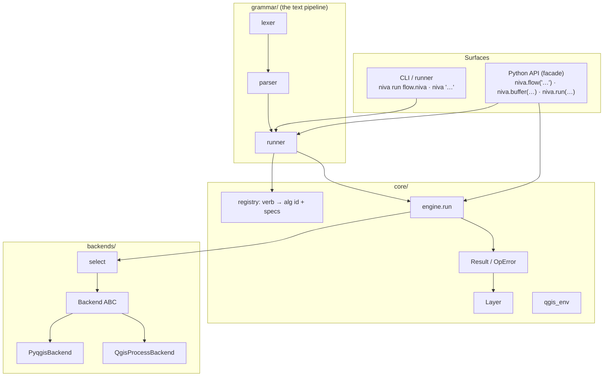
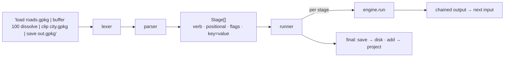
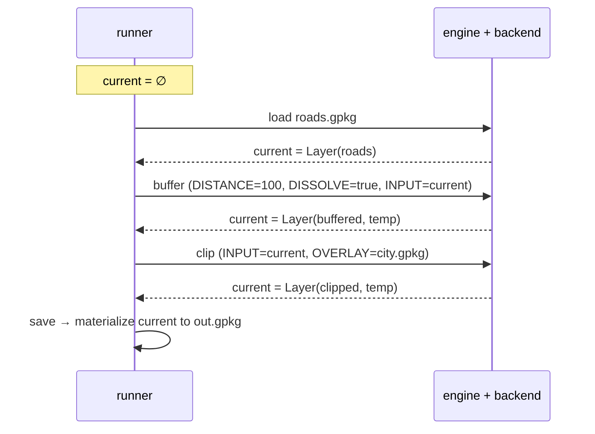
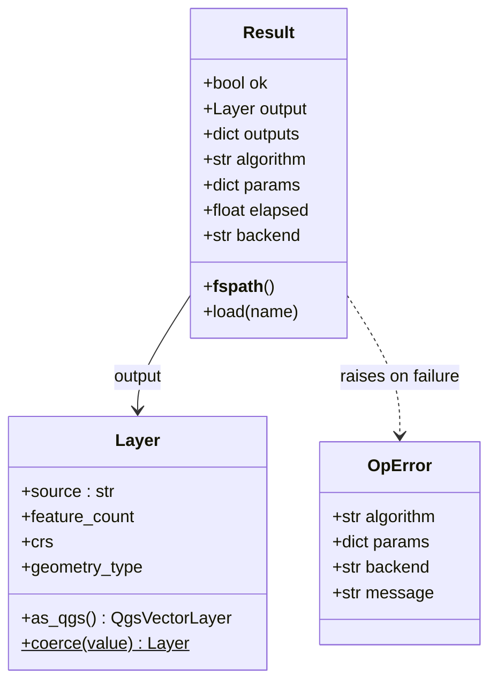
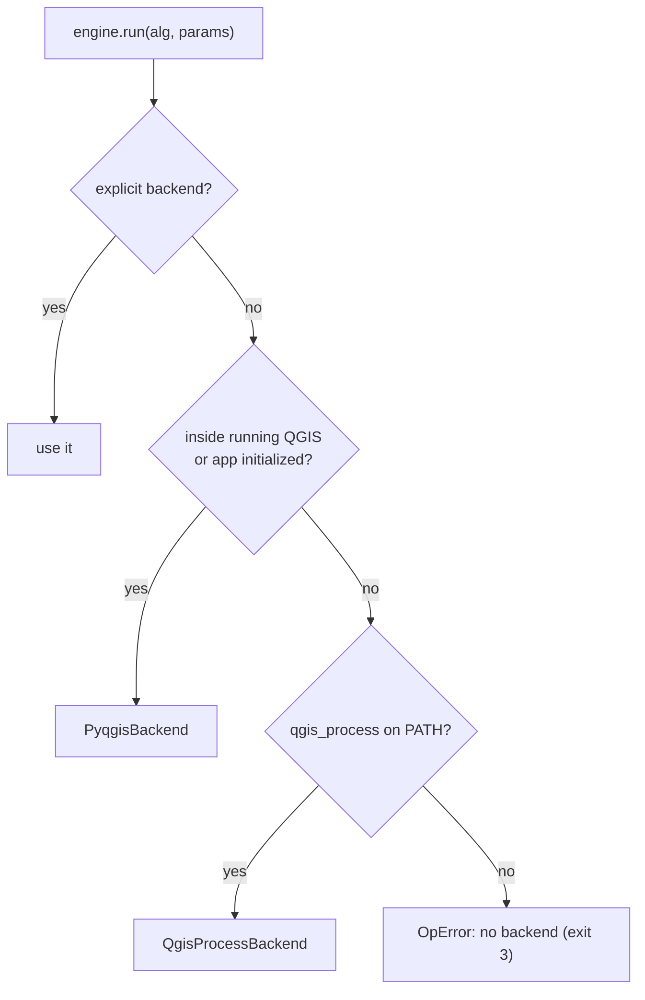
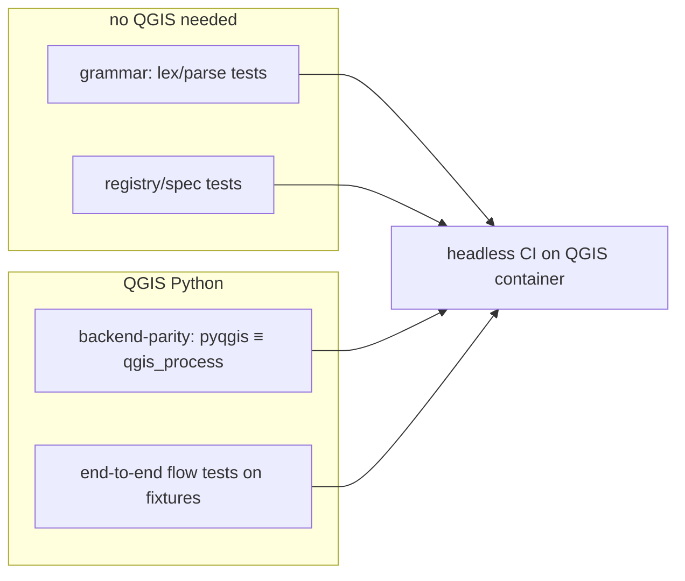

# Niva — Architecture & Technical Design (v1)

_Status: draft for review. Built around the text-pipeline grammar as the primary
surface, with the Python engine underneath._

## 1. Layering



Package layout:

```text
niva/
  grammar/   lexer.py · parser.py · runner.py        # the text pipeline
  core/      registry.py · engine.py · layer.py · result.py · qgis_env.py · logging.py
  backends/  base.py · pyqgis_backend.py · qgis_process_backend.py · select.py
  api.py     # niva.flow(...), niva.buffer(...), niva.run(...), niva.find/describe
  cli/       main.py · emit.py
pyproject.toml
```

Reserved/empty in v1 (future): `grammar/` control-flow, `sql/`.

## 2. The text pipeline: lex → parse → run



A **flow** is one or more **stages** separated by `|`; whitespace and newlines around `|`
are insignificant. Each stage:

```python
@dataclass
class Stage:
    verb: str                 # load, buffer, clip, save, …
    positional: list[str]     # bare values: ["100"] or ["city.gpkg"]
    flags: set[str]           # bare keywords: {"dissolve"}
    params: dict[str, str]    # key=value: {"segments": "16"}
    raw: str
```

Parsing rules (kept deliberately simple so the syntax stays non-code-like):
- split on `|` → stages; tokenize each stage with quote-awareness.
- token 0 = verb; bare `word` = flag; `key=value` = param; everything else = positional.
- the registry's per-verb spec maps positionals/flags/params → Processing parameters,
  so `buffer 100 dissolve` becomes `{DISTANCE:100, DISSOLVE:true, INPUT:<prev>}`.

## 2a. Chain execution (the pipe is the chain)



The runner keeps a single `current` layer; each non-sink stage runs its algorithm with
`INPUT = current` (unless the stage gives its own input) and replaces `current` with the
result. **Sinks** (`save`, `add`) consume `current`: `save` writes to disk, `add` loads
into the live QGIS project. Intermediate outputs are managed temporaries
(`TEMPORARY_OUTPUT` in-process; temp files for `qgis_process`) and cleaned up.

## 3. Return-type contract (`Layer` / `Result`)

Every op produces a `Result`; its `.output` is a `Layer`. This is what makes both the
chain and the power-user escape hatch work.



`Layer` is dual-natured — it wraps **either** an on-disk source (path/URI/PostGIS)
**or** a live `QgsVectorLayer` — so it is accepted as input everywhere and produced as
output everywhere. `Layer.coerce()` accepts a path, a `QgsMapLayer`, a `Result`, or
another `Layer`.

## 3a. Interoperability (escape hatches are first-class)

The grammar must never trap the user; each level exposes the one below.

| niva value | drop down to … | how |
| :-- | :-- | :-- |
| `Result` | raw Processing outputs / what ran | `result.outputs`, `result.algorithm`, `result.params` |
| `Result` / `Layer` | a file path/URI | `os.fspath(result)`, `layer.source` |
| `Layer` | a live `QgsVectorLayer` | `layer.as_qgs()` |
| `Layer` | GeoPandas / Shapely / SQL | `layer.source` → `gpd.read_file(...)`, etc. |
| any op | a not-yet-aliased algorithm | grammar `run provider:alg key=value` or `niva.run(...)` |

## 4. Backend abstraction (the cost of "both backends")



```python
class Backend(ABC):
    name: str
    def available(self) -> bool: ...
    def run_algorithm(self, alg_id: str, params: dict) -> RawResult: ...
    def list_algorithms(self) -> list[AlgInfo]: ...
    def describe(self, alg_id: str) -> AlgInfo: ...
```

- **PyqgisBackend** — `processing.run(...)` in-process; outputs are live layers/paths.
- **QgisProcessBackend** — shells `qgis_process run <alg> --json`; parses JSON outputs.
- **Normalization is the key task:** both return a `RawResult` of identical shape so
  `engine.run()` builds the same `Result` regardless of backend. Each backend owns a
  `_serialize(params)` (live layer/path vs path/URI string).
- **Override:** `niva.use_backend(...)`, env `NIVA_BACKEND`, CLI `--backend`.

## 5. One spec per verb (drives grammar, API, CLI, help)

A verb is declared once; the grammar binding, the Python function, the CLI subcommand,
and `describe` output all derive from it — so they never drift.

```python
Verb("buffer", "native:buffer",
     positional=[("distance", "DISTANCE", float)],     # bare value → DISTANCE
     flags={"dissolve": "DISSOLVE"},                    # bare word → DISSOLVE=true
     params=[("segments","SEGMENTS",int), ("end_cap","END_CAP_STYLE",str)],
     input_param="INPUT", output_param="OUTPUT",
     summary="Buffer features by a distance.")
```

## 6. Errors & exit codes

- Python raises `niva.OpError`; `Result.ok` also set. Grammar/parse problems raise
  `niva.FlowError` with the offending stage.
- CLI exit codes: `0` ok · `1` runtime · `2` usage/parse · `3` missing QGIS/dep ·
  (`4` reserved for SQL/connection in v2). Logs/timing → stderr; data/`--json` → stdout.

## 7. Runtime & distribution

- **Runs on QGIS's own Python** (the marimo-qgis model). `qgis_env` locates the
  interpreter, initializes a headless app when needed, and finds `qgis_process`.
- **Packaging:** standard `pyproject.toml`; `pip install` into QGIS's Python; console
  entry point `niva = "niva.cli.main:main"`.
- **marimo embedding:** a cell calls `niva.flow("load … | … | save …")`; the notebook
  already runs on QGIS's Python (see marimo-qgis).
- **PyPI name `niva`** — verify before publishing (fallbacks in `05`).

## 8. Testing / CI



- Grammar lex/parse and registry tests need **no QGIS** (fast, pure-Python).
- **Backend-parity** tests assert both backends give equivalent outputs per verb.
- **End-to-end** flow tests run small pipelines on tiny fixture GeoPackages
  (`tests/data/`). CI invokes via QGIS's interpreter, mirroring marimo-qgis.

## 9. Relationship to marimo-qgis

niva is the natural geoprocessing layer inside marimo-qgis notebooks. Shared concepts
(QGIS-Python detection, headless init) may later extract into a tiny common module; v1
keeps niva self-contained to avoid premature coupling.
