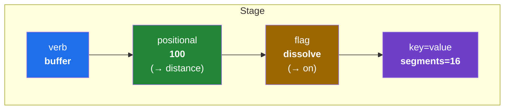
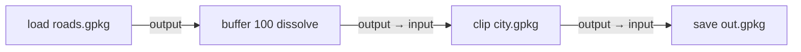

# Niva — v1 MVP Scope

_Status: draft for review. The concrete v1 boundary: the grammar, the verb set, the
runner, the backends._

## 1. The grammar

A **flow** is a chain of **stages** joined by `|`. Each stage is:

```
verb  [positional…]  [flag…]  [key=value…]
```



Rules (kept simple so the syntax never reads like code):
- **Stages joined by `|`**; whitespace and newlines around `|` are insignificant.
- **First bare value** = the verb's primary argument (per-verb; e.g. `buffer 100` →
  distance, `clip city.gpkg` → overlay).
- **Bare word** = an on/off flag (`dissolve`).
- **`key=value`** = any other parameter, only when needed.
- **`|` is the chain**: each stage's output feeds the next stage's input automatically.
- Quote values containing spaces; `#` starts a comment.

> **❓ Open (see `00 §8`):** Is `load` required to start a flow, or may the first stage
> take a path directly (`buffer roads.gpkg 100 | …`)? And do distances accept unit
> suffixes (`buffer 100m`, `0.5km`) or are bare values always CRS units?



## 2. v1 verb set

### Sources & sinks
| verb | positional | does |
| :-- | :-- | :-- |
| `load` | path/URI | open a layer as the start of a flow |
| `save` | path | write the current layer to disk (the only thing that persists) |
| `add` | name? | load the current layer into the live QGIS project |

### Vector operations (positional = primary arg)
| verb | positional | flags / params | QGIS algorithm |
| :-- | :-- | :-- | :-- |
| `buffer` | distance | `dissolve`, `segments=`, `end_cap=`, `join=` | `native:buffer` |
| `clip` | overlay | — | `native:clip` |
| `intersect` | overlay | — | `native:intersection` |
| `union` | overlay | — | `native:union` |
| `difference` | overlay | — | `native:difference` |
| `dissolve` | field? | — | `native:dissolve` |
| `reproject` | target_crs | — | `native:reprojectlayer` |
| `fix` | — | — | `native:fixgeometries` |
| `explode` | — | — | `native:multiparttosingleparts` |
| `filter` | expression | — | `native:extractbyexpression` |
| `select` | overlay | `predicate=` | `native:extractbylocation` |
| `calc` | field, expr | — | `native:fieldcalculator` |
| `merge` | input…(extra) | `target_crs=` | `native:mergevectorlayers` |

> **❓ Open (see `00 §8`):** Confirm the positional conventions above. For two-argument
> verbs like `calc` (field + expression), is `calc area_m2 "$area"` acceptable, or do you
> prefer a named form (`calc field=area_m2 expr=$area`)?

### Meta verbs
| verb | does |
| :-- | :-- |
| `run` | escape hatch: `run native:slope INPUT=dem.tif OUTPUT=slope.tif` |
| `find` | search algorithms / niva verbs (`find dissolve`) |
| `describe` | show a verb's mapping and parameters (`describe buffer`) |

## 3. The `filter` case (keeping expressions non-code-like)

Raw QGIS expressions are the least approachable thing (`"ZONE" = 'R1'` with field
double-quotes). v1's `filter` accepts a **simplified** form and translates it:
- bare field names (no double quotes): `filter ZONE = 'R1'`
- numbers bare, strings single-quoted: `filter POP > 1000`
- `and` / `or`: `filter ZONE = 'R1' and POP > 1000`
- power-user fallback to a raw expression: `filter expr="\"ZONE\" IN ('R1','R2')"`

This is the single most important ergonomics design item in v1 (`01 §8`).

> **❓ Open (see `00 §8`):** How far does the simplified `filter` go in v1 — beyond
> `=`/`<>`/`<`/`>` and `and`/`or`, do we include `IN` / `LIKE` / NULL handling now or
> later? The raw `expr="…"` fallback stays regardless.

## 4. Running a flow (all contexts, same string)

| context | invocation |
| :-- | :-- |
| Headless saved script | `niva run pipeline.niva` |
| Terminal (inline) | `niva "load roads.gpkg \| buffer 100 \| save out.gpkg"` |
| marimo cell / QGIS console | `niva.flow("load roads.gpkg \| buffer 100 \| save out.gpkg")` |
| Power-user Python | `niva.buffer("roads.gpkg", distance=100)` (same engine) |

A **`.niva` script file** holds one or more flows (separated by blank lines), with `#`
comments:

```
# Residential parcels near schools, buffered
load parcels.gpkg
  | filter ZONE = 'R1'
  | buffer 50
  | clip city.gpkg
  | save r1_near.gpkg
```

## 5. Backends (both, in v1)

- In-process **PyQGIS** (default when inside QGIS / a live session) and headless
  **`qgis_process`** (default otherwise), auto-selected; override via `--backend` /
  `NIVA_BACKEND` / `niva.use_backend(...)`. See `02 §4`.

## 6. Explicitly OUT of v1 (see roadmap)

- Control flow in the grammar (variables, branching, loops) → later.
- SQL / PostGIS sources & sinks → v2.
- Raster verbs → v1.1.
- `config` profiles beyond a default-backend setting → v1.1.
- A GUI / QGIS-plugin front end → later.

## 7. Definition of done (v1)

- The grammar (lex/parse/run) executes single- and multi-stage flows; `|` chaining
  threads output→input; `save`/`add` materialize.
- All 13 vector verbs + `load`/`save`/`add`/`run`/`find`/`describe` work via **both**
  backends with equivalent results (backend-parity tests on fixtures).
- The **same flow string** runs headless (`niva run`), inline (`niva "…"`), and in a
  marimo cell (`niva.flow(...)`).
- `filter` translates the simplified form correctly, with the raw-expression fallback.
- Interop verified: `result.output.as_qgs()` / `.source` / `os.fspath(...)` and a
  GeoPandas round-trip back into a flow via `load`.
- `pip`-installable into QGIS's Python; headless CI green.
