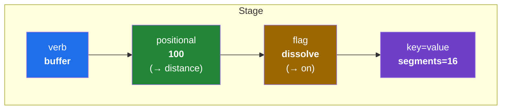

# Niva — v1 MVP Scope

_Status: draft for review. The concrete v1 boundary: the grammar, the verb set, the
runner, the backends._

## 1. The grammar

A **flow** is a chain of **stages** joined by `|`. Each stage is:

```
verb  [positional…]  [flag…]  [key=value…]
```



Rules (kept simple so the syntax never reads like code):
- **Stages joined by `|`**; whitespace and newlines around `|` are insignificant.
- **First bare value** = the verb's primary argument (per-verb; e.g. `buffer 100` →
  distance, `clip city.gpkg` → overlay).
- **Bare word** = an on/off flag (`dissolve`).
- **`key=value`** = any other parameter, only when needed.
- **`|` is the chain**: each stage's output feeds the next stage's input automatically.
- Quote values containing spaces; `#` starts a comment.

> **❓ Open (see `00 §8`):** Is `load` required to start a flow, or may the first stage
> take a path directly (`buffer roads.gpkg 100 | …`)? And do distances accept unit
> suffixes (`buffer 100m`, `0.5km`) or are bare values always CRS units?


## 2. The initial verb set

v1 ships a **curated ~40-verb set** — the slice of the 769-algorithm surface
(`06`) that covers the everyday analyst workflow in `use_cases.md` (acquire →
prepare → explore → analyze → produce). Everything else stays reachable via the
`run` escape hatch (`07-§8`). Each verb is a friendly name mapped to one real
algorithm through the alias registry (`07`); all algorithm ids below are verified
present in QGIS 4.0.3 (`reference/qgis-algorithms-4.0.3.tsv`).

> **Naming & grammar reconciliation.** These names are canonical for v1. Where
> earlier docs differ: `filter` ≡ `where` (06/07); `compute` ≡ `calc`. Parameters
> use **`key=value`** (the lexer in `02 §2`); the space-form `key value` in some
> `07` examples is illustrative only. The registry (`07`) is the source of truth
> for each mapping.

### 2.1 Built-in verbs (engine-level, not registry aliases — `07-§2`)

| verb | argument | does |
| :-- | :-- | :-- |
| `load` | path / URI / `@conn.table` | start a flow from a file, OGR source, or DB table |
| `save` | path | materialize the current layer to disk — the persisting step |
| `add` | name? | register the current layer in the live QGIS project |
| `sql` | `"SELECT …"` [`from` src \| `@conn`] | run spatial SQL; a `SELECT` result becomes the current layer (read passthrough — `06-§4`) |
| `filter` | expression | keep features matching an expression → `native:extractbyexpression` |
| `compute` | `field=` `expr=` | add/update a field via the expression engine → `native:fieldcalculator` |
| `run` | `id KEY=value…` | escape hatch — any algorithm by id |
| `find` | term | search verbs / algorithms (`find dissolve`) |
| `describe` | verb | show a verb's mapping + parameters (`describe buffer`) |

### 2.2 Tier 1 — core registry aliases (ship first)

The must-have geoprocessing the canonical use case needs.

| verb | primary arg | key params / flags | algorithm |
| :-- | :-- | :-- | :-- |
| `buffer` | distance | `dissolve`, `segments=`, `cap=`, `join=` | `native:buffer` |
| `clip` | overlay | — | `native:clip` |
| `intersect` | overlay | — | `native:intersection` |
| `union` | overlay | — | `native:union` |
| `difference` | overlay | — | `native:difference` |
| `dissolve` | field? | — | `native:dissolve` |
| `reproject` | target_crs | `operation=` | `native:reprojectlayer` |
| `fix` | — | — | `native:fixgeometries` |
| `explode` | — | — | `native:multiparttosingleparts` |
| `merge` | extra layers | `crs=` | `native:mergevectorlayers` |
| `join` | `with=` | `field=`, `field2=`, `fields=`, `prefix=` | `native:joinattributestable` |
| `spatialjoin` | `with=` | `predicate=`, `prefix=` | `native:joinattributesbylocation` |
| `extract` | — | `field=`, `op=`, `value=` | `native:extractbyattribute` |
| `selectloc` | overlay | `predicate=` | `native:extractbylocation` |
| `centroid` | — | — | `native:centroids` |

### 2.3 Tier 2 — completes the v1 set

| verb | primary arg | algorithm | | verb | primary arg | algorithm |
| :-- | :-- | :-- |:-:| :-- | :-- | :-- |
| `convexhull` | — | `native:convexhull` | | `refactor` | `fields=` | `native:refactorfields` |
| `simplify` | tolerance | `native:simplifygeometries` | | `drop` | `fields=` | `native:deletecolumn` |
| `smooth` | — | `native:smoothgeometry` | | `retain` | `fields=` | `native:retainfields` |
| `pointonsurface` | — | `native:pointonsurface` | | `rename` | `field=` `to=` | `native:renametablefield` |
| `boundingbox` | — | `native:boundingboxes` | | `promote` | — | `native:promotetomulti` |
| `voronoi` | — | `native:voronoipolygons` | | `countpoints` | points | `native:countpointsinpolygon` |
| `grid` | spacing | `native:creategrid` | | `zonalstats` | raster | `native:zonalstatisticsfb` |
| `vertices` | — | `native:extractvertices` | | `sample` | raster | `native:rastersampling` |

That is **9 built-in + 15 Tier 1 + 16 Tier 2 ≈ 40 verbs**. The count is
affordable because each alias is *data* in the registry (`07`), not code — the
engine runs them uniformly. Tier 1 is the ship-first cut; Tier 2 rounds out v1.

> **❓ Open (see `00 §8`):** two-argument verbs. Is `compute area_m2="$area"` the
> form, or `compute field=area_m2 expr="$area"`? Proposal: one bare positional for
> the primary arg (`buffer 100`, `clip city.gpkg`), named `key=value` for the rest.
> Confirm.

### 2.4 The use case, in verbs

The `use_cases.md` analyst flow (Youngstown cat-canvassing) maps onto the set:

```
# acquire + prepare: FileGDB in EPSG:4629 → cleaned, projected working data
load "cats.gdb|layername=parcels" | reproject EPSG:26918 | fix
  | filter "owns_cat = 1" | save work/cat_parcels.gpkg

# explore/analyze: residence points, blocks that contain them
load work/cat_parcels.gpkg | centroid | save work/cat_points.gpkg
load blocks.gpkg | spatialjoin with=work/cat_points.gpkg predicate=contains
  | save work/blocks_with_cats.gpkg
```

Routing ("visit all residences on foot, most efficiently") needs the
**network-analysis** group (shortest path); full route optimization (TSP) is a
**known gap** in QGIS native algorithms and is out of v1 (§6).

### Meta verbs
(`run` / `find` / `describe` are the built-ins in §2.1.)

## 3. The `filter` case (keeping expressions non-code-like)

Raw QGIS expressions are the least approachable thing (`"ZONE" = 'R1'` with field
double-quotes). v1's `filter` accepts a **simplified** form and translates it:
- bare field names (no double quotes): `filter ZONE = 'R1'`
- numbers bare, strings single-quoted: `filter POP > 1000`
- `and` / `or`: `filter ZONE = 'R1' and POP > 1000`
- power-user fallback to a raw expression: `filter expr="\"ZONE\" IN ('R1','R2')"`

This is the single most important ergonomics design item in v1 (`01 §8`).

> **❓ Open (see `00 §8`):** How far does the simplified `filter` go in v1 — beyond
> `=`/`<>`/`<`/`>` and `and`/`or`, do we include `IN` / `LIKE` / NULL handling now or
> later? The raw `expr="…"` fallback stays regardless.

## 4. Running a flow (all contexts, same string)

| context | invocation |
| :-- | :-- |
| Headless saved script | `niva run pipeline.niva` |
| Terminal (inline) | `niva "load roads.gpkg \| buffer 100 \| save out.gpkg"` |
| marimo cell / QGIS console | `niva.flow("load roads.gpkg \| buffer 100 \| save out.gpkg")` |
| Power-user Python | `niva.buffer("roads.gpkg", distance=100)` (same engine) |

A **`.niva` script file** holds one or more flows (separated by blank lines), with `#`
comments:

```
# Residential parcels near schools, buffered
load parcels.gpkg
  | filter ZONE = 'R1'
  | buffer 50
  | clip city.gpkg
  | save r1_near.gpkg
```

## 5. Backends (both, in v1)

- In-process **PyQGIS** (default when inside QGIS / a live session) and headless
  **`qgis_process`** (default otherwise), auto-selected; override via `--backend` /
  `NIVA_BACKEND` / `niva.use_backend(...)`. See `02 §4`.

## 6. Explicitly OUT of v1 (see roadmap)

- Control flow in the grammar (variables, branching, loops) → later.
- **SQL writes & connection management** (`UPDATE`/`DELETE`, `CREATE TABLE`,
  import-to-PostGIS, managing `@connections`) → v2. *Read passthrough* (`sql
  "SELECT …"` → layer, `06-§4`) **is in v1** as a built-in (§2.1); it reuses
  QGIS's existing connections by `@name` (`02-§3.5`).
- **Heavy raster processing** (terrain, raster calculator, warp pipelines) →
  v1.1. Raster×vector that the workflow needs (`zonalstats`, `sample`) **is in
  v1** (§2.3).
- **Routing / network optimization** (shortest-path verbs, and TSP — a gap in
  QGIS native algorithms) → later, despite the `use_cases.md` need (§2.4).
- Rendering, layouts, symbology (surface 4, `06-§6`) → later.
- `config` profiles beyond a default-backend setting → v1.1.
- A GUI / QGIS-plugin front end → later.

## 7. Definition of done (v1)

- The grammar (lex/parse/run) executes single- and multi-stage flows; `|` chaining
  threads output→input; `save`/`add` materialize.
- The **~40 curated verbs** (§2: 9 built-in + Tier 1 + Tier 2) work via **both**
  backends with equivalent results (backend-parity tests on fixtures), and every
  alias passes the registry linter against the installed QGIS (`07-§9`).
- `sql "SELECT …"` read passthrough returns a usable layer from a file (OGR
  `SQLITE` dialect) and from an `@connection`.
- The **same flow string** runs headless (`niva run`), inline (`niva "…"`), and in a
  marimo cell (`niva.flow(...)`).
- `filter` translates the simplified form correctly, with the raw-expression fallback.
- Interop verified: `result.output.as_qgs()` / `.source` / `os.fspath(...)` and a
  GeoPandas round-trip back into a flow via `load`.
- `pip`-installable into QGIS's Python; headless CI green.
