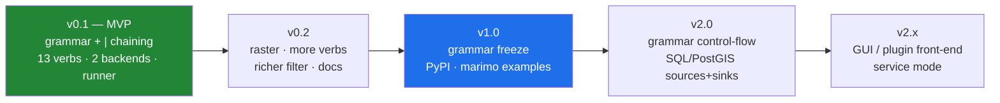

# Niva — Roadmap

_Status: draft for review. The text grammar + pipe chaining is v1 core (not deferred)._

## v0.1 — Grammar + engine (MVP)

The foundation. Get the grammar, the chain model, and the `Layer`/`Result` contract
right — everything later builds on them.

- `grammar/`: lexer, parser (`Stage[]`), runner (pipe chaining, sinks).
- `core/`: `registry` (verb specs + aliases), `engine.run()`, `Layer`, `Result`,
  `OpError`/`FlowError`, `qgis_env`.
- `backends/`: `Backend` ABC, `PyqgisBackend`, `QgisProcessBackend`, auto-`select`.
- **13 vector verbs** + `load`/`save`/`add`/`run`/`find`/`describe`; the simplified
  `filter` translator with raw-expression fallback.
- **Runner everywhere**: `niva run flow.niva` (headless), `niva "…"` (terminal),
  `niva.flow("…")` (marimo/console); Python engine/API as the escape hatch.
- `pyproject.toml`; `pip install` into QGIS's Python; `niva` console script.
- **Tests/CI**: grammar + registry units (no QGIS), backend-parity, end-to-end flow
  tests on fixture GeoPackages; headless GitHub Actions on a QGIS Linux container.
- **Exit criteria**: `03-mvp-scope.md` "definition of done".

## v0.2 — Breadth + polish

- Raster verbs (`warp`/reproject, `clip` by mask/extent, `hillshade`).
- More vector verbs (symmetric difference, centroids, convex hull, simplify…).
- Richer `filter` (IN, LIKE, NULL handling) while staying non-code-like.
- Minimal `config` (default backend); `--json` contracts; timing.
- Docs site + a cookbook of example `.niva` flows.

## v1.0 — Stable release

- **Grammar freeze** (semantic-versioning commitment to the verb/flag/param surface).
- **PyPI publish** (verify `niva` name first; fallbacks in `05`).
- Worked **marimo-qgis integration** (niva flows in notebook cells) and a `startup.py`
  preload snippet for the QGIS console.

## v2.0 — Grammar control-flow + data sources

Extends the grammar without breaking v1 flows.

- **Named intermediates / reuse**: capture a stage's output and reuse it
  (e.g. `... > $roads`, then `load $roads`), enabling non-linear flows (branch/merge).
- **Variables / parameters** in `.niva` scripts for reusable, parameterized pipelines.
- **SQL / PostGIS** as first-class source and sink verbs (`load "service=… query=…"`,
  `save "postgres:…"`); adds exit code `4` (connection/SQL).

## v2.x — Front ends & service mode

- Optional **QGIS plugin / Processing-Toolbox** front end so flows run from the GUI.
- Optional **service/daemon mode** to amortize QGIS startup across many flows.
- Optional compiled outer CLI only if packaging/startup friction warrants it (no
  geoprocessing-speed reason — see `05 §3`).

## Cross-cutting (all milestones)

- **Clean-room** discipline: grammar/API derived from QGIS Processing + readability only.
- **Non-programmer-first** grammar: no stage may read like code.
- **Interop** stays first-class (`02 §3a`).
- **One spec per verb** drives grammar, Python API, CLI, and `describe` — never diverge.
