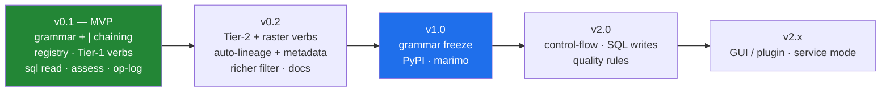

# Niva — Roadmap

_Status: draft for review. The text grammar + pipe chaining is v1 core (not
deferred). This sequences the work defined across the planning docs: the verb set
(`03`), the alias registry (`07`), the layer handle contract (`02`), the SQL/
metadata surfaces (`06`), and data quality/provenance (`08`)._

> **Three parallel tracks** run through the milestones: **Grammar/Engine** (the
> pipeline), **Coverage** (verbs via the registry), and **Provenance** (logging,
> assessment, lineage). The MVP delivers a thin slice of all three.

## v0.1 — Grammar + engine (MVP)

The foundation. Get the grammar, the chain model, and the **layer handle
contract** right (`02-§3`) — everything later builds on them.

**Grammar / engine**
- `grammar/`: lexer, parser (`Stage[]`), runner (pipe chaining, sinks).
- `core/`: `engine.run()`, the `Layer` handle (source/qgs/db_table/memory) +
  cross-surface threading (`02-§3.3`), `Result`, `OpError`/`FlowError`, `qgis_env`.
- `backends/`: `Backend` ABC, `PyqgisBackend`, `QgisProcessBackend`, auto-`select`.

**Coverage (the registry)**
- `registry/`: declarative alias entries + loader + **linter** validating against
  the installed QGIS, and the **scaffolder** that seeds entries from the live
  registry (`07-§9`).
- **Built-in verbs**: `load`/`save`/`add`/`run`/`find`/`describe`/`filter`/
  `compute`, plus **`sql` read passthrough** (`SELECT → layer`, `06-§4`).
- **Tier 1 registry aliases** (`03-§2.2`): buffer, clip, intersect, union,
  difference, dissolve, reproject, fix, explode, merge, join, spatialjoin, extract,
  selectloc, centroid. The simplified `filter` translator with raw-expression
  fallback (`03-§3`).

**Provenance (first slice)**
- **Operation log / run journal** (`08-§2`): structured `OpRecord`s; the ordered
  journal as machine-readable methods documentation.
- **`assess`** (`08-§4`): structure (CRS/extent/schema), validity, duplicates,
  null counts, basic field stats, and any existing lineage — no mutation.

**Delivery**
- **Runner everywhere**: `niva run flow.niva`, `niva "…"`, `niva.flow("…")`
  (marimo/console); Python engine/API as the escape hatch.
- `pyproject.toml`; `pip install` into QGIS's Python; `niva` console script.
- **Tests/CI**: grammar + registry-linter units (no QGIS), backend-parity,
  end-to-end flows on fixture GeoPackages; headless GitHub Actions on a QGIS Linux
  container, across a small QGIS-version matrix (`07-§9`).
- **Exit criteria**: `03-mvp-scope.md` "definition of done".

## v0.2 — Breadth + provenance

- **Tier 2 verbs** (`03-§2.3`): convexhull, simplify, smooth, pointonsurface,
  boundingbox, voronoi, grid, vertices, field ops (refactor/drop/retain/rename),
  promote, countpoints, **zonalstats/sample** (raster×vector).
- **Raster basics**: `warp`/reproject, `clip` by mask/extent, `hillshade`
  (`gdal:*` / `native:*`).
- **Auto-lineage to formal metadata** on `save` (`08-§3`) and the **`metadata`**
  verb (read/set/export, `06-§2.5`); `assess --deep` (Check-geometry battery).
- **Richer `filter`** (IN, LIKE, NULL handling) while staying non-code-like.
- Minimal `config` (default backend); `--json` contracts; timing.
- Docs site + a cookbook of example `.niva` flows.

## v1.0 — Stable release

- **Grammar freeze** — SemVer commitment to the verb/flag/param surface; the
  registry is the contract.
- **PyPI publish** (verify the `niva` name first; fallbacks in `05`).
- Worked **marimo-qgis integration** (niva flows in notebook cells) and a
  `startup.py` preload snippet for the QGIS console.

## v2.0 — Control-flow, SQL writes & quality rules

Extends the grammar without breaking v1 flows.

- **Named intermediates / reuse**: capture a stage's output and reuse it
  (e.g. `… > $roads`, then `load $roads`) — non-linear flows (branch/merge).
- **Variables / parameters** in `.niva` scripts for reusable pipelines.
- **SQL writes & connection management** (`06-§4`, `03-§6`): `UPDATE`/`DELETE`/
  `CREATE`, import-to-PostGIS/SpatiaLite, managing `@connections`; exit code `4`
  (connection/SQL). (Read passthrough already shipped in v0.1.)
- **Quality rules / constraints** (`08-§6`): assert conditions and fail a flow on
  bad data; metadata templates; catalog/search integration
  (`QgsLayerMetadataProviderRegistry`).

## v2.x — Front ends & service mode

- Optional **QGIS plugin / Processing-Toolbox** front end so flows run from the
  GUI (the niva plugin stub is the seed).
- Optional **service/daemon mode** to amortize QGIS startup across many flows.
- **Hard-to-reach surfaces** (`06-§6`): *composing* print layouts and symbology is
  GUI-shaped — later. (But *exporting* an existing atlas/layout is a Processing
  algorithm — `native:atlaslayouttomultiplepdf` — so per-canvasser handouts from a
  `.qpt` template are reachable earlier via `run`.)
- Optional compiled outer CLI only if packaging/startup friction warrants it (no
  geoprocessing-speed reason — see `05 §3`).

## Cross-cutting (all milestones)

- **Clean-room** discipline: grammar/API derived from QGIS Processing + readability only.
- **Non-programmer-first** grammar: no stage may read like code.
- **Introspect, never assume** (`06-§8.4`): the registry, providers, CRS ops and
  SQL functions are build-specific; validate against the installed QGIS.
- **Provider preference: native-first** (`07-§12.1`): prefer `native` → `gdal` →
  `qgis` → `pdal`; **GRASS/SAGA last**, only when nothing else covers the job
  (reached via `run`). The long tail (GRASS network/TSP, PDAL lidar) is reachable
  from v0.1 without curated aliases.
- **Interop** stays first-class (`02-§3.6`); the `run` escape hatch always reaches
  the full surface.
- **One spec per verb** drives grammar, Python API, CLI, and `describe` — never diverge.
- **Provenance is a byproduct**: the op-log and lineage grow with every milestone,
  not bolted on at the end (`08`).
