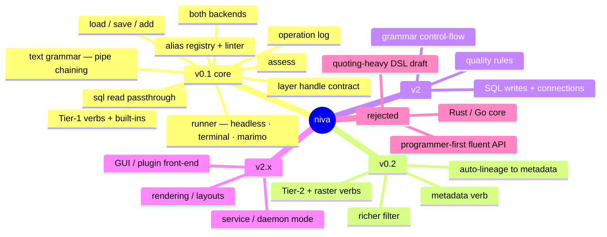

# Niva — Concepts Captured (supersedes the local design exploration)

_Records every relevant concept — from the original local exploration **and** the
later surface/registry/provenance work (`06`–`08`) — with its disposition, so the
planning set is self-sufficient. Clean-room: framed on QGIS/Python terms only._

## 1. Foundational concepts (the original exploration)

| Concept | Disposition | Where |
| :-- | :-- | :-- |
| **Text-pipeline grammar for non-programmers** | **the product** | 01, 03 |
| Pipe `\|` chaining (output→input) | **v0.1 core** | 02 §2a, 03 §1 |
| Brief grammar: positional + flags + `key=value` | **v0.1 core** | 03 §1 |
| Alias registry (verb → `native:*`) + per-verb spec | **v0.1 core** | 07 |
| Built-ins + Tier-1 verbs (the ~40-verb curated set) | **v0.1 (Tier 1) / v0.2 (Tier 2)** | 03 §2 |
| `run` escape hatch · `find` · `describe` | **v0.1** | 03 §2, 07 §8 |
| In-process PyQGIS + `qgis_process` backends, auto-select | **v0.1** | 02 §4 |
| Python engine as power-user **escape hatch** | **v0.1** | 01, 02 §3.6 |
| Interop with raw PyQGIS / GeoPandas / SQL | **v0.1 requirement** | 02 §3.6 |
| `--json`, exit codes, stdout/stderr discipline | **v0.1** | 02 §6 |
| Runs headless (`.niva`) + in marimo cells | **v0.1** | 03 §4 |
| Simplified `filter` translator | **v0.1** | 03 §3 |
| Fluent method-chaining Python API (`.buffer().clip()`) | **Optional** — the *text grammar* is the chaining surface | 02 |
| Programmer-first as the primary face | **Rejected** | 00 §7 |
| Quoting-heavy single-string DSL draft | **Rejected** — replaced by the pipe grammar | 00 §7 |
| Rust/Go core | **Rejected** (no speed gain) | §3 below |

## 2. Concepts from the surface survey (`06`)

The live enumeration of QGIS (769 algorithms, 406 expression functions, 238+
SpatiaLite `ST_*`) reshaped several decisions:

| Concept | Disposition | Where |
| :-- | :-- | :-- |
| **Five surfaces**, not one API: Processing · expressions · DB spatial SQL · PyQGIS-only · drivers | framing for all coverage decisions | 06 §1 |
| **Three-way name collision** — `buffer` is an algorithm, `buffer()` expression, **and** `ST_Buffer` SQL | resolved: `buffer` = the algorithm; SQL only via explicit `sql`; expressions only inside `where`/`compute` | 06 §8.1, 07 §2 |
| **SpatiaLite/PostGIS as a parallel geoprocessing surface** (`ST_*`), near-interchangeable OGC SQL/MM | reach via `sql` passthrough; read in v0.1, writes in v2 | 06 §4 |
| **SpatiaLite Virtual Tables** (VirtualShape/Text/OGR/Postgres) — SQL over heterogeneous sources | a bridging mechanism for the handle | 06 §4.1, 02 §3.3 |
| **Introspect, never assume** — provider/algorithm/CRS/SQL sets are build-specific | a `niva doctor`/capability report from live enumeration | 06 §8.4, 07 §9 |
| Machine-readable **reference inventories** (algorithms + expression fns TSVs) | committed; regenerate per build | 06 appendix, `reference/` |
| **Hard-to-reach surface** (rendering, layouts, symbology) | out until v2.x; but atlas *export* is an algorithm (reachable) | 06 §6, 04 |
| **Provider preference order** — native > gdal > qgis > pdal > … > **GRASS/SAGA last** | **decided** | 07 §12.1, 03 §2.4 |
| Escape hatch reaches the long tail (GRASS network/TSP, PDAL lidar) — coverage isn't capped by the curated verbs | validated by the canonical use case | 03 §2.4, 07 §8 |

## 3. Concepts from the engine & registry design (`02`, `07`)

| Concept | Disposition | Where |
| :-- | :-- | :-- |
| **Layer handle contract** — one `Layer`, four backing kinds (source/qgs/db_table/memory) | **v0.1 (the load-bearing decision)** | 02 §3 |
| **Cross-surface bridging** — expose cheaply (OGR SQLITE / VirtualOGR / virtual layers); materialize to temp GeoPackage **only at boundaries** | v0.1 | 02 §3.3 |
| Connections by **`@name`** via QGIS's own registry (no stored credentials) | v0.1 | 02 §3.5 |
| **Eager now, lazy-capable later** (fuse `sql`, push filters down) | v0.1 eager; planner later | 02 §3.4 |
| Alias entry as **declarative data** (not code); scaffolder + linter vs the live registry | v0.1 | 07 §3, §9 |
| **Word-valued enums** reconciled with the algorithm's option strings | v0.1 | 07 §6 |
| Raw `run id KEY=value` **full-coverage guarantee**; aliases = progressive enhancement | v0.1 | 07 §8 |

## 4. Concepts from data quality & provenance (`08`)

| Concept | Disposition | Where |
| :-- | :-- | :-- |
| **Operation log / run journal** (structured OpRecords) = machine-readable methods doc | **v0.1** | 08 §2 |
| **`assess`** — profile incoming data (CRS/schema/validity/duplicates/nulls + existing lineage) | **v0.1** | 08 §4 |
| **Auto-lineage to formal metadata** on `save` (`native:addhistorymetadata` → `QgsLayerMetadata.history`) | **v0.2** | 08 §3 |
| **`metadata`** verb (read/set/export) | **v0.2** | 08 §5, 06 §2.5 |
| **Provenance as a byproduct** — the op-log becomes the lineage; grows every milestone | cross-cutting | 08 §1, 04 |
| Quality **rules/constraints** (assert + fail on bad data); metadata catalog/search | **v2** | 08 §6 |

## 5. QGIS integration patterns (how niva gets used in-context)

- **marimo-qgis notebooks** — `niva.flow("load … | … | save …")` in a cell; the
  notebook already runs on QGIS's Python. A primary target context.
- **QGIS Python Console** — `import niva`; in-process backend uses the live
  session; `add` loads results into the project; `Layer.as_qgs()` returns project
  layers.
- **`startup.py` / `PYQGIS_STARTUP`** — preload niva so it's always importable;
  keep startup light (paths + import), defer GUI/`iface` work.
- **Standalone / headless** — `niva run flow.niva`; `qgis_env` initializes a
  headless app or auto-selects `qgis_process`. CI and scheduled jobs.
- **(Later) Processing-script / plugin** — niva inside a custom Processing script,
  or a plugin where plugin = UI and niva = logic (the niva plugin stub is the seed).

## 6. Performance guidance (informs design, not a v0.1 deliverable)

Bottleneck is QGIS/`qgis_process` startup + GDAL/GEOS/PROJ + I/O, **not** Python glue:
- Implementation stays **Python**; Rust/Go buys packaging, not geoprocessing speed.
- Later wins: amortize QGIS startup (batch/service mode); push set/filter/join work
  into **PostGIS/SpatiaLite SQL** where appropriate (the `sql` surface and the
  lazy planner, 02 §3.4); prefer native algorithms over per-feature loops; avoid
  needless temp I/O (materialize only at surface boundaries, 02 §3.3). Consider
  `qgis_process --skip-loading-plugins` / `--no-python` for fast headless batches.

## 7. Naming

- Project/package/command name: **`niva`** (decided).
- **Verify before publishing:** PyPI availability of `niva`. If taken, candidate
  fallbacks (distribution name may differ from import name): `pyniva`, `nivagis`,
  `niva-gis`. The CLI command stays `niva`.

## 8. Deliberately rejected / cut (and why)

- **Programmer-first fluent API as the face** — the audience is non-programmers;
  the text grammar leads, the Python API is the escape hatch underneath.
- **Quoting-heavy single-string DSL draft** — replaced by the brief, pipe-chained,
  newline-optional grammar.
- **Rust/Go core** — no runtime benefit for this workload.
- **niva as a GeoPandas replacement** — it *interoperates* with GeoPandas/PyQGIS,
  not a competitor.
- **Mapping SQL `ST_*` into the alias registry** — kept as a distinct `sql` surface
  instead, to avoid the three-way name collision (06 §8.1).

> **Note on backends.** v1 keeps **both** PyQGIS and `qgis_process` with the
> normalization cost accepted — but `00 §3.3` argues for one backend first. This
> is the main *unsettled* concept; the handle contract and registry are written so
> either choice works. Flagged for a decision.
