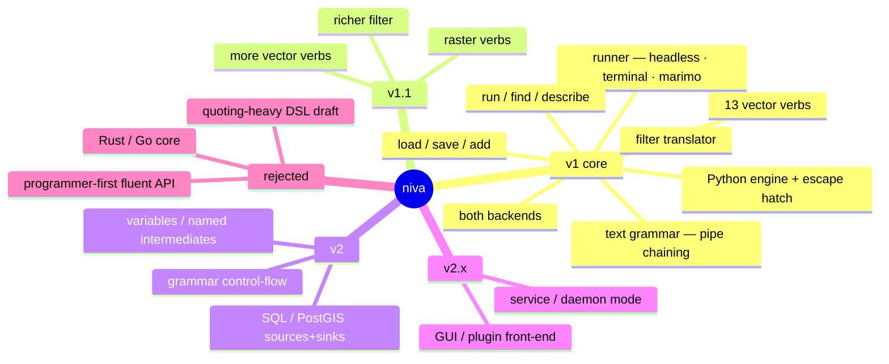

# Niva — Concepts Captured (supersedes the local design exploration)

_Records every relevant concept from the (uncommitted) local exploration with its
disposition, so the planning set is self-sufficient and the source material need not be
committed. Clean-room: framed on QGIS/Python terms only._

## 1. Disposition of every concept

| Concept | Disposition | Where |
| :-- | :-- | :-- |
| **Text-pipeline grammar for non-programmers** | **v1 core — the product** | 01, 03 |
| Pipe `\|` chaining (output→input) | **v1 core** | 02 §2a, 03 §1 |
| Brief grammar: positional + flags + `key=value` | **v1 core** | 03 §1 |
| Alias registry (verb → `native:*`) + per-verb spec | **v1** | 02 §5 |
| 13 vector verbs + `load`/`save`/`add` | **v1** | 03 §2 |
| `run` escape hatch · `find` · `describe` | **v1** | 03 §2 |
| In-process PyQGIS backend | **v1** | 02 §4 |
| `qgis_process` headless backend | **v1** | 02 §4 |
| Auto backend selection + override | **v1** | 02 §4 |
| `Layer` / `Result` return contract | **v1 (key)** | 02 §3 |
| Python engine as power-user **escape hatch** | **v1** | 01, 02 §3a |
| Interop with raw PyQGIS / GeoPandas / SQL | **v1 requirement** | 02 §3a |
| `--json`, exit codes, stdout/stderr discipline | **v1** | 02 §6 |
| Runs headless (saved `.niva`) + in marimo cells | **v1** | 03 §4 |
| Simplified `filter` expression translator | **v1** | 03 §3 |
| Raster verbs | **v1.1** | 04 |
| Grammar control-flow (variables, named intermediates, branch) | **v2** | 04 |
| SQL / PostGIS sources & sinks | **v2** | 04 |
| GUI / plugin / Processing-Toolbox front end | **v2.x** | 04 |
| Service/daemon mode (amortize startup) | **v2.x** | 04 |
| Fluent **method-chaining** Python API (`.buffer().clip()`) | **Optional / v1.1** — engine API is direct functions; the *text grammar* is the chaining surface | 02 |
| Programmer-first / Python-fluent as the primary face | **Rejected** — primary face is the non-programmer grammar | 00 §7 |
| Quoting-heavy single-string DSL draft | **Rejected** — replaced by the brief pipe grammar | 00 §7 |
| Rust/Go core | **Rejected** (no speed gain) | §3 |

## 2. QGIS integration patterns (how niva gets used in-context)

- **marimo-qgis notebooks** — `niva.flow("load … | … | save …")` in a cell; the notebook
  already runs on QGIS's Python. A primary target context.
- **QGIS Python Console** — `import niva`; in-process backend uses the live session;
  `add` loads results into the project; `Layer.as_qgs()` returns project layers.
- **`startup.py` / `PYQGIS_STARTUP`** — preload niva so it's always importable. Keep
  startup light (paths + import); defer GUI/`iface` work.
- **Standalone / headless** — `niva run flow.niva`; `qgis_env` initializes a headless
  app or niva auto-selects the `qgis_process` backend. CI and scheduled jobs.
- **(Later) Processing-script / plugin** — niva inside a custom Processing script, or a
  plugin where plugin = UI and niva = logic.

## 3. Performance guidance (informs design, not a v1 deliverable)

Bottleneck is QGIS/`qgis_process` startup + GDAL/GEOS/PROJ + I/O, **not** Python glue:
- Implementation stays **Python**; Rust/Go buys packaging, not geoprocessing speed
  (rejected).
- Later wins: amortize QGIS startup (batch/service mode), push set/filter/join work into
  **PostGIS SQL** where appropriate, prefer native algorithms over per-feature loops,
  avoid needless temp I/O. Consider exposing `qgis_process --skip-loading-plugins` /
  `--no-python` for fast headless batches in v0.2.

## 4. Naming

- Project/package/command name: **`niva`** (decided).
- **Verify before publishing:** PyPI availability of `niva`. If taken, candidate
  fallbacks (distribution name may differ from import name): `pyniva`, `nivagis`,
  `niva-gis`. The CLI command stays `niva`.

## 5. Deliberately rejected / cut (and why)

- **Programmer-first fluent API as the face** — the audience is non-programmers; the
  text grammar leads, the Python API is the escape hatch underneath.
- **Quoting-heavy single-string DSL draft** — replaced by the brief, pipe-chained,
  newline-optional grammar.
- **Single-backend-only v1** — both interactive and headless are needed from the start;
  accepted the normalization cost.
- **Rust/Go core** — no runtime benefit for this workload.
- **niva as a GeoPandas replacement** — it *interoperates* with GeoPandas/PyQGIS, not a
  competitor.
