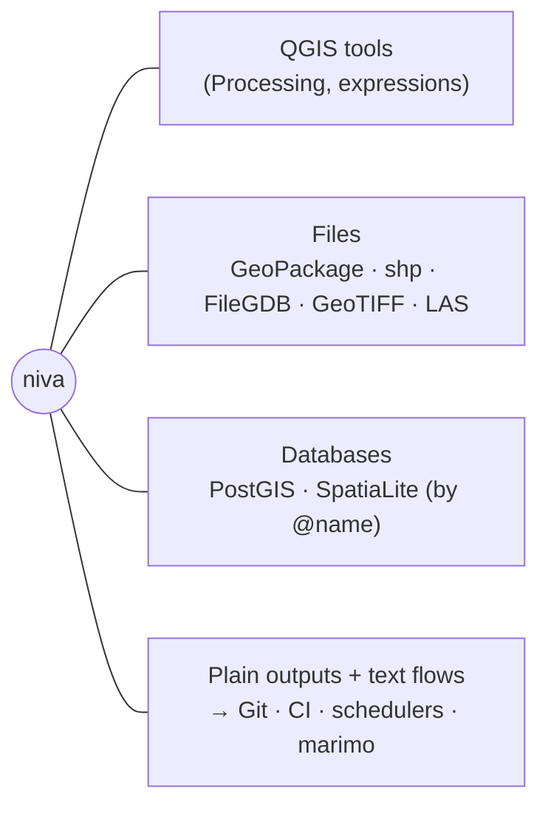

# Niva — Deployment & Operation

_How niva gets onto a workstation, how it connects to QGIS / databases / your
other tools, and the ways people actually run it. Written for an analyst, not a
system architect — concrete and plain. The story matures in phases (§7)._

---

## 1. The one big idea: niva lives inside QGIS's Python

QGIS ships with its own copy of Python. **niva is a small Python package that you
install into *that* Python** — the same one QGIS itself uses. That's the whole
trick: because niva runs in QGIS's Python, it can call QGIS's geoprocessing tools
directly, and it automatically matches your QGIS version (it reads the tools that
are actually installed).

You are **not** installing a second GIS. niva borrows QGIS's.

---

## 2. Getting niva onto a workstation

**Phase 1 (today / v1) — install it yourself, once.** niva is `pip`-installed into
QGIS's Python, the same way the marimo-qgis plugin installs its dependencies:

- **Windows (OSGeo4W):** in the OSGeo4W shell, `python -m pip install niva`.
- **Linux:** `<qgis-python> -m pip install --user niva` (if pip is missing,
  `sudo apt install python3-pip` first).
- **macOS:** `/Applications/QGIS.app/.../bin/python3 -m pip install --user niva`.

**Phase 2 (v1.x) — install it like any QGIS plugin.** A niva QGIS plugin (grown
from the current logo stub) installs niva for you and adds a button/panel — you
get it from **Plugins ▸ Manage and Install Plugins**, no terminal needed.

**Phase 3 (org-wide) — IT pushes it.** For a team, niva and a shared config are
deployed to many workstations with normal software-deployment tools, so analysts
just open QGIS and it's there.

---

## 3. How niva connects to your stuff

- **QGIS:** niva runs on QGIS's Python and uses QGIS's own algorithms and
  expression engine. Run it *inside* a QGIS session and it can read your open
  project and drop results straight onto the map; run it on its own and it works
  headless.
- **Files:** anything QGIS can read — GeoPackage, shapefile, File Geodatabase,
  GeoTIFF, LAS lidar, and so on.
- **Databases (PostGIS, SpatiaLite):** through **QGIS's saved connections**. You
  set a connection up once in QGIS; niva uses it by name (e.g. `@cats_pg`). **niva
  never stores your password** — it reuses what QGIS already has.
- **Your other tools:** niva's inputs and outputs are ordinary files and database
  tables, and a niva *flow is a plain text file*. So it drops into Git, CI,
  schedulers, and marimo notebooks with no special glue.

---

## 4. How you actually run it — pick what fits you

| You prefer… | Interface | Looks like | Phase |
|-------------|-----------|------------|-------|
| A reusable, shareable recipe | a **`.niva` file** | write in any editor, `niva run flow.niva` | v1 |
| The terminal | **CLI one-liner** | `niva "load … \| buffer 100 \| save out.gpkg"` | v1 |
| Working in QGIS | **QGIS Python Console** | `import niva; niva.flow("…")` — uses your open project | v1 |
| Notebooks | **marimo cell** | `niva.flow("…")` in a notebook | v1 |
| Never leaving the GUI | **QGIS plugin panel / Toolbox** | pick a flow, click Run, results land on the map | v1.x |
| Hands-off / scheduled | **batch or service** | run flows nightly on a server | v2.x |

The same flow text works across all of them — write it once, run it where you
like.

---

## 5. Where niva runs

- **On your workstation, QGIS open (interactive):** results appear in your project
  as you go. Best for exploring.
- **On your workstation, no QGIS window (headless):** `niva run flow.niva` for
  repeatable batch work. Same machine, no GUI.
- **On a server / CI (unattended):** the *same* `.niva` files run on a schedule —
  nightly data refreshes, shared team pipelines.
- **(v2.x) shared service:** an always-on niva a team sends flows to, so QGIS
  doesn't have to start up every time.

---

## 6. Operating niva day to day

- **It documents itself.** Every run records what it did (an operation log) and
  writes data lineage into the outputs (`08`) — so you can show exactly how a
  result was produced.
- **Config is small.** Defaults like a working folder or default CRS live in a
  little config file; database connections come from QGIS, not niva.
- **Updating:** `pip install -U niva` (Phase 1) or the Plugin Manager (Phase 2).
  niva re-reads QGIS's installed tools, so it stays correct after a QGIS upgrade.
- **When something's off:** `describe <verb>` shows what a verb will run;
  `--dry-run` prints the exact call without executing; the run log says what
  failed and why.

---

## 7. How the story matures (phases)

| | **Phase 1 — Self-serve** | **Phase 2 — Plugin & team** | **Phase 3 — Service** |
|---|---|---|---|
| Versions | v0.1 → v1.0 | v1.x | v2.x |
| Install | `pip` into QGIS's Python | QGIS Plugin Manager (bundles niva) | org push / container image |
| Interfaces | CLI · `.niva` files · QGIS console · marimo | + **GUI panel / Toolbox**, shared config & connections | + scheduled jobs · service endpoint |
| Runs where | workstation (interactive + headless) · CI | + server batch | + always-on shared service |
| Backend | PyQGIS in-process (`00-§3.3`) | + `qgis_process` for batch | service / pooled |
| Who sets it up | the analyst | the analyst, or IT for a team | IT / platform |

Each phase is additive — nothing from an earlier phase goes away; later phases
just add easier on-ramps and bigger scale.

---

## 8. What niva deliberately does **not** need

- **No second GIS install** — it borrows QGIS's Python and tools.
- **No database of its own** — it reads/writes your files and your QGIS-configured
  databases.
- **No server in Phase 1** — everything runs on your machine.
- **No stored credentials** — database logins stay in QGIS's connection settings.
- **No internet** (except online geocoding and downloading the package) — the work
  runs locally on your data.
